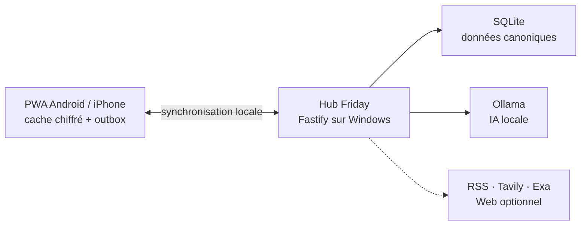

# Friday

> Le quotidien familial, au même endroit — même hors connexion.

Friday est une application privée pour organiser la maison à deux : tâches, courses, budget, conversations avec l’assistant et veille personnelle.

Elle s’installe comme une application sur Android, iPhone et ordinateur. Les actions restent disponibles lorsque le PC ou le Wi-Fi ne répond plus, puis se synchronisent automatiquement au retour du hub familial.

## Tout ce qui compte, sans bruit

| Espace          | Ce qu’on y trouve                                                                                 |
| --------------- | ------------------------------------------------------------------------------------------------- |
| **Aujourd’hui** | Les tâches utiles, les courses restantes et l’essentiel du budget                                 |
| **Agenda**      | Tâches et rendez-vous en liste, semaine ou mois, avec récurrence et responsables                  |
| **Courses**     | Une liste partagée, organisée par rayon, avec un mode magasin utilisable offline                  |
| **Budget**      | Réalisé, prévisionnel, enveloppes, provisions, réserve et épargne réelle                          |
| **Chat**        | Un assistant local privé, avec recherche Web optionnelle et sourcée                               |
| **Veille**      | Des dossiers personnels qui suivent des sources, regroupent les sujets et produisent une synthèse |

L’interface reste volontairement courte et calme : une tâche peut se limiter à un titre, une course à un libellé, et les détails restent facultatifs.

## Local-first par conception

- Une modification est enregistrée d’abord sur le téléphone, dans un cache local chiffré.
- Une outbox conserve les actions réalisées hors ligne jusqu’à leur synchronisation.
- Le PC familial héberge le hub Friday, SQLite et les modèles Ollama.
- Agenda, Courses et Budget sont partagés entre les deux adultes.
- Chat et Veille restent privés pour chaque profil.
- Ollama n’est jamais nécessaire pour enregistrer une tâche, une course ou une dépense.
- Les recherches Web sont explicites et bornées ; le mode local ne contacte aucun service extérieur.

Friday n’est pas un SaaS : les données principales restent dans le foyer et l’application ne dépend pas d’un cloud pour fonctionner au quotidien.

## Une seule PWA, sur tous les appareils

La même Progressive Web App fonctionne sur le PC, Android et iPhone. L’appairage ferme l’accès au foyer, lie chaque appareil à un adulte et permet de révoquer une session si nécessaire.

Les parcours d’installation, d’authentification, de redémarrage offline et de convergence à deux appareils sont validés sur les téléphones du foyer.

## Architecture en bref



Le projet est un monorepo TypeScript : React/Vite pour la PWA, Fastify pour le hub, Dexie/IndexedDB sur les appareils et SQLite sur le PC.

## Lancer le projet

Prérequis : Node.js 24 et pnpm 11.

```powershell
pnpm install --frozen-lockfile
pnpm dev
```

Vérification complète :

```powershell
pnpm verify
```

Le runtime familial Windows, les certificats HTTPS et les procédures de redémarrage sont décrits dans les runbooks.

## Pour aller plus loin

- [Guide fonctionnel et technique](docs/guides/guide-complet-fonctionnel-et-technique-friday.md)
- [Décision produit et architecture](docs/09-decision-finale-pwa-mvp.md)
- [État de reprise du projet](docs/00-reprise-nouveau-chat.md)
- [Runbooks d’exploitation](docs/runbooks/)
- [Recettes sur appareils réels](docs/recipes/)

Friday est un projet familial auto-hébergé, construit pour rester simple, privé et utile quand le réseau ne l’est pas.
