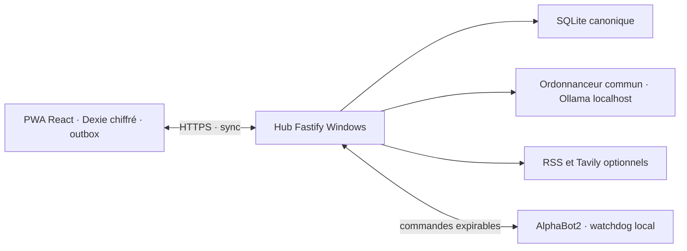

# Friday

Friday est une application familiale auto-hébergée pour deux adultes : agenda,
courses, menus, réserve alimentaire, budget partagé, Chat privé et veille personnelle.
Le PC Windows héberge les données canoniques ; la même PWA s'installe sur ordinateur,
Android et iPhone. Un prototype Robot AlphaBot2 constitue une extension expérimentale.

Statut documentaire : actif.

## Choisir son parcours

- **Utiliser Friday** : [guide utilisateur](docs/guides/utilisation-friday.md), puis [Budget](docs/guides/budget-friday.md).
- **Installer sur un autre PC Windows** : [installation et configuration](docs/guides/installation-windows.md).
- **Développer ou reprendre une conversation** : [architecture](docs/guides/architecture-developpement.md), [contribution](CONTRIBUTING.md) et [reprise courte](docs/00-reprise-nouveau-chat.md).
- **Tout retrouver** : [index documentaire](docs/README.md).

## Les sept espaces

| Espace      | Usage                                                         | Disponibilité sans Hub après une première synchronisation                 |
| ----------- | ------------------------------------------------------------- | ------------------------------------------------------------------------- |
| Aujourd'hui | Tâches utiles, menus, courses, Budget et Veille               | Lecture des données locales                                               |
| Agenda      | Tâches, récurrences et menus en liste/semaine/mois            | Lecture et écritures métier locales ; aucun Google Calendar               |
| Maison      | Courses, Menus et Réserve                                     | Liste, catalogue, planning, bilans et réserve via cache chiffré et outbox |
| Budget      | Réel, prévisionnel, enveloppes, provisions et épargne         | Lecture, calculs et saisies locales                                       |
| Chat        | Conversations privées ; modes Friday, Local et Recherche Web  | Historique déjà mis en cache ; envoi et génération exigent le Hub         |
| Veille      | Dossiers, sources, articles et synthèses privés               | Contenu déjà synchronisé ; collecte et analyse exigent le Hub             |
| Robot       | Manuel, autonomie visuelle, repères, manette et veille réseau | Aucune commande physique hors connexion                                   |

Maison et Budget sont partagés. Chat, Veille et brouillons IA sont privés par profil.
Les écritures Maison utilisent la même voie locale et la même outbox avec ou sans
réseau. Une panne d'Ollama ne bloque pas Maison, Budget ou leur synchronisation.
Le classement des courses, la lecture de photos et les propositions IA exigent le Hub
et les modèles locaux ; les recherches Web exigent aussi Internet et un fournisseur configuré.

## État et limites

La livraison du 6 septembre 2026 comprend Maison, la continuité de recherche Chat
et la modularisation du code. L'[état canonique](docs/27-etat-canonique-app-robot-2026-08-25.md)
sépare code, vérification automatisée, déploiement et recettes réelles.

Le Chat est activé dans le foyer de référence mais sa gate qualitative reste refusée :
une réponse auditée peut encore comporter une erreur ou une omission. Le Chat ne
modifie aucune donnée métier et ne commande pas le Robot. La recette Maison sur
les deux téléphones et plusieurs recettes physiques Robot restent ouvertes.

Google Calendar, la sauvegarde portable chiffrée et sa restauration ne sont pas
implantés. Tailscale reste en pause. Les snapshots techniques existants ne remplacent
pas une solution de sauvegarde utilisateur. Les données financières réelles restent
soumises à la [porte Budget](docs/runbooks/reprise-budget.md).

## Démarrer en développement

Prérequis : Git, Node.js 24, pnpm 11.16 minimum dans la branche 11, Python 3 et
Google Chrome pour les E2E. Sans Robot, aucun matériel Raspberry Pi n'est nécessaire.

```powershell
git clone https://github.com/Sharpsou/friday.git
Set-Location friday
pnpm install --frozen-lockfile
$env:FRIDAY_PUBLIC_ORIGIN = 'http://127.0.0.1:5173'
pnpm dev
```

Ouvrir `http://127.0.0.1:5173`. Cette boucle HTTP locale ne constitue pas une
installation PWA LAN. Le [guide Windows](docs/guides/installation-windows.md)
décrit les données, l'authentification, HTTPS et les services facultatifs.

```powershell
pnpm docs:check
pnpm verify
```

La vérification construit la PWA dans `.verification/web` ; le Hub familial n'est
pas redémarré. Voir l'[environnement de test](docs/runbooks/development.md).

## Architecture



Le dépôt ne contient actuellement aucun fichier de licence accordant des droits
de réutilisation. La publication du code et ce guide d'installation ne constituent
pas un choix de licence ; cette décision reste au propriétaire.
