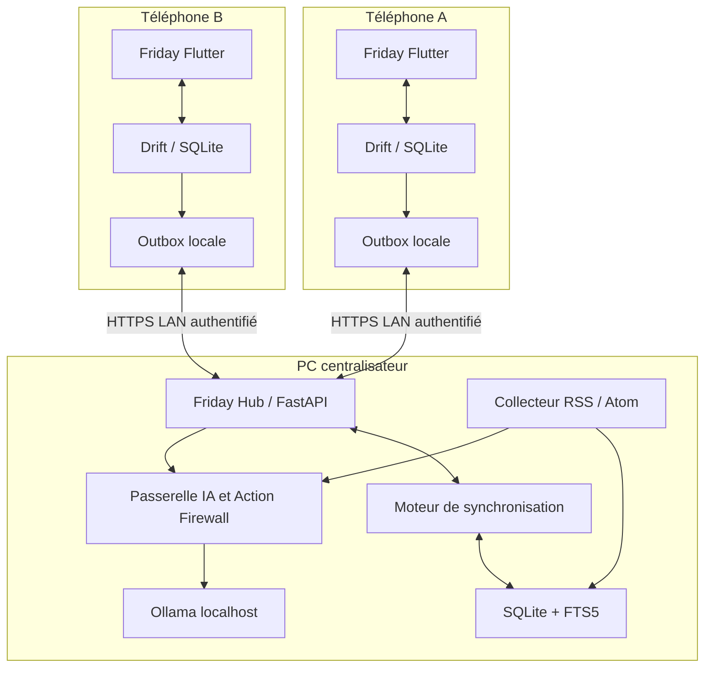
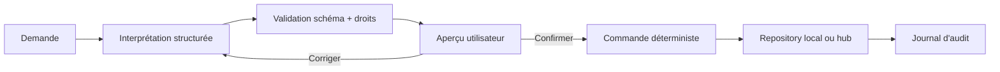

# Architecture local-first

> **Note de mise à jour — 8 août 2026 :** cette architecture Flutter/SQLCipher est historique. Le client actif est une PWA avec cache local chiffré, outbox et hub PC ; Google Calendar est la source de vérité de l'agenda. Voir [09-decision-finale-pwa-mvp.md](09-decision-finale-pwa-mvp.md).

## Décision d'architecture

Friday est composé de deux produits déployables :

- une application Flutter sur chaque téléphone, utile seule ;
- un service Windows sur le PC, responsable de la convergence, de la veille et de l'IA.

Le serveur n'est jamais requis pour consulter ou modifier les domaines quotidiens. Il est requis pour synchroniser les appareils entre eux, collecter de nouvelles sources et utiliser Ollama.



## Pourquoi ne pas exposer Ollama

L'API Ollama locale ne demande pas d'authentification. Elle est liée à `127.0.0.1` par défaut et peut être exposée avec `OLLAMA_HOST`, mais Friday ne doit pas le faire. Le service FastAPI :

- authentifie l'appareil et le profil ;
- applique les droits ;
- limite les tailles, délais et débits ;
- réduit le contexte envoyé au modèle ;
- valide les sorties ;
- décide si une proposition nécessite confirmation ;
- journalise une explication sans conserver de chaîne de pensée.

Référence : [FAQ Ollama, réseau, contexte et chargement](https://docs.ollama.com/faq).

## Structure de dépôt cible

```text
friday/
  mobile/                 # reprise simplifiée de Home Mind Flutter
    lib/
    test/
  server/                 # service Python 3.12
    src/friday_hub/
      api/
      domain/
      persistence/
      sync/
      watch/
      assistant/
      model_gateway/
    tests/
  contracts/              # JSON Schema et exemples versionnés
  deploy/windows/         # scripts de service, sauvegarde et diagnostic
  docs/
```

Le serveur et le mobile ne partagent pas du code d'exécution. Ils partagent des contrats versionnés : identifiants, enums, enveloppe de changements et schémas d'API. OpenAPI génère le client HTTP Dart si cela réduit réellement les divergences.

## Socle mobile

### Réutilisation de Home Mind

- Flutter et navigation existante ;
- Drift/SQLite ;
- repositories de domaine ;
- identités stables, révisions et suppressions logiques ;
- profils, accès et visibilité ;
- tâches, planning, rappels, captures et courses ;
- paquet de synchronisation et réconciliation ;
- notifications locales.

### Évolutions nécessaires

- migration du schéma Drift ;
- ajout de la récurrence, du budget, de la veille en cache et de l'outbox unifiée ;
- transport `LanSyncTransport` ;
- page de connexion au hub et appairage QR ;
- état réseau/synchro visible ;
- client de l'assistant avec un timeout court et un repli offline ;
- migrations testées depuis une base Home Mind réelle.

## Friday Hub

### Choix minimal

- Python 3.12 ;
- FastAPI ;
- Pydantic v2 ;
- SQLite en mode WAL ;
- FTS5 pour articles, notes et recherche textuelle ;
- client Python Ollama ;
- ordonnanceur simple persistant pour les collectes de veille ;
- journaux structurés locaux.

Pydantic AI peut être utilisé autour de l'agent outillé après un spike court. Son provider Ollama prend en charge le serveur auto-hébergé et les sorties structurées contraintes : [documentation Pydantic AI pour Ollama](https://pydantic.dev/docs/ai/models/ollama/). Le premier service n'a cependant pas besoin d'un framework d'agent pour les routes déterministes.

### Processus Windows

Le hub doit démarrer avec Windows comme service utilisateur ou tâche planifiée. Il expose seulement l'API Friday sur le réseau privé. Ollama reste en écoute locale.

Le service doit publier :

- `/health` : disponibilité du hub, de la base et du modèle ;
- `/pairing/*` : appairage temporaire ;
- `/sync/push` et `/sync/pull` ;
- `/assistant/interpret` et `/assistant/chat` ;
- `/briefing` ;
- `/watch/*` ;
- `/diagnostics` pour l'administrateur.

## Synchronisation

### Enveloppe de changement

```json
{
  "changeId": "deviceA:00001234",
  "householdId": "...",
  "entityType": "grocery_item",
  "entityId": "deviceA:item:42",
  "operation": "upsert",
  "baseRevision": 4,
  "revision": 5,
  "changedAt": "2026-08-07T20:15:00Z",
  "sourceDeviceId": "deviceA",
  "sourceProfileId": "profileA",
  "payload": {},
  "deletedAt": null
}
```

Les changements sont idempotents grâce à `changeId`. Le client garde l'élément dans son outbox jusqu'à accusé de réception. Le serveur attribue un curseur global monotone que chaque téléphone utilise pour tirer les changements suivants.

### Règles de fusion MVP

- ajout d'entités différentes : fusion automatique ;
- transaction budgétaire : append-only, correction par contre-écriture ou version de remplacement ;
- suppression : tombstone conservée ;
- même entité, révisions compatibles : mise à jour ;
- même entité modifiée simultanément : conflit conservant les deux versions, résolution explicite ;
- élément de courses coché sur un appareil et édité sur l'autre : état le plus récent et conflit visible si des champs descriptifs divergent ;
- préférences personnelles : jamais fusionnées dans un autre profil.

Un CRDT général n'est pas nécessaire pour deux adultes et un hub. Des règles par type d'entité sont plus lisibles et testables.

### PC indisponible

- timeout de connexion inférieur à deux secondes ;
- aucune modale bloquante ;
- l'outbox conserve les mutations ;
- l'app affiche « hors ligne — 3 changements à synchroniser » ;
- reprise avec backoff lorsque l'app revient au premier plan ou lorsque le réseau change ;
- aucune synchronisation permanente agressive en arrière-plan dans le premier MVP.

## Appairage et sécurité

### Appairage

1. L'administrateur ouvre Friday Hub sur le PC.
2. Le hub génère un secret à usage unique et un certificat local.
3. Le téléphone scanne un QR contenant l'adresse LAN, l'empreinte du certificat, l'identifiant du foyer et le secret temporaire.
4. Le téléphone crée sa paire de clés ou son secret d'appareil dans le stockage sécurisé Android.
5. Le hub émet un jeton révocable lié à l'appareil et au profil.
6. Le secret temporaire expire immédiatement.

### Exigences minimales

- HTTPS avec certificat épinglé ou tunnel privé équivalent ;
- jeton par appareil, révocable ;
- scopes par endpoint ;
- aucune clé dans les logs, QR persistants ou URLs de requêtes ;
- verrouillage de l'app pour les écrans budget et contenus privés ;
- chiffrement des sauvegardes ;
- BitLocker ou chiffrement de disque recommandé sur le PC ;
- rotation de la clé foyer documentée avant diffusion large ;
- rétention courte des requêtes et réponses assistant ;
- pas de conservation d'audio dans le MVP.

Le stockage Drift actuel de Home Mind n'est pas chiffré en totalité. Deux niveaux sont possibles :

- pilote rapide : sandbox Android, biométrie, champs les plus sensibles chiffrés et disque PC chiffré ;
- cible renforcée : SQLCipher pour toute la base mobile.

Ce choix doit être tranché avant de saisir des données financières réelles.

## Stratégie Ollama

### Inventaire local observé

| Modèle | Taille locale | Capacités observées | Usage candidat |
|---|---:|---|---|
| `granite4:3b` | 2,1 Go | texte, outils | routage et extraction rapide |
| `ministral-3:8b` | 6,0 Go | texte, vision, outils | candidat interactif à benchmarker |
| `gemma4-12b-builder:64k` | 7,6 Go | texte, vision, audio, outils, thinking | synthèse et analyse de qualité |
| `gemma4-12b-multimodal:128k` | 7,6 Go | multimodal | hors MVP |
| modèles 20B/35B installés | 13 à 23 Go | raisonnement/code | hors service quotidien |

Le Gemma 4 12B local est quantifié en Q4_K_M et configuré actuellement avec 65 536 tokens de contexte. Le PC dispose d'environ 27,7 Go de RAM ; la mémoire vidéo remontée par Windows ne permet pas de considérer le 12B comme un modèle « instantané » sans benchmark.

Google présente Gemma 4 12B comme un modèle local multimodal destiné en priorité aux machines avec environ 16 Go de VRAM ou mémoire unifiée : [guide officiel Gemma 4 12B](https://developers.googleblog.com/gemma-4-12b-the-developer-guide/). Sur ce PC, il doit être traité comme un modèle de qualité ou d'arrière-plan, pas comme l'unique routeur interactif.

### Routage recommandé

| Besoin | Moteur | Contexte cible | Température |
|---|---|---:|---:|
| calcul, droits, dates, budget, synchro | code déterministe | aucun | aucune |
| classification d'une capture | Granite 4 3B | 4–8k | 0 |
| extraction JSON | Granite 4 3B, repli Ministral | 4–8k | 0 |
| question interactive courte | modèle gagnant du benchmark Granite/Ministral | 8–12k | 0,1–0,3 |
| résumé d'article | Gemma 4 12B en file d'arrière-plan | 8–16k | 0,1–0,3 |
| digest multi-articles | Gemma 4 12B | 16–24k | 0,1–0,3 |

Un grand contexte augmente la mémoire nécessaire. La documentation Ollama relie explicitement contexte et consommation mémoire : [context length](https://docs.ollama.com/context-length). Le tag `64k` ne doit donc pas imposer 64k à chaque requête.

### Sorties structurées

Friday transmet un JSON Schema et valide encore le résultat avec Pydantic. Ollama documente les sorties structurées et recommande une température basse pour les rendre déterministes : [Structured Outputs](https://docs.ollama.com/capabilities/structured-outputs). Les outils sont décrits avec un schéma fermé : [Tool calling](https://docs.ollama.com/capabilities/tool-calling).

### Politique de chargement

- garder Granite chargé pendant les heures d'usage ;
- charger Gemma à la demande pour les jobs de fond ;
- ne pas charger plusieurs gros modèles simultanément par défaut sur Radeon/Windows ;
- limiter à une requête interactive à la fois et mettre les résumés en file ;
- mesurer P50/P95, temps de chargement, tokens/s, RAM et répartition CPU/GPU avec `ollama ps` ;
- prévoir un timeout et un résultat « résumé en attente » plutôt que bloquer la synchronisation.

## Action Firewall

Le modèle ne reçoit jamais un accès direct aux repositories. Il produit une proposition typée.



Niveaux MVP :

- R0 : répondre ou rechercher sans modifier ;
- R1 : créer localement une capture brute ;
- R2 : proposer une tâche, course, dépense ou événement, avec confirmation ;
- R3 : opération sensible ou partagée importante, confirmation renforcée ;
- R4 : paiement, message externe, shell, suppression de masse et commande domotique refusés.

## Veille

### Pipeline

1. l'ordonnanceur sélectionne les abonnements dus ;
2. le collecteur télécharge RSS/Atom avec cache HTTP ;
3. URL, titre, date et source sont normalisés ;
4. l'article est dédupliqué ;
5. le texte disponible est nettoyé comme donnée non fiable ;
6. Gemma produit résumé et étiquettes sous JSON Schema ;
7. le résultat conserve la provenance ;
8. les digests sont construits par profil ;
9. la synchronisation envoie les nouvelles fiches aux téléphones.

Le contenu collecté ne peut pas donner d'instructions au système, appeler un outil ou modifier le foyer. Il est toujours traité comme donnée.

### Recherche

FTS5 suffit au MVP pour titres, sources, extraits, tags et résumés. Les embeddings ne seront ajoutés qu'après un jeu de questions et une comparaison mesurée. Ollama propose un endpoint d'embeddings, mais sa disponibilité n'est pas une raison suffisante pour l'utiliser : [documentation embeddings](https://docs.ollama.com/capabilities/embeddings).

## Sauvegarde et restauration

- snapshot chiffré quotidien sur un second disque ou dossier explicitement choisi ;
- conservation glissante, par exemple 7 quotidiennes et 4 hebdomadaires ;
- export manuel chiffré depuis l'app ;
- restauration testée, pas seulement fichier créé ;
- le hub peut être reconstruit depuis un snapshot et les journaux récents ;
- aucun compte cloud obligatoire ;
- Drive peut rester un transport de secours optionnel si l'utilisateur l'accepte.

## Observabilité

### Visible pour le foyer

- hub disponible ou non ;
- date de dernière synchro ;
- changements en attente ;
- dernier digest généré ;
- modèle indisponible ou résumé en attente ;
- conflits à résoudre.

### Visible en diagnostic administrateur

- latence API et Ollama ;
- files de jobs ;
- taux d'erreur par source ;
- taille des bases et sauvegardes ;
- nombre de changements appliqués/ignorés ;
- versions de schéma ;
- empreinte de l'appareil, sans secrets.

Les logs ne contiennent pas les montants, notes privées ou prompts complets par défaut.
