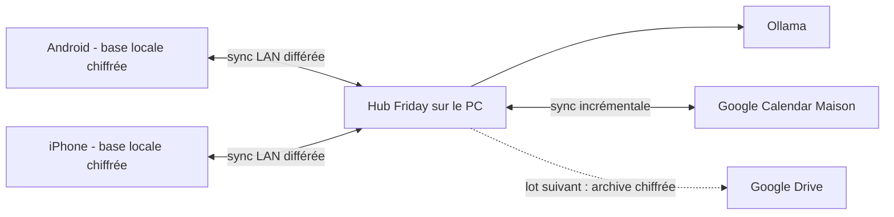

# Décisions produit après les réponses utilisateur

Date de décision : 8 août 2026

Statut : **historique — remplacé** par [09-decision-finale-pwa-mvp.md](09-decision-finale-pwa-mvp.md). Ce document décrit l'étape Flutter/native antérieure à la décision PWA.

## Résumé exécutable

Friday sera une application de foyer très simple, utilisable par deux adultes sur Android et iPhone. Le PC familial est le hub de convergence, de veille et d'IA, mais chaque téléphone garde une base locale et les fonctions essentielles restent utilisables sans Wi-Fi ni PC.

Les données opérationnelles sont communes : tâches, courses, agenda maison et budget. Les profils servent seulement à personnaliser la veille, l'assistant et les notifications. Ce choix supprime l'essentiel de la matrice de permissions de Home Mind.

Google Calendar devient la référence de l'agenda maison. Au premier MVP, Friday importe les événements, les met en cache et les affiche ; la création reste dans Google Calendar. Friday ne recrée donc pas un agenda complet.

## Décisions actées

| Sujet | Décision |
|---|---|
| Architecture | PC centralisateur + réplica local sur chaque téléphone |
| Disponibilité du PC | fonctionnement par périodes de 2 à 3 jours ; aucun Wake-on-LAN au MVP |
| Téléphones | Samsung Galaxy A17 comme plateforme de validation ; compatibilité iOS conservée et compilation différée sur un Mac récent |
| Agenda | un calendrier Google « Maison » est la source de vérité |
| Saisie agenda | Google Calendar en priorité ; Friday lit et met en cache |
| Partage | tâches, courses, agenda et budget sont communs aux deux adultes |
| Profils | préférences de veille, assistant, digest et notifications seulement |
| Budget | manuel, partagé, rapide à saisir : frais fixes, courses, santé, loisirs, extras, revenus réguliers/extra et épargne mensuelle |
| Base mobile | SQLite chiffrée avec SQLCipher, sous réserve d'un test d'intégration sur les deux plateformes |
| Recherche | recherche structurée + FTS5 au MVP ; pas de RAG pour les données domestiques |
| Veille | thèmes et sources choisis librement par chaque utilisateur |
| IA | Ollama sur le PC ; modèle rapide pour le routage, Gemma 4 12B pour les travaux de fond |
| Sauvegarde cloud | sauvegardes chiffrées, versionnées, dans Google Drive après stabilisation du LAN |
| UX | trois destinations et une saisie rapide ; aucun formulaire détaillé obligatoire |

## Ce que je challenge

### 1. « PC central » ne doit pas signifier « téléphone dépendant »

Si le PC est éteint, les deux téléphones doivent encore pouvoir consulter et modifier tâches, courses et budget. Le PC est l'autorité de convergence lorsqu'il redevient joignable, pas une dépendance pour ouvrir l'application.

Conséquences :

- une base locale par téléphone ;
- une file d'opérations en attente ;
- un état de synchronisation visible mais discret ;
- résolution déterministe des doublons et conflits ;
- aucune fonctionnalité essentielle qui appelle Ollama.

### 2. Un compte Google « Maison » est utile, mais ne doit pas devenir l'identité des deux personnes

Le compte peut posséder le calendrier et recevoir les sauvegardes Friday. Il ne doit pas servir de compte Friday partagé ni obliger les deux adultes à se connecter avec le même mot de passe.

Configuration recommandée :

1. créer un compte Google dédié au foyer avec validation en deux étapes et codes de récupération conservés hors ligne ;
2. créer dans ce compte un calendrier « Maison » ;
3. partager ce calendrier avec les comptes Google personnels des deux adultes avec le droit de modifier les événements ;
4. connecter le hub Friday au compte Maison par OAuth ;
5. limiter Friday aux portées Calendar nécessaires, puis Drive uniquement lorsque les sauvegardes cloud seront activées.

Cela garde une propriété neutre du calendrier, sans mot de passe commun dans l'usage quotidien.

### 3. Il ne faut pas transformer chaque phrase en tâche par IA

Pour « acheter du lait », ouvrir un LLM serait plus lent et moins fiable qu'une saisie directe. Le modèle n'est appelé que pour une phrase ambiguë ou composée, une synthèse de veille, un briefing ou une question.

### 4. Le RAG n'est pas un prérequis

Les tâches, événements, courses et transactions sont déjà structurés. Des requêtes SQL et la recherche plein texte répondent mieux à « quelles charges restent ce mois-ci ? » ou « qu'est-ce qu'il faut acheter ? ».

Les embeddings ne deviennent pertinents que pour rechercher par sens dans un historique conséquent de veille ou de notes. Ils seront alors calculés et stockés sur le PC, sans être répliqués sur les téléphones.

### 5. Le vrai risque MVP est la synchronisation, pas l'IA

Une synthèse imparfaite est tolérable ; perdre une dépense ou recréer trois fois une tâche ne l'est pas. La première démonstration doit donc valider deux téléphones, des modifications hors ligne et la convergence après reconnexion avant d'élargir l'assistant.

## Expérience utilisateur simplifiée

### Navigation

L'application possède trois destinations :

1. **Aujourd'hui** : événements, tâches dues, état des courses, alerte budget et briefing ;
2. **Maison** : trois listes simples `Tâches`, `Courses`, `Budget` ;
3. **Veille** : digest propre au profil actif et gestion de ses thèmes.

L'avatar ouvre les préférences de profil et l'état du hub. Un bouton `+` reste visible pour la saisie rapide.

### Saisie d'une tâche

Obligatoire :

- titre.

Optionnel, replié par défaut :

- date ou rappel ;
- personne concernée ;
- répétition ;
- note libre.

Il n'y a pas de catégorie, priorité, charge mentale, sensibilité, dépendance, contexte ou pièce obligatoire. Friday peut proposer une date ou un responsable, jamais les imposer.

### Courses

Saisie en une ligne, case à cocher, quantité facultative. Le regroupement par rayon et les suggestions automatiques sont post-MVP.

### Budget

Une opération demande :

- montant ;
- type `dépense` ou `revenu` ;
- date, préremplie à aujourd'hui ;
- libellé court.

La catégorie est suggérée et modifiable, mais ne bloque jamais l'enregistrement. Les récurrences évitent de ressaisir loyers, salaires et abonnements.

Les flux sont volontairement limités :

- revenus : `régulier` ou `extra` ;
- dépenses : `frais fixes`, `courses`, `santé`, `loisirs` ou `extra` ;
- épargne : objectif mensuel et versement réellement effectué.

L'épargne n'est pas assimilée au « reste du mois ». Friday distingue la somme volontairement mise de côté du solde non dépensé, afin de ne pas surestimer l'épargne réelle.

L'écran montre seulement :

- revenus réguliers et revenus extra ;
- dépenses réalisées par catégorie ;
- frais fixes restant à payer ;
- disponible estimé ce mois ;
- objectif d'épargne et montant réellement épargné ;
- évolution de l'épargne mois par mois et cumul annuel.

Le calcul est déterministe. L'assistant peut expliquer les chiffres mais ne les invente ni ne les modifie.

### Agenda

L'écran Aujourd'hui affiche le cache du calendrier Google Maison. Un bouton `Ouvrir Google Calendar` permet la création ou la modification dans l'interface déjà maîtrisée par Google.

Friday synchronise les changements par incréments lorsque le PC a Internet. En l'absence de connexion, la dernière copie locale reste consultable. La création d'événements directement dans Friday n'entre qu'après observation d'un besoin réel.

### Veille

Chaque profil choisit :

- le nom du thème ;
- une requête ou des mots-clés ;
- des sources RSS/Atom facultatives ;
- la langue ;
- la fréquence ;
- la longueur maximale du digest.

Friday peut proposer des modèles de thème, mais aucun sujet n'est imposé. Chaque résultat garde son titre, sa source, sa date et son lien.

## Périmètre du MVP rapide

### Inclus

- deux profils adultes ;
- app Flutter validée d'abord sur Samsung Galaxy A17 avec base locale chiffrée ;
- projet maintenu compatible iOS et transférable vers un Mac récent ;
- appairage au hub sur le réseau local ;
- tâches minimales, récurrence simple et rappels locaux ;
- liste de courses partagée ;
- budget partagé manuel avec récurrences, revenus réguliers/extra, catégories retenues et suivi mensuel de l'épargne ;
- lecture et cache du calendrier Google Maison ;
- écran Aujourd'hui ;
- veille RSS/Atom par profil, déduplication et digest Ollama ;
- assistant texte avec lecture des données autorisées et propositions à confirmer ;
- mode dégradé explicite quand le PC ou Ollama est indisponible ;
- sauvegarde locale exportable et procédure de restauration testée.

### Différé au lot suivant

- sauvegarde chiffrée automatique sur Google Drive ;
- import CSV bancaire ;
- création d'événement Google depuis Friday ;
- accès distant hors du domicile par VPN privé ;
- recherche sémantique de l'historique de veille ;
- météo et briefing de départ ;
- pièces jointes et scan de tickets.

### Hors MVP

- connexion bancaire et initiation de paiement ;
- lecture de Gmail ;
- domotique, capteurs, robotique ou écran mural ;
- assistant vocal permanent ;
- scraping général du Web et réseaux sociaux ;
- recommandations financières produites par LLM ;
- sous-profils enfants, rôles complexes et confidentialité au niveau de chaque objet.

## Architecture cible du MVP

Règles :

- l'API du hub n'est exposée qu'au LAN ;
- Ollama reste lié à `localhost` et n'est jamais appelé directement par un téléphone ;
- l'appairage initial affiche un QR code à durée courte sur le PC ;
- chaque mutation possède un identifiant unique, une révision et un appareil auteur ;
- les suppressions sont des tombstones synchronisables avant purge ;
- le cache Calendar est en lecture seule dans la base Friday au premier MVP ;
- l'absence du hub ne bloque pas les écritures locales.

## SQLCipher et embeddings

### Ce qu'est SQLCipher

SQLCipher est une variante compatible SQLite qui chiffre le fichier complet de la base. L'application continue d'utiliser des tables et des requêtes SQL ; les pages sont chiffrées et déchiffrées à la volée.

Pour Friday, son intérêt est concret : les montants, tâches et listes ne sont pas lisibles en copiant simplement le fichier de base depuis un téléphone déverrouillé ou une sauvegarde brute.

### Coût attendu

Le coût n'est pas nul. L'éditeur annonce souvent environ 5 à 15 % de surcharge dans de bonnes conditions. Pour une base familiale de petite taille, cela ne devrait pas être perceptible si la connexion reste ouverte, les écritures sont groupées en transactions et les colonnes de recherche sont indexées. Un micro-benchmark réel sur l'Android A17 et l'iPhone 11 Pro Max reste un critère de validation.

### Gestion de la clé

- une clé aléatoire par appareil ;
- clé conservée dans Android Keystore ou iOS Keychain ;
- jamais dérivée uniquement d'un PIN court ;
- export de sauvegarde rechiffré avec une clé de récupération du foyer ;
- procédure de récupération testée avant de saisir des données réelles.

### Embeddings

SQLCipher peut conserver un vecteur sous forme de BLOB, mais il ne fournit pas à lui seul une recherche vectorielle. Ce stockage n'apporte donc pas automatiquement un RAG.

Décision :

- FTS5 sur les titres, notes et articles au MVP ;
- aucun embedding de tâches, courses, agenda ou budget ;
- plus tard, embeddings d'articles de veille sur le PC seulement ;
- extension vectorielle choisie après benchmark, pas dans la base mobile.

## Modèles Ollama

Répartition initiale :

| Besoin | Moteur |
|---|---|
| règles, dates, calculs, budget, synchronisation | code déterministe |
| classification rapide d'une phrase | `granite4:3b` déjà installé |
| réponse courte interactive | modèle rapide validé localement, `granite4:3b` au départ |
| résumé de veille et briefing de qualité | `gemma4-12b-builder:64k` en tâche de fond |
| indisponibilité d'Ollama | aucune panne des fonctions Maison |

Le modèle rapide pourra être remplacé après un test français sur cinquante phrases réelles. La taille seule n'est pas un critère ; latence, JSON valide et taux de correction manuelle comptent davantage.

## Faisabilité iOS

L'iPhone 11 Pro Max est compatible avec iOS 26. Le matériel du téléphone n'est donc pas un blocage.

Le MacBook Pro 2014 est officiellement limité à macOS Big Sur, alors que Xcode 26 exige au minimum macOS Sequoia 15.6 et que les soumissions iOS doivent utiliser le SDK iOS 26 depuis avril 2026. Il ne peut pas être la machine officielle de build actuelle.

Décision retenue :

- développer et valider fonctionnellement Friday sur le PC Windows et le Samsung Galaxy A17 ;
- maintenir chaque dépendance Flutter compatible Android/iOS et éviter les choix spécifiques à Android sans abstraction ;
- transférer le dépôt complet, ses versions verrouillées et une procédure de build vers un Mac récent connu ;
- compiler dans Xcode et tester ensuite sur l'iPhone 11 Pro Max ;
- ne pas souscrire personnellement à l'Apple Developer Program.

Limite importante : un compte Apple gratuit apparaît dans Xcode comme une `Personal Team`. Ses identifiants d'appareil, App IDs et profils d'installation expirent après sept jours ; Friday doit alors être reconstruit et réinstallé sur l'iPhone. Disposer du Mac récent ne supprime pas cette limite de signature.

Une installation iPhone durable exigera donc plus tard l'un des choix suivants :

1. utiliser l'équipe Apple Developer payante du propriétaire du Mac, s'il en possède une et accepte de porter la signature ;
2. accepter une réinstallation hebdomadaire pendant les essais ;
3. revoir le canal iPhone, par exemple avec un client Web/PWA aux capacités offline plus limitées.

Le MacBook 2014 peut rester utile pour Git et la documentation, mais pas pour la chaîne iOS actuelle.

Le transfert vers le Mac doit inclure :

- le dépôt Git complet ou une archive avec historique de version ;
- la version exacte de Flutter ;
- `pubspec.lock` et les dépendances natives verrouillées ;
- le bundle identifier choisi ;
- un script de diagnostic `flutter doctor` ;
- une checklist Xcode pour la signature, le réseau local, les notifications et SQLCipher ;
- aucun secret Google, clé de chiffrement ou donnée familiale dans l'archive source.

## Découpage et délai honnête

### Lot 0 — Socle et preuve de chaîne : 2 à 3 jours

- figer le code Home Mind retenu ;
- supprimer sa navigation actuelle et poser les trois destinations ;
- valider SQLCipher et l'installation Android sur le Galaxy A17 ;
- verrouiller les dépendances compatibles iOS et préparer le paquet de transfert Mac ;
- lancer le hub Windows et appairer un téléphone.

Porte de sortie : une modification locale survit à un redémarrage sur le Galaxy A17 et le projet ne contient aucun blocage iOS connu.

### Lot 1 — Maison partagée : 6 à 9 jours

- tâches minimales, rappels et récurrence ;
- courses ;
- budget simple complet ;
- synchronisation LAN et conflits ;
- lecture/cache Google Calendar ;
- écran Aujourd'hui.

Porte de sortie Android : le Galaxy A17 est utilisé sept jours, dont au moins une période hors ligne, sans perte ni doublon. La porte de sortie à deux téléphones sera rejouée après la première compilation sur le Mac récent.

### Lot 2 — Veille et assistant : 4 à 6 jours

- thèmes et sources par profil ;
- collecte, déduplication, résumé et digest ;
- assistant texte et propositions confirmées ;
- limites de contexte et journal des actions.

### Lot 3 — Durcissement : 3 à 5 jours

- notifications finales ;
- export/restauration ;
- tests de migration et de coupure réseau ;
- ergonomie à deux et réduction des écrans ;
- sauvegarde Drive chiffrée si le lot LAN est stable.

Estimation totale : **15 à 23 jours de développement** pour le MVP complet. Une première version réellement utile « Maison » doit être visée en **8 à 12 jours**, puis utilisée avant d'ajouter davantage d'IA. La session de portage sur le Mac récent et les éventuelles corrections iOS ajoutent une réserve de **1 à 3 jours**, hors délai d'accès à cette machine.

## Critères d'acceptation

- une tâche se crée en moins de dix secondes ;
- une dépense se crée en moins de quinze secondes ;
- aucune catégorie n'est obligatoire ;
- les deux téléphones voient la même donnée après reconnexion ;
- deux créations hors ligne ne disparaissent jamais ;
- Friday affiche l'agenda mis en cache lorsque le PC est éteint ;
- le budget reste exact avec Ollama arrêté ;
- les revenus réguliers et extra sont séparés ;
- l'épargne réelle n'est jamais confondue avec le reste disponible ;
- l'évolution de l'épargne est visible mois par mois ;
- chaque article de veille garde une source et un lien ;
- le digest de chaque adulte suit ses propres thèmes ;
- une sauvegarde peut être restaurée sur une base vide ;
- l'interface principale ne dépasse pas trois destinations.

## Questions restantes et valeurs par défaut

Ces réponses ne bloquent pas le lot 0 ; les valeurs par défaut permettent d'avancer.

1. **Le propriétaire du Mac récent possède-t-il déjà une équipe Apple Developer payante et accepterait-il de signer Friday ?**

   Défaut : non ; la première installation iPhone sera un test de sept jours avec une `Personal Team` gratuite.

2. **Quels flux doivent déclencher une notification ?**

   Défaut : rappel de tâche, événement proche, dépassement d'enveloppe et digest prêt ; aucune relance répétée sans changement.

3. **Le compte Google Maison doit-il servir aussi d'adresse email administrative ?**

   Défaut : oui pour les alertes techniques uniquement ; Friday ne lit pas Gmail au MVP.

4. **L'épargne réelle sera-t-elle saisie manuellement ou calculée depuis un compte/une enveloppe dédiée ?**

   Défaut : un versement d'épargne manuel ou récurrent ; le solde de fin de mois reste une mesure séparée.
