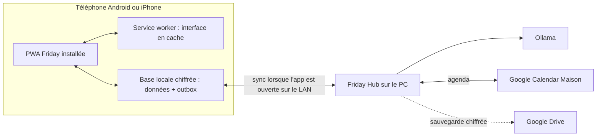

# Option PWA offline pour Friday

Date : 8 août 2026

Statut : **option acceptée**. La décision d'implémentation et le périmètre de test PC + Galaxy A17 sont maintenant figés dans [09-decision-finale-pwa-mvp.md](09-decision-finale-pwa-mvp.md).

## Verdict

Oui, Friday peut devenir une application Web installable sur les écrans d'accueil Android et iPhone, servie par le PC sur le Wi-Fi du foyer et utilisable hors connexion.

La bonne architecture n'est cependant pas d'exécuter une copie depuis Google Drive. Elle est :

- application et ressources mises en cache sur le téléphone par un service worker ;
- dernière copie des données conservée dans une base locale du navigateur ;
- modifications offline placées dans une outbox ;
- synchronisation vers le PC quand Friday est rouvert sur le Wi-Fi ;
- Google Drive réservé aux sauvegardes chiffrées et à la restauration.

## Pourquoi Drive ne doit pas exécuter Friday

Google Drive est un stockage de fichiers, pas un hébergeur d'application Web ni un moteur de réplication transactionnelle.

Une archive Friday dans Drive peut être téléchargée et restaurée, mais elle ne fournit pas correctement :

- une origine HTTPS stable pour le service worker ;
- un cache applicatif contrôlé ;
- une base locale transactionnelle ;
- une file d'opérations offline ;
- une résolution des conflits entre deux téléphones ;
- un lancement fiable depuis l'écran d'accueil.

Le dossier `appDataFolder` de Drive n'est accessible que par l'application qui l'a créé et ne peut pas être partagé directement. Il convient à une sauvegarde technique, pas à une « version offline » lancée par l'utilisateur : [documentation Google Drive](https://developers.google.com/workspace/drive/api/guides/appdata).

### Peut-on tout de même lire Drive hors du domicile ?

Techniquement, une PWA connectée à Internet pourrait télécharger le dernier snapshot chiffré depuis Drive. Cela n'apporte presque rien sur un appareil déjà appairé : sa copie locale est normalement aussi récente, voire plus récente.

Ce mode peut être utile uniquement pour restaurer un nouvel appareil. Autoriser les deux téléphones à modifier directement un fichier Drive créerait un second système de synchronisation multi-maître, avec conflits et risques d'écrasement. Cette voie est exclue du MVP.

## Fonctionnement réel

### Première utilisation

1. Le téléphone rejoint le Wi-Fi du foyer.
2. L'utilisateur ouvre l'URL HTTPS de Friday.
3. Il s'identifie ou appaire son appareil par QR code.
4. Il ajoute Friday à son écran d'accueil.
5. Friday télécharge l'interface, le profil et un snapshot initial.
6. L'application demande au navigateur de rendre son stockage persistant.

### Hors Wi-Fi ou PC éteint

- l'icône Friday ouvre l'interface depuis le cache ;
- les tâches, courses, budget, agenda déjà importé et veille déjà reçue restent consultables ;
- les créations et modifications sont enregistrées localement ;
- un bandeau discret affiche `Hors ligne — N changements à synchroniser` ;
- l'assistant Ollama et la collecte de veille sont indisponibles ;
- aucune donnée n'est perdue si l'application est fermée normalement.

### Retour sur le Wi-Fi

Lorsque Friday est ouverte ou revient au premier plan :

1. elle découvre le hub ;
2. elle renouvelle sa session si nécessaire ;
3. elle pousse son outbox avec des identifiants idempotents ;
4. elle récupère les changements du foyer depuis son dernier curseur ;
5. elle affiche l'heure de la dernière convergence.

Sur iPhone, il ne faut pas compter sur une synchronisation silencieuse fiable lorsque la PWA est fermée. La synchronisation se fait donc systématiquement au lancement, au retour au premier plan, au changement réseau et périodiquement tant que l'app reste ouverte. La demande WebKit concernant Background Sync reste ouverte : [suivi WebKit](https://bugs.webkit.org/show_bug.cgi?id=201866).

## Ce qui est stocké sur le téléphone

La base locale contient seulement le nécessaire :

- profil de l'appareil ;
- tâches actives et historique récent ;
- liste de courses ;
- budget et synthèses mensuelles ;
- événements Calendar dans une fenêtre configurable ;
- derniers digests de veille ;
- outbox non synchronisée ;
- curseur et heure de dernière synchronisation.

Les articles complets, journaux techniques, embeddings et sauvegardes restent sur le PC.

## Chiffrement et comptes

Une PWA ne peut pas employer SQLCipher comme une app native iOS/Android classique. Friday doit chiffrer les données sensibles au niveau applicatif avant leur stockage dans IndexedDB ou l'Origin Private File System.

Proposition :

- clé de données aléatoire par appareil ;
- chiffrement authentifié via Web Crypto ;
- clé enveloppée par un secret d'appareil ou un PIN local ;
- jeton de synchronisation révocable, distinct du mot de passe ;
- effacement du cache local à la déconnexion explicite ;
- aucune clé de récupération dans Google Drive avec la sauvegarde qu'elle protège.

La gestion de compte reste centralisée sur le hub :

- un compte par adulte ;
- données Maison communes ;
- profil de veille et préférences personnelles ;
- appareil mémorisé après appairage ;
- session offline autorisée uniquement sur un appareil déjà appairé ;
- révocation possible depuis le PC.

## Stockage iPhone

WebKit prend en charge Cache API, IndexedDB, Service Workers et la demande de stockage persistant. Une PWA ajoutée à l'écran d'accueil bénéficie des quotas d'une application Web autonome. Le stockage reste néanmoins soumis à la place disponible et peut être supprimé sous pression si la persistance n'a pas été accordée : [politique de stockage WebKit](https://www.webkit.org/blog/14403/updates-to-storage-policy/).

Conséquences :

- demander `navigator.storage.persist()` après l'installation ;
- contrôler quota et erreurs d'écriture ;
- afficher `Cache offline prêt` ou `Cache à réparer` ;
- garder le PC comme copie canonique ;
- sauvegarder le hub, jamais compter sur le téléphone comme seule copie.

## Installation iPhone

Sur iOS 26, tout site ajouté à l'écran d'accueil peut s'ouvrir comme une application Web, sans App Store, Xcode ni Apple Developer Program : [WebKit Safari 26](https://webkit.org/blog/17333/webkit-features-in-safari-26-0/).

La procédure utilisateur est courte :

1. ouvrir Friday dans Safari sur le Wi-Fi Maison ;
2. toucher `Partager` puis `Sur l'écran d'accueil` ;
3. conserver l'option `Ouvrir comme app` ;
4. ouvrir Friday depuis sa nouvelle icône ;
5. autoriser stockage, compte et notifications si elles sont activées.

## Notifications : la limite principale

Les PWA installées sur iPhone prennent en charge Web Push depuis iOS 16.4 et cela ne requiert pas de compte Apple Developer : [Web Push sur iOS](https://webkit.org/blog/13878/web-push-for-web-apps-on-ios-and-ipados/).

Mais un push doit provenir d'un serveur joignable. Si le PC est éteint et que le téléphone est hors réseau, Friday ne peut pas garantir un rappel de tâche à une heure future comme le ferait une application native avec notification locale programmée.

Pour le MVP PWA :

- Google Calendar garde ses propres rappels d'événement ;
- Friday envoie les alertes lorsque le hub est disponible ;
- les échéances sont visibles dans Aujourd'hui hors ligne ;
- les rappels de tâches totalement offline sont explicitement non garantis.

Si ce dernier point devient bloquant, une petite app native compagnon pourra être envisagée plus tard sur Android ; iOS conserverait les rappels Calendar.

## HTTPS sur le réseau local

Un service worker et les fonctions de sécurité exigent une origine HTTPS fiable. Une simple URL `http://192.168.x.x` ne suffit pas pour une PWA de production.

Trois chemins sont possibles :

| Option | Avantage | Inconvénient |
|---|---|---|
| domaine réel + certificat public + DNS local | expérience propre et durable | nécessite un domaine et l'automatisation du certificat |
| autorité de certification privée installée sur les deux téléphones | entièrement local | configuration initiale plus technique |
| réseau privé géré avec nom et certificat HTTPS | installation rapide et accès distant optionnel | dépendance à un composant réseau supplémentaire |

Recommandation pour le pilote : autorité locale Friday installée manuellement sur les deux appareils, puis migration vers un domaine et certificat automatisé si l'usage est confirmé.

## Comparaison avec l'app Flutter native

| Critère | PWA | Flutter natif |
|---|---|---|
| installation iPhone sans abonnement | excellente | réinstallation après 7 jours |
| une seule livraison Android/iPhone/PC | excellente | builds par plateforme |
| fonctionnement offline CRUD | bon | excellent |
| résistance à l'éviction du stockage | bonne mais non absolue | excellente |
| chiffrement local | Web Crypto applicatif | SQLCipher + Keychain/Keystore |
| rappels totalement offline | faible | excellent |
| sync en arrière-plan sur iPhone | limitée | meilleure, toujours contrôlée par iOS |
| mises à jour | immédiates au retour LAN | nouvelle build à installer |
| vitesse de mise en service à deux | meilleure | pénalisée par Apple |

## Recommandation

Pour Friday tel qu'il est désormais défini — formulaires courts, données structurées, PC central et Google Calendar — la PWA devient le meilleur candidat au MVP.

Je recommande :

1. une PWA responsive comme client principal sur Samsung et iPhone ;
2. un fonctionnement offline via cache local + IndexedDB chiffré + outbox ;
3. synchronisation au premier plan sur iPhone ;
4. Google Drive comme sauvegarde chiffrée du hub uniquement ;
5. aucun build Apple pour le MVP ;
6. réévaluation d'une app native seulement si les rappels offline ou l'intégration système deviennent indispensables.

## Preuve technique avant bascule

La bascule PWA est actée. Construire un spike court — cible actuelle d’environ 1,5 à 3 heures agentiques, hors recette physique — sur le PC et le Galaxy A17 :

- installer la PWA sur le Galaxy A17 ;
- la lancer en mode avion avec le PC éteint ;
- créer une tâche, une course et une dépense hors ligne ;
- reconnecter le Galaxy A17 au hub ;
- vérifier convergence, absence de doublon et persistance après redémarrage ;
- mesurer le comportement après fermeture forcée de la PWA ;
- tester la demande de stockage persistant ;
- tester une notification Web Push ;
- documenter l'installation du certificat HTTPS.

Le MVP démarre seulement si cette preuve passe sur le Galaxy A17. La même campagne sera rejouée plus tard sur l'iPhone 11 Pro Max sans bloquer la mise au point initiale.
