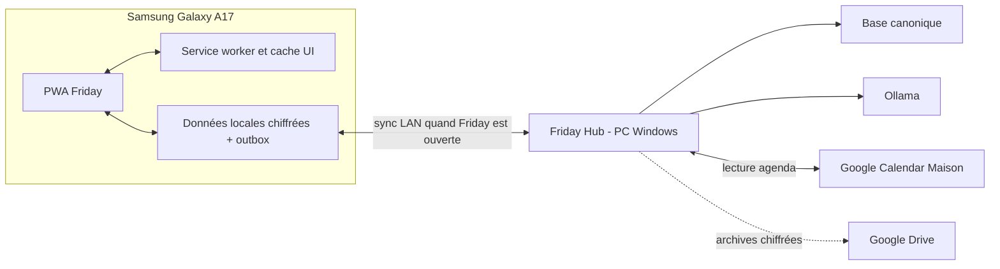

# Décision finale : MVP PWA local-first

Date : 8 août 2026

Statut : **référence produit active**. Ce document remplace les choix Flutter/native des documents précédents. L’exécution technique et les estimations agentiques sont définies dans [10-feuille-de-route-technique-implementation.md](10-feuille-de-route-technique-implementation.md).

## Décision

Friday sera une Progressive Web App installable, servie par le PC familial sur le réseau local et capable de fonctionner hors ligne grâce à un cache applicatif et une base locale dans le navigateur.

La mise au point et la recette du MVP utilisent uniquement :

- le PC Windows comme hub, serveur Web, base centrale et hôte Ollama ;
- le Samsung Galaxy A17 comme appareil client de développement, test UX et validation offline.

L'iPhone 11 Pro Max n'est plus dans le chemin critique du MVP. Il sera testé plus tard avec la même PWA, sans build Xcode ni App Store.

## Conséquences immédiates

- aucun build Flutter Android ou iOS dans le MVP ;
- aucun abonnement Apple Developer ;
- aucune exportation Xcode ;
- une seule application Web responsive pour les téléphones et le navigateur PC ;
- Home Mind reste une source de concepts métier et de tests, pas la base d'interface à conserver ;
- le PC reste la copie canonique ;
- Google Drive sert au backup chiffré, jamais à exécuter Friday ni à synchroniser directement les deux clients.

## Périmètre produit confirmé

### Navigation

Trois destinations :

1. **Aujourd'hui** : agenda, tâches dues, état des courses, budget et briefing ;
2. **Maison** : tâches, courses et budget ;
3. **Veille** : digest et thèmes du profil actif.

Un bouton `+` permanent ouvre la saisie rapide.

### Tâches

- titre obligatoire ;
- date, personne, répétition et note facultatives ;
- aucune catégorie, priorité ou fiche détaillée obligatoire ;
- rappels visibles dans Friday ;
- rappel système totalement offline non garanti dans la PWA.

### Courses

- libellé ;
- quantité facultative ;
- case à cocher ;
- liste commune au foyer.

### Budget partagé

Dépenses :

- frais fixes ;
- courses ;
- santé ;
- loisirs ;
- extras.

Revenus :

- réguliers ;
- extra.

Épargne :

- objectif mensuel ;
- versement réel manuel ou récurrent ;
- évolution mois par mois ;
- cumul annuel et taux d'épargne.

Friday distingue toujours l'épargne réellement versée du simple reste disponible.

### Agenda

- calendrier Google « Maison » comme source de vérité ;
- création et modification dans Google Calendar au MVP ;
- lecture et cache dans Friday ;
- dernière copie consultable hors ligne.

### Veille et assistant

- thèmes, mots-clés, sources et fréquence choisis par profil ;
- collecte RSS/Atom et déduplication sur le PC ;
- modèle rapide Ollama pour le routage ;
- Gemma 4 12B pour les résumés en arrière-plan ;
- aucune dépendance à Ollama pour les tâches, courses, budget ou données offline ;
- FTS5 avant tout usage d'embeddings ;
- éventuels embeddings conservés plus tard sur le PC uniquement.

## Architecture

### Hub PC

Responsabilités :

- comptes, profils et appareils ;
- API de synchronisation ;
- base canonique ;
- intégration Calendar ;
- veille et assistant ;
- sauvegardes et restauration ;
- page d'appairage par QR code ;
- diagnostic et journal technique.

Le hub démarre avec la session Windows ou comme service utilisateur. Un redémarrage du PC ne doit pas nécessiter d'intervention manuelle autre que l'ouverture de session si elle est requise par Windows.

### PWA

Responsabilités :

- interface tactile responsive ;
- cache versionné de l'application ;
- copie locale des données utiles ;
- outbox des mutations offline ;
- synchronisation au lancement, au retour au premier plan, au retour réseau et périodiquement lorsque l'app reste ouverte ;
- affichage de la dernière synchronisation et des mutations en attente ;
- mode dégradé sans Ollama ni hub.

### HTTPS local

Une origine HTTPS stable est obligatoire pour le service worker et les API de sécurité.

Pour le pilote PC + A17 :

- nom local stable pour le hub ;
- autorité de certification Friday installée sur le PC et le Galaxy A17 ;
- certificat serveur limité au nom Friday ;
- aucune exposition du hub à Internet ;
- procédure de renouvellement documentée.

Un domaine et un certificat automatisé pourront remplacer l'autorité locale après validation du produit.

## Modèle offline

### Première installation

1. Le Galaxy A17 rejoint le Wi-Fi Maison.
2. L'utilisateur ouvre l'URL HTTPS Friday.
3. Il appaire l'appareil par QR code.
4. Il ajoute Friday à l'écran d'accueil.
5. La PWA télécharge son interface et le snapshot initial.
6. Elle demande la persistance du stockage et valide un test d'écriture/lecture.

### Données locales

Conserver uniquement :

- identité technique de l'appareil et profil par défaut ;
- tâches actives et historique récent ;
- courses ;
- budget utile aux vues mensuelles ;
- fenêtre locale des événements Calendar ;
- derniers digests ;
- outbox ;
- curseur et date de synchronisation.

Les pages Web complètes, embeddings, logs et sauvegardes restent sur le PC.

### Écriture offline

Chaque opération possède :

- identifiant unique généré côté client ;
- appareil et profil auteur ;
- horodatage client informatif ;
- révision connue de l'objet ;
- type d'opération ;
- payload validé ;
- état `pending`, `sent`, `acknowledged` ou `conflict`.

Le hub est idempotent : renvoyer la même opération ne doit jamais créer un doublon.

### Reconnexion

1. pousser l'outbox dans son ordre causal ;
2. recevoir les accusés et conflits ;
3. récupérer les événements serveur depuis le dernier curseur ;
4. mettre à jour la base locale en transaction ;
5. afficher le nouvel état de synchronisation.

Au MVP, un conflit de modification simultanée conserve les deux versions et demande un choix. Une case cochée et un ajout de course utilisent des règles de fusion déterministes.

## Comptes et sécurité

- un compte par adulte, même si seul le compte principal est utilisé pendant la mise au point ;
- données Maison partagées ;
- préférences de veille et d'assistant par profil ;
- jeton révocable par appareil ;
- session offline uniquement après un premier appairage réussi ;
- chiffrement applicatif des données sensibles avant stockage navigateur ;
- clé locale distincte du mot de passe du compte ;
- effacement de la copie locale lors d'une déconnexion explicite ;
- chiffrement du disque PC activé ;
- sauvegardes Drive chiffrées avec une clé de récupération conservée séparément.

SQLCipher ne s'applique plus au client PWA. Au MVP, la base centrale s’appuie sur le chiffrement du volume Windows, les ACL et les sauvegardes chiffrées. SQLCipher ne sera réévalué que si le threat model montre que cette protection est insuffisante.

## Rôle de Google Drive

Drive conserve des archives versionnées et chiffrées du hub :

- sauvegardes quotidiennes si Internet est disponible ;
- rétention indicative : 7 quotidiennes, 4 hebdomadaires, 12 mensuelles ;
- manifeste contenant version du schéma, date et checksum ;
- test de restauration périodique ;
- aucune clé de déchiffrement stockée avec l'archive ;
- aucune écriture directe des téléphones dans le fichier Drive.

Une restauration Drive vers un nouvel appareil passe toujours par le hub.

## Stratégie de mise au point

### Environnement unique initial

| Élément | Cible |
|---|---|
| serveur | PC Windows familial |
| navigateur PC | navigateur moderne pour administration et diagnostic |
| client mobile | Samsung Galaxy A17 |
| réseau | Wi-Fi du foyer |
| mode offline | mode avion, Wi-Fi coupé et hub arrêté |
| iPhone | hors recette MVP, testé ultérieurement |

### Boucle UX

Chaque fonctionnalité est d'abord validée sur le téléphone :

1. action réalisable au pouce ;
2. formulaire sans champ superflu ;
3. tâche créée en moins de dix secondes ;
4. dépense créée en moins de quinze secondes ;
5. information importante visible sans ouvrir plus de deux niveaux ;
6. état offline compréhensible sans message technique ;
7. aucun blocage si le hub ou Ollama est indisponible.

### Matrice offline obligatoire

| Scénario | Résultat attendu |
|---|---|
| Wi-Fi actif, hub actif | synchronisation normale |
| Wi-Fi actif, hub arrêté | lecture/écriture locale, outbox conservée |
| Wi-Fi coupé | application démarre, fonctions Maison disponibles |
| mode avion puis redémarrage téléphone | cache et données toujours présents |
| fermeture forcée de la PWA | aucune mutation validée perdue |
| hub redémarré avec outbox en attente | reprise idempotente |
| même opération renvoyée deux fois | un seul effet serveur |
| changement de version de la PWA | migration du cache et des données sans perte |
| stockage refusé ou quota dépassé | message clair, aucune fausse confirmation d'écriture |

### Tests automatisés

- règles budget et dates en tests unitaires ;
- validation de schéma des payloads ;
- tests d'idempotence de l'API ;
- tests de migration de la base centrale et du stockage Web ;
- tests d'intégration avec coupure réseau simulée ;
- tests de service worker et mise à jour de version ;
- parcours de tâche, course et dépense en test navigateur ;
- sauvegarde puis restauration sur une base vide.

### Journal de recette manuelle

Pour chaque session sur le Galaxy A17, noter :

- version Friday ;
- état du PC et du réseau ;
- heure de dernière synchronisation ;
- opérations créées offline ;
- temps des saisies principales ;
- défaut UX observé ;
- résultat après reconnexion.

## Campagne iPhone différée

L'iPhone sera testé après stabilisation du MVP Android/PWA. Cette campagne ne nécessite pas de build natif.

À vérifier plus tard :

- installation depuis Safari sur l'écran d'accueil ;
- certificat HTTPS local ;
- persistance du stockage ;
- lancement PC éteint et mode avion ;
- migrations de service worker ;
- synchronisation au retour au premier plan ;
- Web Push ;
- ergonomie sur la taille d'écran de l'iPhone 11 Pro Max ;
- absence de divergence avec les données du Galaxy A17.

La prise en charge iPhone n'est déclarée terminée qu'après cette recette réelle. Aucun comportement iOS ne sera affirmé uniquement depuis un simulateur ou un navigateur desktop.

## Roadmap révisée

### P0 — Spike PWA/offline : environ 1,5 à 3 heures agentiques

- HTTPS local ;
- installation écran d'accueil A17 ;
- service worker ;
- stockage local chiffré ;
- outbox minimale ;
- appairage ;
- test PC arrêté, Wi-Fi coupé et mode avion.

Porte de sortie : une tâche créée offline survit à un redémarrage du téléphone et converge une seule fois après retour du hub.

### P1 — Friday Maison : environ 3 à 6 heures agentiques

- navigation Aujourd'hui/Maison/Veille ;
- tâches ;
- courses ;
- budget défini ;
- comptes et profil ;
- synchronisation et conflits ;
- cache Calendar ;
- UX tactile.

Porte de sortie technique : scénarios automatisés et recette A17 sans perte ni doublon. Une observation quotidienne de sept jours est recommandée pour la confiance UX, mais n’empêche pas de construire P2 après validation des risques critiques.

### P2 — Veille et assistant : environ 2 à 4 heures agentiques

- thèmes par profil ;
- RSS/Atom ;
- déduplication et digest ;
- assistant avec propositions confirmées ;
- mode Ollama indisponible.

### P3 — Sauvegarde et durcissement : environ 1 à 3 heures agentiques

- sauvegarde Drive chiffrée ;
- restauration ;
- notifications Web Push lorsque le hub est disponible ;
- migrations et mise à jour PWA ;
- tests de coupure et sécurité ;
- documentation d'exploitation.

La campagne iPhone est un lot ultérieur distinct. La cible de construction du MVP PWA PC + Galaxy A17 est d’environ **8 à 16 heures de travail agentique cumulé**. Cette fourchette n’est pas un engagement de délai : installations, erreurs réelles, validations physiques et intégrations externes peuvent l’allonger. Les périodes d’observation de 7/14 jours sont séparées du développement.

## Critères de go/no-go après le spike

Passer au MVP PWA seulement si :

- Friday s'installe depuis le PC sur l'écran d'accueil du Galaxy A17 ;
- elle se lance deux fois de suite en mode avion ;
- les données locales survivent au redémarrage ;
- une mutation offline converge sans doublon ;
- le stockage chiffré reste assez rapide pour une saisie instantanée ;
- la mise à jour du service worker ne casse pas la base locale ;
- l'installation du certificat est acceptable pour un usage familial.

Si un de ces points échoue sans correction simple, réévaluer un client Android natif avant de construire les domaines métier.
