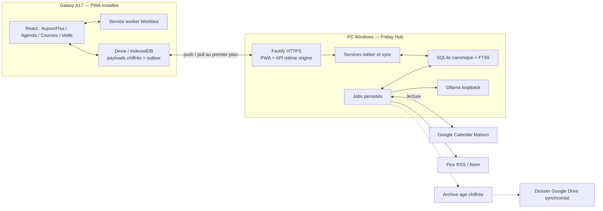
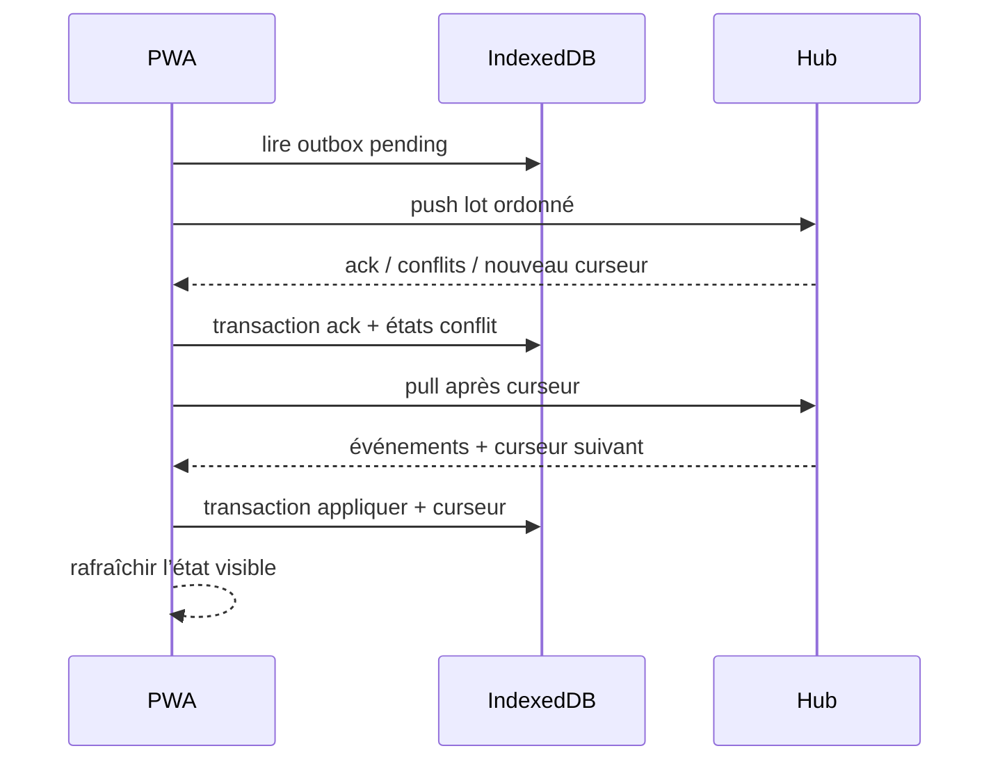

# Friday — feuille de route technique de développement et d’implémentation

> Ce document est une feuille de route cumulative : ses lots, gates et règles
> d’exécution restent utiles, mais ses encarts datés ne décrivent pas tous
> l’état live. Pour la reprise et les migrations actuelles, consulter
> [27-etat-canonique-app-robot-2026-08-25.md](27-etat-canonique-app-robot-2026-08-25.md).

Date : 8 août 2026

Statut : **support d’exécution et historique des lots ; pas état live**

Périmètre : MVP sur PC Windows + Samsung Galaxy A17 ; validation iPhone différée.

Ce document traduit les décisions produit de [09-decision-finale-pwa-mvp.md](09-decision-finale-pwa-mvp.md) en travaux de développement vérifiables. En cas de contradiction :

1. ce document fait autorité pour la façon de construire et tester ;
2. le document 09 fait autorité pour la promesse produit et la cutline du MVP ;
3. les documents 01 à 08 restent des sources et un historique de décision.

## 1. Résultat attendu

Friday doit être mis en service rapidement comme une application familiale simple qui reste utile quand le PC ou le Wi-Fi est indisponible.

Le MVP est réussi si les deux adultes peuvent :

- consulter et modifier les tâches, courses et données budgétaires partagées ;
- consulter le calendrier Google Maison déjà synchronisé ;
- continuer à écrire hors connexion sans perte ni doublon au retour du hub ;
- retrouver un écran Aujourd’hui compréhensible en quelques secondes ;
- utiliser une veille et un assistant adaptés au profil actif lorsque le PC et Ollama sont disponibles ;
- restaurer le hub depuis une sauvegarde chiffrée testée.

La simplicité est une exigence fonctionnelle : une tâche ne demande qu’un titre ; une course qu’un libellé ; une dépense qu’un montant, un libellé et une catégorie.

## 2. Challenge de la vision et décisions fermes

### 2.1 Ce que Friday n’est pas

Friday n’est pas :

- une copie simplifiée de Home Mind avec tous ses écrans ;
- un chatbot qui possède les données métier ;
- une application exécutée depuis Google Drive ;
- un logiciel de comptabilité ou de connexion bancaire ;
- un nouvel agenda complet ;
- une plateforme domotique, multi-agent ou RAG au MVP ;
- une application native Android/iOS au MVP.

### 2.2 Les arbitrages structurants

| Sujet | Décision | Conséquence |
|---|---|---|
| Autorité des données | PC familial | Le mobile garde une copie locale et une outbox, mais le PC arbitre la convergence. |
| Client | PWA offline-first | Une seule interface pour PC, A17 et iPhone ultérieur. |
| Offline | Cache applicatif + IndexedDB | Google Drive n’intervient pas dans l’exécution. |
| Partage | Tâches, courses, agenda et budget communs | Pas de visibilité privée par objet au MVP. |
| Personnalisation | Veille, digest, assistant et notifications par profil | Les requêtes et caches IA portent toujours un `profileId`. |
| Agenda | Google Calendar Maison en lecture | La création/modification reste dans Google Calendar au MVP. |
| IA | Ollama sur le PC, jamais dans le chemin critique | Une panne IA ne bloque ni Maison, ni budget, ni sync. |
| Recherche | SQLite FTS5 | Les embeddings restent hors MVP. |
| Sauvegarde | Archive chiffrée vers un dossier Google Drive synchronisé | Pas de second protocole de synchronisation applicatif. |
| Apple | Même PWA, campagne réelle plus tard | Aucun Xcode, App Store ou abonnement Apple. |

### 2.3 Fonctions importantes conservées sans gonfler le MVP

Les sources Home Mind, Jarvis, Budget et Modulo, complétées par les inspirations robotiques externes, font ressortir des fonctions utiles qui ne doivent pas être oubliées. Elles sont réparties ainsi :

| Fonction | MVP | Après observation | Motif |
|---|---:|---:|---|
| capture rapide / « À préciser » | P2, version minimale | oui | Forte valeur, mais l’écriture métier de base passe avant le routage IA. |
| prochaine action calme | oui, règle déterministe simple | enrichissement ultérieur | Évite un tableau de bord anxiogène. |
| récurrence domestique | oui, simple | règles complexes plus tard | Besoin quotidien avéré. |
| revue hebdomadaire du foyer | P2 | oui | À construire après que les données de base soient fiables. |
| rappels administratifs et santé pratique | via tâche/Calendar | domaine dédié non | Pas de dossier médical. |
| entretien maison/voiture | non | oui si usage observé | Peut d’abord être une tâche récurrente. |
| menus reliés aux courses | non | oui si usage observé | Ne doit pas retarder la liste partagée. |
| checklists départ/vacances | non | oui | Modèles de tâches ultérieurs. |
| import CSV bancaire | non | oui | La saisie manuelle valide d’abord le modèle budget. |
| voix, domotique, capteurs | non | beaucoup plus tard | Hors promesse MVP et coûteux à fiabiliser. |
| agent physique domestique | non | prototype post-MVP par étapes, noyau visé 500–600 €, estimation prudente 490–650 €, plafond livré 700 € | Compagnon cible 45 cm et maximum 50 cm, à roues différentielles asservies, LiDAR, contrôleur vital, Pi autonome et persona continu ; politique neuronale et pince facultatives après simulation, observateur et preuve de la base sûre. |

## 3. Exigences traçables du MVP

Chaque ticket de développement doit référencer au moins un identifiant ci-dessous et un critère d’acceptation.

### 3.1 Fonctionnel

| ID | Exigence |
|---|---|
| FR-HOME-01 | Un écran Aujourd’hui montre événements, tâches dues, état des courses, résumé budget et disponibilité du briefing. |
| FR-TASK-01 | Créer une tâche avec titre obligatoire et date, responsable, récurrence, note facultatifs. |
| FR-TASK-02 | Terminer, rouvrir, modifier et supprimer logiquement une tâche, en ligne ou hors ligne. |
| FR-TASK-03 | Gérer une récurrence quotidienne, hebdomadaire ou mensuelle sans doublon d’occurrence. |
| FR-GROCERY-01 | Ajouter, cocher, modifier et retirer une course partagée hors ligne. |
| FR-GROCERY-02 | Classer sur demande les courses par rayon via un job persistant, arrêtable et confirmé avant application, sans bloquer la liste. |
| FR-BUDGET-01 | Saisir dépenses dans frais fixes, courses, santé, loisirs ou extras. |
| FR-BUDGET-02 | Saisir revenus réguliers ou extra. |
| FR-BUDGET-03 | Saisir objectif et versement réel d’épargne, puis afficher progression mensuelle, cumul et taux. |
| FR-BUDGET-04 | Distinguer le reste disponible de l’épargne réellement versée. |
| FR-CALENDAR-01 | Lire et mettre en cache une fenêtre du calendrier Google Maison. |
| FR-WATCH-01 | Choisir thèmes, mots-clés, sources et fréquence par profil. |
| FR-WATCH-02 | Collecter RSS/Atom, dédupliquer, sourcer et construire un digest par profil. |
| FR-AI-01 | Répondre avec les seules données autorisées au profil et annoncer les données périmées. |
| FR-AI-02 | Transformer du texte en proposition validée ; toute écriture demande confirmation. |
| FR-PROFILE-01 | Disposer d’un compte et d’un appareil lié par adulte. |
| FR-PROFILE-02 | Partager les données Maison et isoler les données de veille/assistant par profil. |

### 3.2 Offline, synchronisation et fiabilité

| ID | Exigence |
|---|---|
| NFR-OFF-01 | La PWA démarre deux fois de suite en mode avion après installation. |
| NFR-OFF-02 | Une écriture validée est atomiquement enregistrée avec son opération d’outbox. |
| NFR-SYNC-01 | Le renvoi d’une même opération produit un seul effet serveur. |
| NFR-SYNC-02 | Une reconnexion pousse l’outbox puis tire les changements depuis le curseur. |
| NFR-SYNC-03 | Un conflit ne peut pas écraser silencieusement une modification concurrente. |
| NFR-MIG-01 | Les migrations Web et hub sont testées depuis N-1 et sur une base vide. |
| NFR-BACKUP-01 | Une sauvegarde chiffrée se restaure sur un hub vide. |
| NFR-OBS-01 | L’utilisateur voit dernière synchro, nombre d’opérations en attente et erreur utile. |

### 3.3 Sécurité et respect de la vie privée

| ID | Exigence |
|---|---|
| SEC-01 | Le hub et la PWA partagent une origine HTTPS de confiance et stable. |
| SEC-02 | Ollama écoute uniquement sur la boucle locale ; seule l’API Friday l’appelle. |
| SEC-03 | Les données sensibles du cache navigateur sont chiffrées par Web Crypto. |
| SEC-04 | Les secrets, tokens Google et clés privées ne sont jamais dans le dépôt ni dans le bundle PWA. |
| SEC-05 | Un appareil ou une session peut être révoqué depuis le hub. |
| SEC-06 | Une politique CSP stricte interdit scripts tiers, `eval`, objets et framing. |
| SEC-07 | Les archives Drive sont chiffrées avant d’entrer dans le dossier synchronisé. |
| SEC-08 | Les contenus RSS et les textes utilisateurs sont traités comme non fiables. |

### 3.4 Performance et UX

| ID | Cible sur Galaxy A17 |
|---|---|
| UX-01 | Tâche créée en moins de 10 secondes. |
| UX-02 | Dépense créée en moins de 15 secondes. |
| UX-03 | Retour visuel immédiat après écriture locale, sans attendre le hub. |
| UX-04 | Navigation principale limitée à Aujourd’hui, Agenda, Courses, Veille et bouton `+`. |
| PERF-01 | Réouverture offline utilisable en moins de 2 secondes après cache chaud. |
| PERF-02 | Interaction locale courante perceptuellement instantanée ; cible p95 sous 100 ms hors rendu. |
| PERF-03 | État de synchronisation mis à jour dans les 2 secondes suivant une réponse du hub. |

## 4. Architecture cible



### 4.1 Choix de stack

| Couche | Choix | Pourquoi | À ne pas ajouter au MVP |
|---|---|---|---|
| dépôt | monorepo TypeScript, `pnpm` workspaces | Contrats, outils et tests partagés ; Node et pnpm sont déjà présents. | Nx/Turborepo tant que le temps de build ne le justifie pas. |
| PWA | React + TypeScript + Vite | Écosystème mature, composants simples, test navigateur direct. | SSR, Next.js, micro-frontends. |
| service worker | `vite-plugin-pwa` en `injectManifest` + Workbox | Contrôle explicite de mise à jour et du cache offline. | Cache API utilisé comme base métier. |
| stockage mobile | Dexie sur IndexedDB | Transactions, migrations et requêtes adaptées à une PWA. | OPFS ou SQLite/WASM avant preuve de besoin. |
| chiffrement mobile | Web Crypto, AES-256-GCM, clé non extractible par appareil | API native du navigateur en contexte sécurisé. | Crypto maison, clé codée en dur, mot de passe stocké. |
| hub | Fastify 5 + TypeScript | API légère, validation/serialization par schémas. | NestJS, GraphQL, bus de messages. |
| contrats | Zod 4 comme schéma source + export JSON Schema | Validation partagée Web/hub et format structuré Ollama. | Types TypeScript seuls sans validation runtime. |
| base hub | SQLite en WAL via `better-sqlite3` | Transactions simples, FTS5, sauvegarde facile, support Node 24 mature. | `node:sqlite` tant qu’il reste Release Candidate ; ORM lourd. |
| authentification | Better Auth, SQLite, identifiant Friday/phrase secrète, inscription fermée | Évite une implémentation de mot de passe/session artisanale ; sessions révocables, sans demander d’adresse e-mail. | OAuth social et serveur d’e-mail au MVP. |
| tests | Vitest + Playwright + recette A17 | Fonctions pures, intégration API/DB, service worker et vrais parcours. | Appium ou ferme d’appareils avant iPhone. |
| IA | client HTTP Ollama depuis le hub | Une seule stack applicative, Ollama non exposé. | Python de production, notebooks, LangGraph, multi-agent. |
| sauvegarde | `age` + dossier Google Drive Desktop | Chiffrement indépendant de Friday, restauration simple, aucune API Drive nécessaire. | Écriture directe des mobiles dans Drive. |
| démarrage | script PowerShell + Planificateur de tâches Windows | Suffisant pour le PC actuel, sans Docker. | Kubernetes, Docker ou service cloud. |

Les versions exactes sont épinglées dans `pnpm-lock.yaml` à la création du dépôt. Le socle local observé le 8 août 2026 est Node 24, pnpm 11, Ollama 0.32 ; le bootstrap doit échouer clairement si les versions minimales ne sont pas respectées.

### 4.2 Pourquoi ne pas utiliser SQLCipher maintenant

SQLCipher chiffre une base SQLite entière. Il n’est pas directement applicable à IndexedDB dans une PWA et compliquerait le binaire SQLite du hub.

Le MVP applique donc :

- sur le téléphone : chiffrement applicatif des payloads sensibles avec Web Crypto ;
- sur le PC : chiffrement du disque Windows, ACL du répertoire, secrets séparés et sauvegardes `age` ;
- dans Drive : uniquement des archives déjà chiffrées ;
- embeddings : aucun au MVP ; s’ils sont ajoutés, ils restent dans SQLite sur le PC.

SQLCipher ne sera réévalué que si le modèle de menace montre que le chiffrement du volume PC est insuffisant. Cette décision doit alors inclure une preuve de build, de migration, de sauvegarde et de performance.

### 4.3 Structure cible du dépôt

```text
friday/
  apps/
    hub/
      src/
        api/
        auth/
        db/
        domains/
        integrations/
        jobs/
        sync/
    web/
      src/
        app/
        components/
        crypto/
        db/
        domains/
        sync/
        sw.ts
  packages/
    contracts/       # Zod, types et versions de protocole
    domain/          # calculs purs partagés
    test-support/    # factories, horloge et scénarios
    config/          # TypeScript, ESLint, Vitest
  infra/
    windows/         # démarrage, sauvegarde, diagnostic
    certificates/    # instructions et certificats publics seulement
  docs/
    adr/
    runbooks/
    recipes/
  tests/
    e2e/
```

Interdictions de structure : import direct de `apps/web` vers `apps/hub`, accès SQL depuis une route HTTP, accès Ollama depuis la PWA, et logique budgétaire dans un composant React.

## 5. Modèle métier MVP

### 5.1 Règles communes

Toute entité synchronisée porte :

- `id` : UUID généré côté client ;
- `householdId` ;
- `revision` : entier serveur monotone par objet ;
- `createdAt`, `updatedAt`, `deletedAt` en UTC ;
- `createdByProfileId`, `updatedByProfileId`, `deviceId` ;
- `schemaVersion` pour les payloads versionnés.

Règles transverses :

- montants en centimes entiers, jamais en flottant ;
- devise `EUR` explicite ;
- dates calendaires distinguées des instants UTC ;
- suppression logique synchronisée avant purge ;
- agrégats reconstruits depuis les données sources ;
- résultat LLM stocké avec modèle, version de prompt et provenance.

### 5.2 Tables minimales du hub

| Domaine | Tables | Données essentielles |
|---|---|---|
| foyer | `households`, `profiles`, `devices` | foyer unique, deux profils adultes, appareil lié et révocation |
| tâches | `tasks`, `task_occurrences` | titre, date, responsable, note, règle simple, état, clé d’occurrence |
| courses | `grocery_items`, `grocery_classifications`, `grocery_classification_rules`, `grocery_classification_jobs` | libellé, quantité, état, rayon partagé, règle apprise et job persistant |
| budget | `budget_entries`, `budget_recurring_templates`, `savings_months` | direction, catégorie fermée, montant, date, récurrence, cible/versement réel |
| agenda | `calendar_events` | identifiant Google, début/fin, titre, mise à jour, fenêtre de cache |
| veille | `watch_topics`, `watch_sources`, `articles`, `profile_article_states`, `digests` | préférences par profil, provenance, déduplication, états de lecture |
| assistant | `captures`, `assistant_proposals` | texte, intention validée, statut, confirmation, entités créées |
| sync | `applied_operations`, `change_log`, `device_cursors`, `conflicts` | idempotence, séquence serveur, curseurs et résolutions |
| exploitation | `jobs`, `job_runs`, `audit_events`, `schema_migrations` | reprise des tâches de fond et diagnostics |

### 5.3 Tâches

Champ utilisateur minimal :

- `title` obligatoire ;
- `dueDate` facultative ;
- `assigneeProfileId` facultatif ;
- `recurrence` facultative : quotidienne, hebdomadaire ou mensuelle ;
- `note` facultative ;
- `status` : `todo` ou `done`.

La priorité, la catégorie, la pièce, l’énergie, la sensibilité et les dépendances ne sont pas demandées. Une occurrence récurrente reçoit une clé déterministe `taskId + localDate` afin que deux relances ne créent pas deux occurrences.

### 5.4 Courses

- liste unique du foyer ;
- `label` obligatoire ;
- `quantityText` facultatif, volontairement libre ;
- `checkedAt` nullable ;
- fusion par identifiant, jamais par ressemblance de texte au MVP.

« Lait » ajouté deux fois reste deux lignes tant que l’utilisateur ne fusionne pas : une déduplication automatique approximative serait plus surprenante qu’utile.

Le classement facultatif par rayon utilise la taxonomie versionnée `retail-fr-v1`. Les corrections exactes du foyer puis les règles courantes sont appliquées avant d'envoyer les seuls libellés inconnus à Ministral 3 8B. Chaque entrée et réponse porte un index vérifié pour empêcher tout décalage entre produits. Le résultat reste une proposition corrigeable ; une correction humaine gagne toujours et devient une règle partagée. Le job SQLite travaille par lots de 30, survit à la fermeture de la PWA, reprend après redémarrage du hub et peut être annulé sans effet partiel.

### 5.5 Budget

`budget_entries` représente le réel :

- `kind` : `expense`, `income`, `savings_transfer` ;
- dépenses : `fixed`, `groceries`, `health`, `leisure`, `extra` ;
- revenus : `regular`, `extra` ;
- `label`, `amountCents`, `occurredOn` ;
- `recurringTemplateId` facultatif.

`budget_recurring_templates` génère de façon idempotente les frais/revenus réguliers. `savings_months` contient l’objectif mensuel ; le versement réel est calculé depuis les entrées `savings_transfer`.

Calculs purs obligatoires :

- revenus du mois ;
- dépenses par catégorie ;
- reste disponible = revenus − dépenses − versements d’épargne ;
- épargne réelle ;
- taux d’épargne = épargne réelle / revenus, avec règle explicite pour revenu nul ;
- écart à l’objectif ;
- cumul annuel et série mensuelle.

Aucun de ces calculs ne passe par Ollama.

### 5.6 Agenda Google Maison

- compte Google Maison propriétaire du calendrier secondaire Maison ;
- accès Friday limité en lecture ;
- fenêtre locale par défaut : 30 jours passés à 365 jours futurs ;
- rafraîchissement toutes les 15 minutes lorsque le hub et Internet sont disponibles ;
- le cache garde `sourceUpdatedAt` et `syncedAt` pour annoncer son ancienneté ;
- en cas d’échec Google, Friday conserve la dernière copie et n’efface rien.

L’intégration préférée pour le MVP est un compte de service Google ajouté en lecteur au calendrier. Si ce partage s’avère impossible ou trop complexe avec le compte choisi, une ADR remplace ce mécanisme par OAuth local ; aucune implémentation hybride n’est conservée.

### 5.7 Données stockées sur le téléphone

IndexedDB ne contient que :

- profil lié à l’appareil et préférences UI ;
- tâches actives et historique récent ;
- courses ;
- budget des 24 derniers mois et mois futur utile ;
- événements Calendar de la fenêtre locale ;
- derniers digests et métadonnées d’articles ;
- outbox, conflits, curseur et journal de migration.

Pages Web complètes, logs serveur, modèles, embeddings et sauvegardes restent sur le PC.

## 6. Protocole de synchronisation

### 6.1 Principe : une seule voie d’écriture

Même quand le hub est joignable, la PWA écrit d’abord localement et crée une opération dans l’outbox au cours de la même transaction Dexie. Elle n’a donc pas deux comportements différents en ligne et hors ligne.

### 6.2 Enveloppe d’opération

```json
{
  "protocolVersion": 1,
  "operationId": "uuid",
  "deviceId": "uuid",
  "profileId": "uuid",
  "entityType": "task",
  "entityId": "uuid",
  "operation": "upsert",
  "baseRevision": 3,
  "clientCreatedAt": "2026-08-08T10:00:00Z",
  "payload": {}
}
```

Le serveur n’utilise jamais `clientCreatedAt` pour décider qui a raison. Il vérifie l’autorisation, le schéma, l’idempotence et la révision connue.

### 6.3 API minimale

| Route | Usage |
|---|---|
| `GET /api/health` | état hub, DB, jobs, Ollama et intégrations sans secret |
| `GET /api/bootstrap` | profil, capacités, snapshot initial et curseur |
| `POST /api/sync/push` | lot ordonné d’opérations, accusés et conflits |
| `GET /api/sync/pull?after=` | changements serveur après un curseur opaque |
| `POST /api/pairing/start` | code/QR court, usage administrateur local |
| `POST /api/pairing/complete` | lie une session et un appareil au profil choisi |
| `POST /api/devices/:id/revoke` | révoque l’appareil et ses sessions |
| `POST /api/assistant/proposals` | crée une proposition IA, sans mutation métier |
| `POST /api/groceries/classification-proposals` | lance ou retrouve le job de classement actif du foyer |
| `GET /api/groceries/classification-proposals/:jobId` | lit progression, erreur ou proposition |
| `POST /api/groceries/classification-proposals/:jobId/cancel` | arrête le job sans appliquer de résultat partiel |
| `POST /api/groceries/classifications/apply` | confirme un aperçu corrigeable de façon idempotente |
| `GET /api/groceries/classifications?after=` | synchronise le cache chiffré des rayons avec un curseur séparé |

Les routes métier de lecture peuvent être ajoutées pour le PC, mais toutes les mutations PWA passent par le même pipeline d’opérations.

### 6.4 Transaction serveur

Pour chaque opération :

1. vérifier session, appareil, profil, foyer et schéma ;
2. chercher `operationId` dans `applied_operations` ;
3. si déjà appliquée, retourner le même accusé ;
4. vérifier `baseRevision` et la règle de conflit du domaine ;
5. appliquer la mutation et augmenter la révision ;
6. ajouter un événement à `change_log` avec séquence monotone ;
7. mémoriser le résultat d’idempotence ;
8. valider l’ensemble dans une transaction SQLite.

### 6.5 Règles de conflit

| Cas | Règle MVP |
|---|---|
| ajout de deux objets différents | union |
| même tâche modifiée en parallèle | conflit visible, conserver les deux versions |
| tâche terminée vs texte modifié | fusion des champs si révisions compatibles, sinon conflit |
| course cochée/décochée | dernière séquence serveur pour l’état ; conflit si libellé modifié en parallèle |
| transaction budget | append-only ; correction explicite, pas d’écrasement silencieux |
| objectif d’épargne du même mois | conflit explicite |
| état lu/enregistré d’un article | dernière opération du même profil |
| préférence UI | locale à l’appareil |

### 6.6 Cycle de reconnexion



Déclencheurs : lancement, retour au premier plan, événement réseau, action manuelle et intervalle de 60 secondes tant que l’app est visible. Aucun résultat ne dépend de Background Sync.

## 7. PWA, chiffrement local et mises à jour

### 7.1 Service worker

Le service worker précache uniquement l’app shell versionné. Les données métier restent dans IndexedDB et les réponses API ne sont pas mises en cache aveuglément.

Règles :

- stratégie `injectManifest` ;
- page de repli offline ;
- nettoyage explicite des anciens caches ;
- aucune mise à jour automatique pendant une opération ;
- notification « Mise à jour disponible » ; activation après fermeture des transactions ;
- migration Dexie terminée avant d’afficher la nouvelle version ;
- compatibilité protocole N et N−1 pendant un déploiement.

### 7.2 Chiffrement IndexedDB

Au premier appairage :

1. générer une clé AES-256-GCM non extractible avec Web Crypto ;
2. conserver l’objet `CryptoKey` dans IndexedDB ;
3. chiffrer chaque payload sensible avec un IV aléatoire unique ;
4. authentifier comme données associées `table`, `id`, `schemaVersion` et `deviceId` ;
5. garder en clair seulement les index techniques nécessaires : identifiant, type, révision, état de sync et dates non sensibles ;
6. supprimer clé, cache et données à la déconnexion explicite.

Limite assumée : une PWA ne possède pas l’équivalent complet d’un Keystore natif. Une injection de script dans la même origine pourrait demander au navigateur de déchiffrer. La défense principale est donc HTTPS, CSP stricte, zéro script tiers, dépendances auditées et absence de HTML non assaini. Le chiffrement protège surtout les fichiers de stockage au repos et l’inspection accidentelle ; il ne rend pas une origine compromise sûre.

La clé mobile n’est pas sauvegardée : le téléphone se réappaire et télécharge un nouveau snapshot après perte de cache.

### 7.3 HTTPS local

Pour le pilote :

- réserver l’adresse IP du PC dans le DHCP du routeur ;
- servir PWA et API depuis la même origine Fastify HTTPS ;
- générer une autorité locale et un certificat avec `mkcert` ;
- installer uniquement le certificat public de l’autorité sur l’A17 ;
- ne jamais copier `rootCA-key.pem` hors du PC ;
- tester l’origine réelle dans Chrome avant l’installation de la PWA ;
- limiter le pare-feu Windows au profil réseau privé et au port Friday.

Changer de nom ou d’IP change l’origine Web et rend l’ancien stockage inaccessible. La réservation réseau fait donc partie de la définition de terminé du spike.

## 8. Authentification et autorisation

### 8.1 Configuration MVP

- Better Auth avec `better-sqlite3` ;
- inscription publique non exposée ; bootstrap du propriétaire possible uniquement tant que le foyer est vide, puis second adulte autorisé par code à usage unique ;
- identifiant Friday simple et phrase secrète locale, sans adresse e-mail à saisir ni dépendance à Gmail ; Better Auth utilise en interne une adresse technique dérivée par hachage et jamais exposée ;
- cookie de session `HttpOnly`, `Secure`, `SameSite=Strict` ;
- sessions stockées en base et révocables ;
- session de 30 jours compatible avec l’usage familial ; réauthentification fraîche à ajouter avant la restauration et l’affichage de la future clé de récupération ;
- limitation du nombre de tentatives et journal d’événements d’authentification ;
- aucun secret de session accessible au JavaScript de la PWA.

Le mode offline n’authentifie pas auprès du PC. Il déverrouille seulement la copie déjà liée à l’appareil et compte sur le verrouillage du téléphone. Au démarrage, cette session locale hydrate l’interface sans attendre le hub ; la validation réseau se poursuit avec une échéance de cinq secondes afin qu’une connexion cellulaire sans route vers l’IP privée ne bloque jamais `Ouverture du foyer`. Un marqueur de déconnexion volontaire en attente interdit toutefois cette ouverture locale. Le profil lié ne peut pas être changé hors ligne au MVP.

### 8.2 Autorisation

- un appareil est lié à un seul profil adulte ;
- tâches, courses, agenda et budget sont accessibles aux deux adultes ;
- préférences, états et digests de veille sont filtrés par `profileId` ;
- l’assistant reçoit un contexte déjà filtré ; le prompt n’est jamais le mécanisme d’autorisation ;
- les opérations d’administration courantes exigent le rôle `owner` ; la réauthentification fraîche reste requise pour les futures opérations critiques de restauration et de récupération ;
- une révocation refuse le prochain push/pull et demande un réappairage.

## 9. Jobs, Google et sauvegardes

### 9.1 Moteur de jobs minimal

Pas de Redis ni de queue externe. Une table `jobs` et un worker dans le hub suffisent :

- état `queued`, `running`, `succeeded`, `failed` ;
- `runAfter`, nombre d’essais, délai exponentiel et erreur normalisée ;
- bail avec expiration pour reprendre après arrêt brutal ;
- clé d’idempotence par travail ;
- journal `job_runs` ;
- limite d’une génération Ollama lourde à la fois.

Jobs initiaux : classement des courses, Calendar, collecte RSS, analyse d’article, génération digest, sauvegarde, purge et compactage.

### 9.2 Google Calendar

Le compte Google Maison est utile comme identité opérationnelle, mais il ne devient pas la base de données Friday.

Procédure cible :

1. créer le calendrier secondaire `Maison` dans le compte dédié ;
2. partager ce calendrier en lecture avec l’identité technique Friday ;
3. conserver les identifiants Google uniquement dans le coffre de secrets du hub ;
4. utiliser le scope le plus étroit ;
5. synchroniser de façon incrémentale si l’API le permet, sinon fenêtre bornée ;
6. traiter quotas, expiration et coupures avec backoff ;
7. afficher `Agenda mis à jour il y a …`.

La saisie d’événement dans Friday est hors MVP : un bouton ouvre Google Calendar.

### 9.3 Sauvegarde chiffrée

Pipeline quotidien :

1. créer un snapshot SQLite cohérent via l’API de backup, jamais par copie brute d’un fichier WAL actif ;
2. inclure manifeste, version de schéma, checksums, configuration non secrète et export minimal des secrets enveloppés si nécessaire ;
3. compresser dans un répertoire temporaire contrôlé ;
4. chiffrer vers une clé publique `age` ;
5. vérifier que le fichier final est lisible par `age-inspect` et que son checksum est stable ;
6. déplacer l’archive finalisée dans le dossier local synchronisé par Google Drive Desktop ;
7. appliquer la rétention : 7 quotidiennes, 4 hebdomadaires, 12 mensuelles ;
8. enregistrer le succès uniquement après toutes les vérifications.

La clé privée `age` n’est ni dans le dépôt, ni dans le dossier Drive. Elle est conservée dans un gestionnaire de mots de passe partagé ou sur support papier/USB protégé.

Une restauration de test sur un répertoire vide est obligatoire avant de considérer P3 terminé, puis au moins trimestriellement.

## 10. Veille et assistant Ollama

### 10.1 Séparation stricte

| Besoin | Moteur |
|---|---|
| budget, dates, récurrence, sync | code déterministe |
| recherche tâches/courses/budget | SQL et filtres structurés |
| recherche articles | FTS5 |
| extraction d’intention courte | modèle rapide Ollama |
| résumé et digest | Gemma 4 en job de fond |
| réponse quotidienne | modèle rapide, avec contexte borné et données datées |

### 10.2 Modèle du Chat

- `qwen3.5:9b-q4_K_M` : modèle par défaut du Chat et de son orchestration ;
- `gemma4:e4b-it-qat` : option Gemma du Chat, avec thinking natif automatique ;
- Tavily est le connecteur Web principal ; Exa MCP anonyme complète seulement `Web approfondi`, sans navigateur automatisé ;
- `ministral-3:8b` reste réservé au classement facultatif des courses ;
- un modèle ne remplace Gemma qu’après comparaison sur un jeu d’évaluation documenté.

Ces noms correspondent au runtime candidat du 10 août 2026 et doivent être vérifiés par `ollama list` au bootstrap. Friday ne télécharge jamais automatiquement un modèle volumineux.

### 10.3 Contrat du modèle

Chaque appel structuré :

- utilise un schéma Zod exporté en JSON Schema ;
- fixe une température basse ;
- porte `modelId`, `promptVersion`, timeout et taille maximale ;
- revalide la sortie ;
- refuse tout type d’outil absent du registre fermé ;
- ne reçoit que les données filtrées du profil ;
- renvoie une proposition, jamais une écriture métier directe.

Chaîne d’action : `texte → intention structurée → validation → aperçu → confirmation → commande déterministe → audit`.

État d’exécution au 18 août 2026 : la destination `Chat` privée par profil conserve conversations, cache/outbox chiffrés, file SQLite persistante, pause/reprise, journal opérationnel et rendu Markdown sans HTML brut. Les modes `Local`, `Web léger` et `Web approfondi` utilisent Qwen 3.5 9B Q4 par défaut ou Gemma 4 en remplacement depuis les réglages. Tavily alimente les modes Web et Exa MCP anonyme complète `Web approfondi`, avec budgets, checkpoints, diagnostics, consentement et vérification des sources. Le modèle est persisté par run. Qwen ajoute automatiquement un plan interne non-thinking de 256 tokens au plus pour les demandes locales complexes ; les modes Web utilisent déjà leur plan et leur vérification. Gemma active son thinking natif seulement pour les demandes complexes et les passes Web pertinentes. La case de forçage par message est retirée. Les contextes sont optimisés par étape à 8K/16K/32K, les sorties à 2K/4K et les extraits Web à 60000 caractères. Les durées excluent la file, le consentement et les pauses. Les migrations SQLite 14, 15 et 19 conservent la compatibilité historique. L’état produit est dans `docs/13-etat-assistant-local.md`, le checkpoint consolidé dans `docs/15-checkpoint-chat-tavily.md` et le runtime dans `docs/runbooks/assistant-gemma.md`.

### 10.4 Veille orchestrée RSS-first

1. télécharger RSS/Atom avec ETag et `Last-Modified` ;
2. normaliser URL, titre, date, source et extrait ;
3. dédupliquer par URL canonique puis empreinte ;
4. enregistrer la provenance avant toute analyse ;
5. calculer l’adéquation au profil avec règles/mots-clés ;
6. résumer seulement les meilleurs éléments ;
7. générer un digest limité ;
8. synchroniser métadonnées, résumés et états de lecture, pas les pages complètes.

Le contenu d’un article est une entrée hostile : les instructions qu’il contient ne sont jamais suivies. Tout résumé conserve un lien source et indique l’échec éventuel du modèle.

État d’exécution au 18 août 2026 : la Veille orchestrée est candidate avec dossiers privés, sources vérifiées, collecte HTTP conditionnelle, découverte multi-sources, référence initiale, cadence quotidienne/hebdomadaire, rattrapage unique, analyse Qwen structurée sans outil, FTS5, concepts à trois états, sujets fusionnés, synthèse sourcée, cache/outbox Dexie chiffrés et signalement dans `Aujourd’hui`. RSS/Atom reste prioritaire ; un complément Tavily borné intervient lorsqu’une veille possède trop peu de flux. Les migrations SQLite 16 à 18 et Dexie 6 à 7 portent le stockage ; voir `docs/17-etat-veille-orchestree.md` et `docs/runbooks/veille-rss.md`.

### 10.5 Critère avant embeddings

Un spike embeddings n’est autorisé que si, sur un corpus réel d’au moins 300 articles :

- FTS5 échoue sur des requêtes utiles documentées ;
- un jeu d’évaluation mesure précision et rappel ;
- le gain dépasse clairement le coût de stockage, modèle et migration ;
- les vecteurs restent sur le PC et sont reconstruisibles.

## 11. Interface et parcours

### 11.1 Navigation

- **Aujourd’hui** : prochain événement, tâches du jour, courses restantes, budget du mois, briefing disponible ;
- **Agenda** : tâches et rendez-vous en vues Liste, Semaine et Mois ;
- **Courses** : liste partagée, quantité facultative, état acheté et présentation unique regroupée par rayon ;
- **Budget** : réalisé, prévisionnel, enveloppes, provisions, réserve et épargne partagés ;
- **Chat** : conversations privées par profil, Gemma 4 ou Qwen 3.5 local avec Tavily et Exa MCP optionnels selon le mode Web ;
- **Veille** : digest, articles et thèmes du profil ;
- bouton `+` persistant hors Assistant : Tâche, Course, Dépense/Revenu, Capture.

### 11.2 Règles UX non négociables

- formulaires courts, valeurs par défaut et détails repliés ;
- cible tactile d’au moins 44 CSS px ;
- libellés visibles, pas d’icônes seules pour les actions essentielles ;
- pas de couleur comme seul signal ;
- message offline humain : `Hors ligne — 3 changements en attente` ;
- distinction `Enregistré sur ce téléphone` / `Partagé avec le foyer` ;
- aucune fausse confirmation avant validation IndexedDB ;
- erreurs récupérables, sans effacer le formulaire ;
- données périmées signalées sans bloquer leur lecture ;
- animations courtes et désactivables via `prefers-reduced-motion`.

### 11.3 Budget visible

Le tableau de bord mensuel montre seulement :

- revenus ;
- dépenses et répartition dans les cinq catégories ;
- épargne réelle / objectif ;
- reste disponible ;
- progression sur les mois précédents.

Pas de jargon comptable, pas de conseil produit par LLM et pas de graphique sans valeur décisionnelle.

## 12. Stratégie de test

### 12.1 Pyramide

| Niveau | Outil | Couvre |
|---|---|---|
| fonctions pures | Vitest | budget, récurrence, fusion, dates, schémas |
| repositories | Vitest + SQLite temporaire / fake IndexedDB | transactions, migrations, tombstones, FTS5 |
| API | injection Fastify | auth, validation, idempotence, conflits, erreurs |
| contrats | tests Web + hub avec mêmes fixtures | compatibilité des schémas et versions |
| navigateur | Playwright Chromium | installation logique, offline, service worker, migrations, UX critique |
| appareil réel | Chrome sur Galaxy A17 | stockage persistant, mode avion, redémarrage, tactile, certificat |
| exploitation | scripts dédiés | backup/restore, redémarrage hub, corruption simulée |

### 12.2 Scénarios automatisés obligatoires

- écriture locale et outbox dans une seule transaction ;
- perte réseau avant, pendant et après `push` ;
- même `operationId` envoyé deux fois ;
- serveur appliquant la mutation puis réponse perdue ;
- modifications concurrentes du même objet ;
- migration Dexie avec outbox non vide ;
- migration SQLite N−1 vers N ;
- ancienne PWA face au nouveau hub ;
- service worker mis à jour pendant une session ;
- stockage ou quota refusé ;
- Ollama absent, lent, JSON invalide ou modèle manquant ;
- classement de courses arrêté, repris après redémarrage, rendu périmé par une modification et fusionné entre deux profils ;
- flux RSS cassé et article contenant une prompt injection ;
- Calendar indisponible sans disparition du cache ;
- sauvegarde puis restauration sur base vide.

### 12.3 Matrice manuelle Galaxy A17

Pour chaque build candidat :

| PC | Wi-Fi | Action | Attendu |
|---|---|---|---|
| actif | actif | créer et modifier | partage nominal |
| arrêté | actif | créer tâche/course/dépense | local + outbox visible |
| actif | coupé | mêmes actions | local + outbox visible |
| arrêté | mode avion | fermer de force, rouvrir | interface et données présentes |
| redémarré | actif | rouvrir Friday | convergence sans doublon |
| actif | actif | renvoyer la même requête | un seul effet serveur |
| actif | actif | installer une nouvelle version | migration sans perte |

Consigner version, heure, taille d’outbox, dernière sync, temps de saisie et capture d’écran du défaut.

### 12.4 Commande qualité unique

Le dépôt doit fournir `pnpm verify`, qui exécute au minimum : format check, lint, typecheck, tests unitaires, tests d’intégration, build PWA/hub et E2E critiques. Une tâche n’est pas annoncée terminée sur la seule base d’une lecture du code.

## 13. Exploitation sur Windows

### 13.1 Démarrage

- build versionné dans un répertoire `releases/<version>` ;
- lien/configuration `current` changé seulement après healthcheck ;
- Planificateur de tâches au démarrage de session avec redémarrage sur échec ;
- répertoire de données séparé du code ;
- arrêt gracieux : terminer transaction, rendre les baux de jobs, fermer SQLite ;
- aucun terminal visible en usage normal.

### 13.2 Journal et diagnostic

- logs JSON structurés côté hub ;
- rotation locale et rétention de 14 jours ;
- corrélation par `requestId`, `operationId`, `jobRunId`, sans payload sensible ;
- écran diagnostic : version, uptime, DB, dernière sauvegarde, Calendar, RSS, Ollama, nombre de conflits/outbox ;
- export diagnostic expurgé, jamais de token ou de contenu budgétaire complet.

### 13.3 Mise à jour

1. backup local vérifié ;
2. appliquer migration hub compatible N−1 ;
3. démarrer nouvelle release sur un port de contrôle ;
4. healthcheck et tests de fumée ;
5. basculer ;
6. proposer la mise à jour PWA ;
7. garder la release précédente tant que la migration reste réversible.

Un rollback applicatif n’implique pas automatiquement un rollback de données. Chaque migration indique explicitement sa stratégie.

## 14. Roadmap d’implémentation détaillée

Les durées ci-dessous représentent du travail agentique cumulé, pas des journées humaines ni un engagement de délai. Les commandes, installations, corrections inattendues et validations physiques peuvent déplacer la fourchette. Le pilote d’usage ajoute seulement du temps d’observation.

### Lot 0A — socle reproductible (30 à 60 minutes)

Travaux :

- initialiser Git et une branche principale protégée localement par `pnpm verify` ;
- créer le monorepo et la structure cible ;
- épingler Node/pnpm et les dépendances ;
- configurer TypeScript strict, ESLint, Prettier, Vitest et Playwright ;
- créer `env.example`, politique de secrets et répertoires de données ;
- rédiger les ADR 001 à 004 listées plus bas.

Sortie : un clone neuf installe, teste et construit Web + hub avec une commande documentée.

### Lot 0B — vertical slice PWA/offline (1 à 2 heures)

Travaux :

- Fastify HTTPS sert la PWA et `/api/health` sur la même origine ;
- certificat pilote, IP DHCP réservée et installation A17 ;
- manifeste PWA et service worker `injectManifest` ;
- Dexie, demande de stockage persistant et affichage de quota ;
- clé Web Crypto et table chiffrée minimale ;
- entité `task`, outbox et API push/pull ;
- idempotence SQLite et curseur serveur ;
- état de connexion compact et résumé discret des opérations en attente ;
- Playwright offline + journal de recette A17.

Porte go/no-go :

> Une tâche créée sur l’A17, PC arrêté et téléphone en mode avion, survit à la fermeture forcée et au redémarrage du téléphone, puis apparaît une seule fois sur le hub après reconnexion.

Stopper et réévaluer un client natif Android si cette porte échoue à cause d’une limite structurelle non corrigeable après un cycle de diagnostic ciblé.

État d’exécution au 8 août 2026 : **porte go/no-go validée sur le Galaxy A17**. Le vertical slice, HTTPS A17, le cache local chiffré, l’outbox, push/pull idempotent, la suppression offline, les états `Connecté`/`Connexion…`/`Hors ligne` et les raccourcis d’exploitation Windows sont implémentés. Une tâche et son attente ont survécu au redémarrage complet hors réseau, puis ont convergé une seule fois au retour du hub. Les contrôles de confiance non bloquants restent suivis dans [`recipes/galaxy-a17-p0.md`](recipes/galaxy-a17-p0.md).

### Lot 1A — comptes, tâches et courses (1 à 3 heures)

Dépend de Lot 0 validé.

Travaux :

- Better Auth, création fermée de deux adultes, sessions et révocation ;
- appairage et liaison appareil/profil ;
- modèle complet des tâches simples et occurrences récurrentes ;
- courses partagées ;
- conflits visibles et tombstones ;
- navigation Aujourd’hui/Agenda/Courses/Veille ;
- raccourci `+`, formulaires tactiles et états offline ;
- tests de contrats, concurrence et migrations.

Sortie technique : tâches et courses passent les tests et la recette courte A17 sans perte ni action ambiguë. L’usage sur plusieurs jours reste une mesure de confiance.

Ordre d’exécution après fermeture du Lot 0B :

1. terminer et rouvrir une tâche, en ligne comme hors ligne ;
2. ajouter la date et l’heure facultatives ;
3. ajouter responsable, récurrence simple et note ;
4. implémenter l’authentification fermée et l’appairage avant les données réelles ou l’usage à deux ;
5. ajouter les courses partagées, puis finaliser conflits et tombstones.

État d’exécution au 9 août 2026 : les points 1 à 3 sont candidats avec la même voie locale/outbox, y compris heure/durée, responsables, note, récurrence bornée, occurrences futures, édition au toucher et suppression unitaire ou de série. Le mode `Modifier` conserve le bouton `Supprimer` directement visible. Une tâche éditée peut viser l'occurrence ou toute la série ; une course éditée accepte libellé, quantité et rayon manuel offline-first. Le point 4 est implémenté avec Better Auth/SQLite, identifiant Friday simple sans adresse e-mail à fournir, bootstrap fermé du propriétaire, appairage du second adulte par code de 8 chiffres valable 10 minutes et à usage unique, sessions liées aux appareils, contrôle d'identité de push/pull, révocation et remplacement de l'appareil révoqué. Après révocation, le propriétaire peut aussi oublier explicitement l'ancien compte adulte et créer une nouvelle identité sans supprimer les données partagées. Le propriétaire a initialisé le foyer ; le second adulte est ensuite appairé et validé physiquement sur l’iPhone le 18 août pour auth, offline et convergence. Le point 5 couvre les courses partagées et leur classement facultatif : libellé/quantité, achat/réouverture, tombstone, résumé `Aujourd'hui`, cache chiffré, outbox, taxonomie `retail-fr-v1`, règles apprises, job SQLite persistant/arrêtable et présentation unique regroupée par rayon. Les migrations passent à SQLite 7 et Dexie 3 ; les deux nouvelles colonnes portent la correction manuelle de rayon partagée, prioritaire sur le classement automatique. Après indexation des entrées/réponses, le corpus local de 150 libellés atteint 99,3 % famille/rayon avec 96,7 % traités par règles ; le corpus difficile atteint 88,9 % avec Ministral 3 8B en 10,4 secondes à chaud. Gemma 4 12B atteint 77,8 % en 36 secondes et reste écarté du runtime quotidien. Le cache local d'un appareil lié reste utilisable hors ligne et Ollama ne bloque jamais les mutations. L'ADR-011 reste la décision de repli pour les conflits et la purge, mais l'utilisateur reporte leur implémentation jusqu'à un signal d'usage réel ; aucune purge physique n'est active. Le prochain lot fonctionnel — budget recommandé, Calendar en lecture ou période d'usage Maison — doit être discuté avant implantation. Les recettes `galaxy-a17-lot-1a-auth.md`, `galaxy-a17-lot-1a-groceries.md` et `galaxy-a17-lot-1a-grocery-classification.md` restent à confirmer physiquement sur l’A17.

### Lot 1B — budget et agenda (1 à 3 heures)

Travaux :

- tables budget, catégories fermées et écritures récurrentes ;
- fonctions pures et fixtures de trois mois ;
- saisie rapide et tableau de bord ;
- objectif/versement réel d’épargne ;
- intégration Calendar en lecture et cache offline ;
- lien d’ouverture vers Google Calendar ;
- contrôles de non-régression offline et sync.

Sortie : les totaux des fixtures sont exacts, une dépense offline converge, le cache agenda reste visible sans Internet.

État d’exécution au 10 août 2026 : le Budget partagé est candidat et déployé avec réalisé/prévisionnel, récurrences déterministes, enveloppes, provisions, réserve, corrections, tombstones et cache chiffré. Calendar reste à construire. Les données réelles restent bloquées par la porte BitLocker/ACL/sauvegarde décrite dans `docs/12-etat-budget-partage.md`.

### Observation P1 — pilote Maison recommandé (7 jours calendaires)

Cette observation n’est pas du développement et n’impose pas d’attendre avant P2 lorsque les validations critiques sont passées. Pendant l’usage, mesurer :

- pertes, doublons, conflits et besoin de réappairage ;
- temps réel de saisie tâche/course/dépense ;
- écrans ou champs ignorés ;
- compréhension du statut offline ;
- fréquence d’usage spontanée.

La compagne n’est pas obligée d’utiliser le pilote tant que l’iPhone n’est pas testé ; les scénarios deuxième profil sont alors joués sur navigateur PC et session séparée. Le partage réel à deux reste une porte avant déclaration finale du produit.

### Lot 2 — veille et assistant borné (2 à 4 heures)

Travaux :

- thèmes/sources/fréquence par profil ;
- collecteur RSS/Atom, cache HTTP, normalisation et déduplication ;
- FTS5 et états d’articles ;
- gateway Ollama, timeouts, métriques et file de jobs ;
- jeu d’évaluation Granite/Gemma ;
- résumé/digest sourcé ;
- capture brute offline puis proposition structurée ;
- briefing déterministe, reformulation IA facultative ;
- prompt injection et indisponibilité modèle dans les tests.

Sortie : deux profils obtiennent des digests différents ; toute proposition doit être confirmée ; une panne Ollama ne bloque ni collecte ni application Maison.

État d’exécution au 18 août 2026 : le Chat propose trois profondeurs, avec Gemma 4 ou Qwen 3.5 local, Tavily et Exa MCP optionnels, bornés et sourcés. La Veille orchestrée et ses synthèses sont candidates automatisées ; leur recette physique reste ouverte. Le briefing déterministe reste à construire. Une panne Ollama reste hors du chemin critique Maison.

### Lot 3 — sauvegarde et durcissement (1 à 3 heures)

Travaux :

- threat model actualisé et corrections prioritaires ;
- CSP, limites de requête, rate limiting, revue auth et dépendances ;
- scripts `age`, rétention, Drive Desktop et restauration ;
- Planificateur de tâches Windows, logs, rotation et diagnostic ;
- tests d’arrêt brutal, migration et espace disque ;
- procédure d’installation/reprise et runbooks ;
- campagne complète `pnpm verify` + A17.

Sortie : restauration sur hub vide, redémarrage automatique, aucune vulnérabilité critique connue, runbook exécutable sans mémoire du développeur.

### Lot 4 — iPhone validé, observation en cours

Après stabilisation Android :

- installer autorité et PWA depuis Safari ;
- rejouer toute la matrice offline et migration ;
- vérifier éviction/persistance du stockage ;
- vérifier retour au premier plan et Web Push ;
- corriger uniquement les divergences réelles ;
- utiliser les deux téléphones pendant 14 jours avant de déclarer le partage familial terminé.

État d’exécution au 18 août 2026 : certificat/origine, mise à jour PWA, appairage du second adulte, authentification, redémarrage offline, convergence à deux appareils et suppression de l’auto-zoom des champs sont confirmés physiquement sur l’iPhone. L’observation d’usage prolongée reste ouverte.

### Estimation consolidée

| Ensemble | Développement |
|---|---:|
| spike P0 | 1,5 à 3 heures agentiques |
| Maison P1 | 3 à 6 heures agentiques |
| veille/assistant P2 | 2 à 4 heures agentiques |
| sauvegarde/durcissement P3 | 1 à 3 heures agentiques |
| total MVP PC + A17 | **environ 8 à 16 heures agentiques cumulées** |
| observation séparée | 7 jours recommandés sur A17, puis 14 jours à deux après iPhone |

La borne basse suppose peu de retours UX et une intégration Google directe. Cette estimation sert à ordonner le travail, pas à promettre un temps mural : une difficulté de certificat, d’auth Google ou de service worker consomme d’abord la marge du spike, pas la qualité de la synchronisation.

## 15. Ordre des travaux à lancer maintenant

1. suivre `docs/14-prochaines-etapes-apres-assistant.md` ;
2. faire confirmer les recettes physiques A17 auth/courses/classement/`En course`/budget/Assistant ;
3. conserver la recette iPhone validée en observation d’usage à deux ;
4. valider BitLocker, ACL et sauvegarde avant toute donnée financière réelle ;
5. laisser conflits et tombstones en observation jusqu’à un signal réel ;
6. maintenir l’accès Tailscale `/32` en pause jusqu’à une reprise explicite ;
7. discuter avant implantation du prochain lot, Calendar en lecture restant l’option naturelle.

Ne pas commencer en parallèle le design complet, le RAG, l’import bancaire ou une app native. Le risque principal est la fiabilité offline/sync, il doit être éliminé en premier.

## 16. Registre des ADR

| ADR | Décision | État |
|---|---|---|
| ADR-001 | monorepo TypeScript, React/Vite et Fastify | accepté par ce document |
| ADR-002 | Dexie/IndexedDB et service worker `injectManifest` | confirmé par la porte A17 du 08/08/2026 |
| ADR-003 | journal d’opérations, idempotence et conflits | accepté ; détails validés par tests P0 |
| ADR-004 | SQLite `better-sqlite3`, WAL et migrations SQL numérotées | accepté |
| ADR-005 | Better Auth, inscription fermée et liaison appareil | accepté ; candidat automatisé, recette physique en attente |
| ADR-006 | Web Crypto, clé non extractible, limites XSS | à confirmer par spike |
| ADR-007 | compte de service Calendar ou OAuth local | trancher lors de P1B |
| [ADR-008](adr/008-sauvegarde-portable-chiffree.md) | snapshot SQLite + archive `age` partageable + restauration contrôlée | conception détaillée ; à implanter et prouver par restauration P3 |
| ADR-009 | Granite rapide, Gemma fond, FTS5 sans embeddings | accepté pour P2 |
| ADR-010 | classement facultatif des courses par taxonomie, règles et Ollama | accepté ; candidat automatisé, recette physique en attente |
| ADR-011 | conflits explicites et tombstones acquittés avant purge | accepté comme filet de sécurité ; implémentation reportée sur signal d'usage |
| [ADR-012](adr/012-budget-partage-enveloppes.md) | budget partagé, enveloppes, provisions et réserve | accepté ; candidat automatisé, recette physique et données réelles en attente |
| [ADR-013](adr/013-acces-exterieur-tailscale-route-privee.md) | route Tailscale privée `/32`, origine conservée et enrôlement local | accepté ; mise en œuvre en pause |
| [ADR-014](adr/014-agent-physique-otto-diy-oeil-friday.md) | compagnon à roues, LiDAR, Pi autonome, persona continu, politique neuronale bornée, gateway et Action Firewall | orientation révisée ; noyau visé 500–600 €, estimation prudente 490–650 €, plafond livré 700 €, expérimentation post-MVP uniquement |

Une ADR contient : contexte, options réelles, décision, conséquences, preuve, retour arrière et date de révision.

## 17. Politique de skills Codex et skills.sh

### 17.1 Principe

Un skill améliore la discipline d’exécution ; il ne rend ni une API ni une décision correcte par magie. Les sources de vérité restent : exigences Friday, ADR, documentation officielle, tests et recette réelle.

[skills.sh](https://skills.sh) sert de catalogue de découverte. Les pages [Official](https://skills.sh/official) mettent en avant les skills publiés par les créateurs des technologies ; la page [Audits](https://skills.sh/audits) agrège plusieurs contrôles. Ces signaux sont utiles mais ne remplacent pas la lecture intégrale du `SKILL.md` et de ses scripts.

Ordre de confiance :

1. skill système/curated déjà fourni avec Codex ;
2. skill officiel du mainteneur de la technologie ;
3. skill tiers audité, maintenu et strictement nécessaire ;
4. skill local Friday, court et fondé sur les documents/tests du dépôt.

Aucun skill tiers n’est installé automatiquement dans cette phase documentaire.

### 17.2 Pack minimal recommandé par phase

| Phase | Skill | Source / confiance | Rôle | Statut |
|---|---|---|---|---|
| avant P0 | `security-threat-model` | catalogue curated Codex | produire le modèle de menace Friday avant auth/crypto | à installer après validation |
| P0 | `security-best-practices` | catalogue curated Codex | revue HTTPS, stockage, cookies, CSP et secrets | à installer après validation |
| P0 | `playwright` | catalogue curated Codex | tests E2E, service worker et offline | à installer après validation |
| P0 manuel | `browser:control-in-app-browser` | déjà disponible | inspection locale et captures, en complément des tests | disponible |
| P0/P1 | `vercel-react-best-practices` | officiel `vercel-labs/agent-skills`, via skills.sh, audité | revue React et performances sans imposer un framework | candidat prioritaire |
| P1 | `web-design-guidelines` | officiel `vercel-labs/agent-skills`, via skills.sh, audité | audit UX/accessibilité de l’A17 | candidat, à utiliser en revue |
| P1 auth | `better-auth-best-practices` | officiel `better-auth/skills`, via skills.sh | configuration et intégration Better Auth | seulement si ADR-005 confirmé |
| P1 auth | `better-auth-security-best-practices` | officiel `better-auth/skills`, via skills.sh | revue sécurité spécifique auth | seulement si ADR-005 confirmé |
| toutes | `test-driven-development` | tiers `obra/superpowers`, via skills.sh, audité | écrire d’abord un test de règle/bug vérifiable | candidat après lecture |
| toutes | `verification-before-completion` | tiers `obra/superpowers`, via skills.sh, audité | empêcher les déclarations de fin sans preuve fraîche | candidat prioritaire |
| P2 | `llm-security` | officiel `semgrep/skills`, via skills.sh | revue des frontières LLM et contenus hostiles | à installer au début de P2 |
| P3 | `code-security` | officiel `semgrep/skills`, via skills.sh | audit statique orienté sécurité | à installer au début de P3 |

Éviter les doublons : si le skill curated Playwright couvre le besoin, ne pas installer simultanément `playwright-cli` et `webapp-testing` sans manque documenté. Ne pas installer Sentry, PostHog, Supabase, Neon, Vercel ou Cloudflare : ils ne correspondent pas à l’architecture locale actuelle.

Les mentions « audité » ci-dessus correspondent aux signaux consultés le 8 août 2026. L’audit et le contenu doivent être revérifiés au moment réel de l’installation.

#### Gate de skills par lot

| Lot | Skills actifs attendus | Ce qu’ils doivent empêcher | Preuve avant de poursuivre |
|---|---|---|---|
| 0A — socle | `security-threat-model`, `verification-before-completion` | architecture sans menace explicite ; fin déclarée sans build | threat model versionné et bootstrap rejoué |
| 0B — offline | `playwright`, `security-best-practices`, `vercel-react-best-practices` | faux offline, cache opaque, crypto/CSP improvisés | E2E + matrice A17 + revue sécurité |
| 1A — comptes/Maison | skills Better Auth officiels, `test-driven-development` | auth artisanale, profils non filtrés, régression de sync | révocation et scénarios deux profils testés |
| 1B — budget/agenda | `test-driven-development` ; aucun skill financier générique | formules inventées, calcul confié au LLM | fixtures de trois mois et cache Calendar testé |
| pilote P1 | `web-design-guidelines`, `verification-before-completion` | ajouter des écrans au lieu de mesurer les frictions | journal A17 et décisions UX tracées |
| 2 — veille/assistant | `llm-security`, puis skill local `friday-llm-guardrails` | prompt injection, outil ouvert, écriture directe | corpus hostile et jeu d’évaluation modèles |
| 3 — durcissement | `code-security`, `security-best-practices`, `verification-before-completion` | secret exposé, backup non restaurable, faux rapport de sécurité | scan revu + restauration sur hub vide |
| 4 — iPhone | skill navigateur déjà disponible + `playwright` pour la non-régression Web | extrapoler Chrome à Safari sans preuve | recette réelle iPhone signée |

Un skill absent de cette table n’entre pas dans le lot sans besoin, provenance et critère de retrait documentés.

### 17.3 Skills locaux Friday à créer progressivement

Utiliser le skill système `skill-creator` seulement quand les règles correspondantes sont stabilisées et testées :

| Skill local | Création | Contenu autorisé |
|---|---|---|
| `friday-domain-rules` | après P1B | catégories budget, formules, tâches simples, partage commun |
| `friday-offline-sync` | après réussite P0 | enveloppe, idempotence, curseurs, conflits et tests obligatoires |
| `friday-security-boundaries` | après threat model | données, secrets, chiffrement, auth et interdictions |
| `friday-llm-guardrails` | après évaluations P2 | schémas, registre fermé, confirmations, provenance et prompt injection |

Ces skills référencent les fichiers canoniques au lieu de recopier de longues règles. Ils ne doivent pas contenir de secret, de chemin utilisateur absolu ou d’instruction permettant une mutation externe sans confirmation.

### 17.4 Gate d’installation obligatoire

Avant chaque installation :

1. vérifier que la phase a réellement besoin du skill ;
2. préférer la source officielle ou curated ;
3. relever dépôt, sous-répertoire, licence, date de maintenance et commit/tag ;
4. lire tout `SKILL.md` et tous les scripts exécutables ;
5. relever accès réseau, commandes shell, écritures et dépendances ;
6. vérifier les audits skills.sh quand ils existent, sans les prendre pour une garantie ;
7. installer un seul skill répondant au besoin ;
8. exécuter une tâche non destructive d’essai ;
9. enregistrer la décision ;
10. retirer le skill s’il ajoute du bruit, modifie le périmètre ou contredit Friday.

Dans cet environnement Codex, l’installation passe par le skill système `skill-installer`, après accord explicite, avec un tag ou commit fixé lorsque la source le permet. La commande générique `npx skills add` affichée par skills.sh sert d’indication de provenance ; elle n’est pas exécutée automatiquement.

Registre à maintenir dans `docs/skills-register.md` à partir de P0 :

```text
nom | source | commit/tag | licence | audit/date | phase | but | permissions | valideur | décision
```

### 17.5 Règles anti-dérive pour l’agent

- citer l’exigence et l’ADR avant une modification structurante ;
- vérifier les API changeantes dans leur documentation officielle ;
- ne jamais inventer une capacité PWA/iOS sans test sur appareil ;
- ne jamais introduire une dépendance demandée uniquement par un skill ;
- accompagner toute règle métier d’un test lisible ;
- accompagner toute correction de sync d’un scénario de coupure ;
- ne jamais annoncer « terminé » sans commande ou recette fraîche ;
- consigner toute déviation de cutline avant de coder ;
- limiter une tâche agentique à un résultat borné et révisable.

## 18. Questions non bloquantes et valeurs par défaut

| Question | Défaut de travail |
|---|---|
| port Friday | `8443`, à confirmer libre dans le spike |
| origine | IP DHCP réservée au pilote ; nom local plus tard |
| chemin données hub | répertoire dédié hors code et hors dossier Drive |
| notifications | événements via Google Calendar ; alertes Friday lorsque hub disponible |
| clé de récupération | gestionnaire de mots de passe partagé + copie hors ligne |
| Drive | dossier Google Drive Desktop du compte Maison |
| historique veille | 6 mois de métadonnées/résumés, pas de page complète permanente |
| durée budget mobile | 24 mois + mois futur utile |
| disponibilité PC | redémarrage accepté ; jobs reprennent depuis la DB |
| création Calendar dans Friday | hors MVP, lien vers Google Calendar |

Si le routeur ne permet pas de réserver l’IP ou si Google Drive Desktop n’est pas souhaité, une décision explicite remplace le défaut ; le code ne doit pas supposer silencieusement une alternative.

## 19. Definition of Done du MVP

Friday PC + A17 n’est terminé que si :

- toutes les exigences Must ont une preuve de test ou de recette ;
- `pnpm verify` réussit depuis un environnement propre ;
- le Galaxy A17 passe la matrice offline après redémarrage ;
- trois cycles PC arrêté/rallumé ne perdent ni ne dupliquent une opération ;
- budget et épargne correspondent aux fixtures de référence ;
- Calendar indisponible laisse le dernier cache lisible ;
- Ollama indisponible laisse toute la section Maison utilisable ;
- la séparation des deux profils de veille est testée ;
- une session/appareil révoqué ne peut plus synchroniser ;
- une migration N−1 et une restauration complète réussissent ;
- les secrets sont absents du dépôt et du bundle ;
- le runbook de démarrage, backup et restauration est rejoué ;
- aucune anomalie critique de perte, confidentialité ou auth n’est ouverte.

La compatibilité iPhone et l’usage réel simultané par les deux adultes restent une Definition of Done distincte du Lot 4.

## 20. Références techniques vérifiées

- [Fastify — validation et sérialisation JSON Schema](https://fastify.dev/docs/latest/Reference/Validation-and-Serialization/)
- [better-sqlite3 — transactions et WAL](https://github.com/WiseLibs/better-sqlite3)
- [Better Auth — adaptateur SQLite](https://better-auth.com/docs/adapters/sqlite)
- [Better Auth — intégration Fastify](https://better-auth.com/docs/integrations/fastify)
- [Vite PWA — service worker `injectManifest`](https://vite-pwa-org.netlify.app/guide/inject-manifest)
- [Playwright — tests de service workers](https://playwright.dev/docs/service-workers)
- [W3C Web Crypto — clés dans IndexedDB et AES-GCM](https://www.w3.org/TR/WebCryptoAPI/)
- [Google Calendar — partage et niveaux d’accès](https://developers.google.com/workspace/calendar/api/concepts/sharing)
- [Google Drive — dossier applicatif et limites](https://developers.google.com/workspace/drive/api/guides/appdata)
- [Ollama — sorties structurées et JSON Schema](https://docs.ollama.com/capabilities/structured-outputs)
- [`mkcert` — autorité locale et précautions](https://github.com/FiloSottile/mkcert)
- [`age` — chiffrement de fichiers](https://github.com/FiloSottile/age)
- [OWASP — stockage des mots de passe](https://cheatsheetseries.owasp.org/cheatsheets/Password_Storage_Cheat_Sheet.html)
- [skills.sh — skills officiels](https://skills.sh/official)
- [skills.sh — audits](https://skills.sh/audits)
