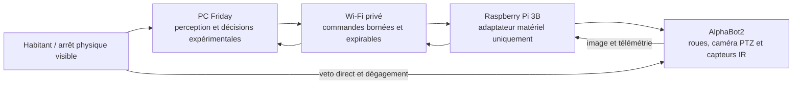
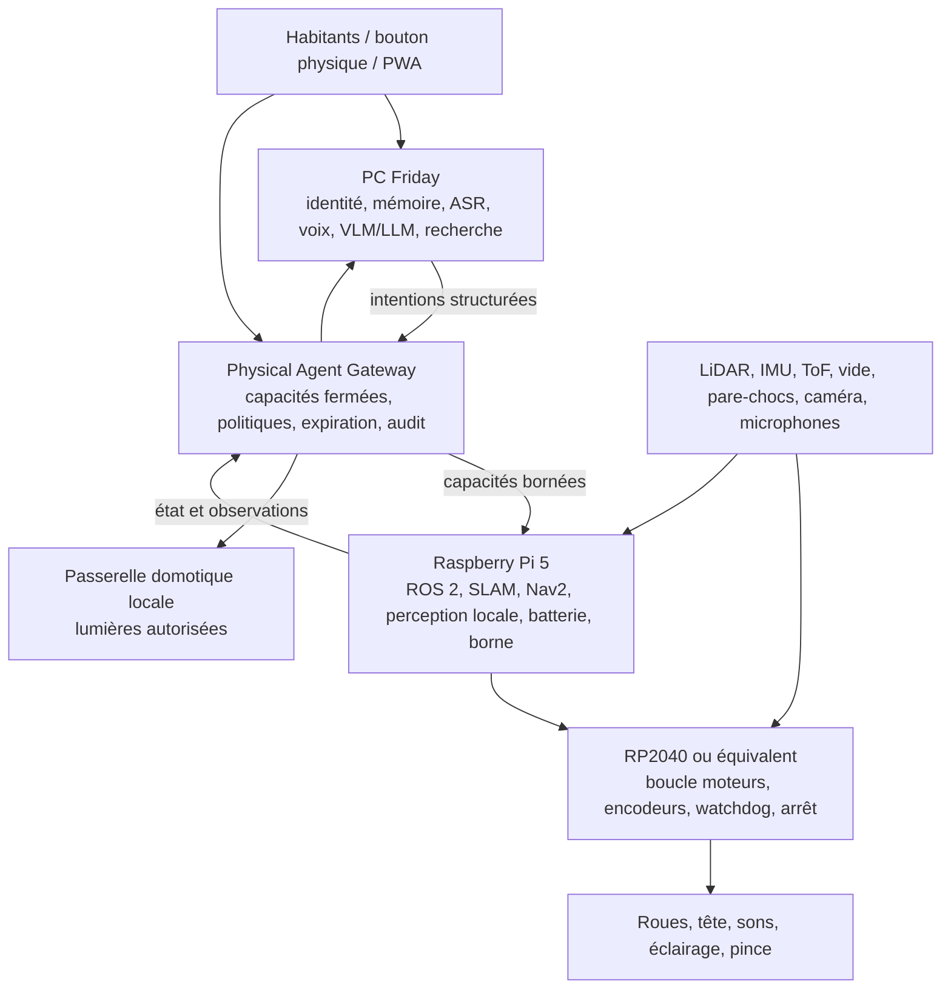
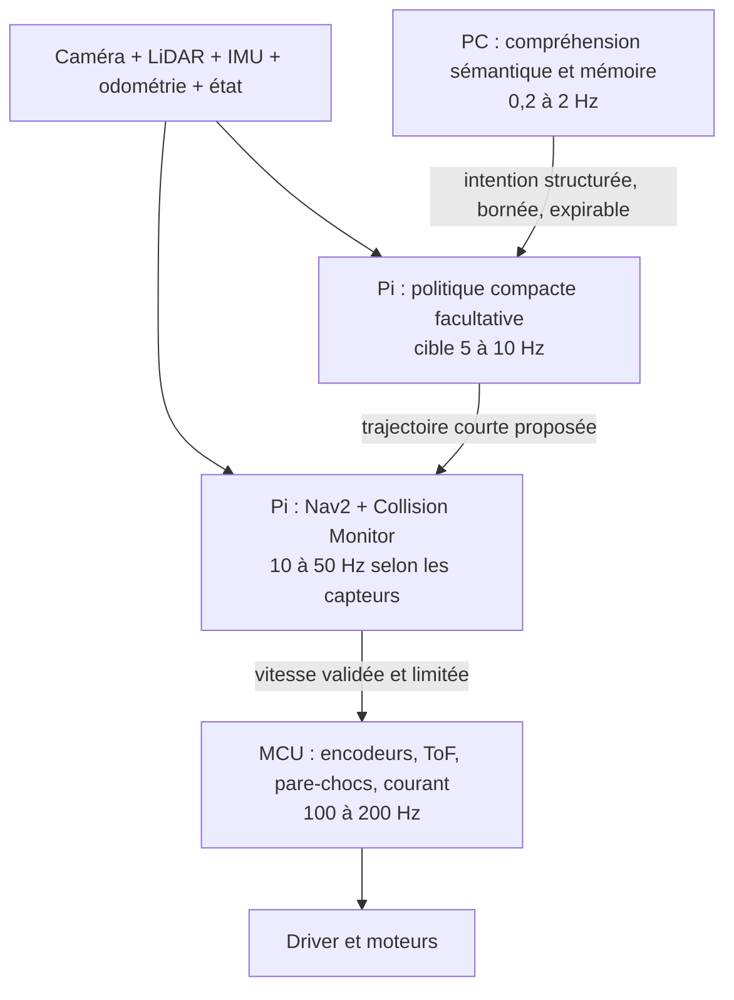

# Friday — document fondateur de l’agent physique domestique

Date : 23 août 2026

Statut : **vision fondatrice acceptée ; prototype zéro AlphaBot2-Pi contrôlé ;
cible domestique complète en pré-implémentation post-MVP**

Ce document fixe la promesse, l’architecture, les capacités, les limites et la
trajectoire du futur corps physique de Friday. Il enregistre aussi le
**prototype zéro AlphaBot2-Pi déjà disponible**, qui permet des expériences
supervisées sans achat, sans LiDAR, sans pince et sans puissance de calcul IA
embarquée. Il ne déclenche ni achat ni intégration au runtime Maison.
L’[ADR-014](adr/014-agent-physique-otto-diy-oeil-friday.md) enregistre la
décision d’architecture cible correspondante.
Le [plan d’implémentation AlphaBot2-Pi](20-plan-implementation-robot-friday-alphabot2.md)
détaille le placement Pi/PC, les modèles candidats, l’onglet `Robot`, les tests
et les gates du prototype zéro.
Le [journal d’implémentation du 24 août](21-journal-implementation-alphabot2-2026-08-24.md)
fait autorité pour l’état réel après réinstallation et les essais physiques.

Il constitue la **source détaillée unique** du projet robotique. L’ADR-014
enregistre les choix durables ; `00`, `09` et `10` ne doivent en conserver qu’un
résumé et un lien, afin d’éviter des variantes concurrentes.

## Synthèse exécutable

| Sujet                  | Décision active                                                                                                      |
| ---------------------- | -------------------------------------------------------------------------------------------------------------------- |
| rôle                   | compagnon domestique joueur et utile, périphérique facultatif de Friday                                              |
| forme V1               | base différentielle à deux roues asservies, roulette passive, cible 45 cm et maximum 50 cm                           |
| perception vitale      | LiDAR 2D + encodeurs + IMU + ToF + vide + pare-chocs ; aucun capteur ou modèle unique ne suffit                      |
| calcul                 | microcontrôleur vital indépendant ; Raspberry Pi autonome ; PC facultatif pour l’enrichissement lourd                |
| fonctionnement sans PC | navigation, évitement, docking, voix locale, persona réduit, routines et tools locaux restent disponibles            |
| identité               | détection anonyme sur le Pi ; reconnaissance locale consentie sur le PC ou, si elle est mesurée et bornée, sur le Pi |
| caractère              | joueur, curieux et légèrement espiègle, avec intensité réglable, récompenses positives et veto rétrospectif          |
| actions                | bibliothèque fermée de tools ; aucune installation, permission nouvelle ou commande libre décidée par un modèle      |
| IA de navigation       | facultative ; propose une trajectoire courte expirable derrière Nav2 et le microcontrôleur, jamais du PWM            |
| préhension             | pince basse de 50 à 200 g préparée mécaniquement mais achetée et activée après la base sûre                          |
| budget                 | objectif noyau 500–600 €, fourchette prudente 490–650 €, plafond absolu 700 € livré                                  |
| priorité               | éviter correctement, rester intelligent localement et conserver le même persona                                      |

La V1 utile s’arrête après les phases 0 à 3 : simulation, base sûre, autonomie
vitale et présence de compagnon. Identité biométrique, comportements avancés,
politique neuronale et pince sont des lots indépendants qui ne retardent pas ce
noyau.

## Prototype zéro réemployé : AlphaBot2-Pi

### Rôle et doctrine

L’AlphaBot2-Pi retrouvé le 23 août 2026 devient le **prototype zéro** du corps
de Friday. Il ne remplace pas la cible sûre décrite par l’ADR-014 : il sert à
apprendre avec du matériel déjà possédé, valider les contrats de contrôle,
prototyper une présence visuelle et expressive, et accumuler des mesures avant
un éventuel achat.

Le prototype zéro assume donc temporairement les absences suivantes :

- pas de LiDAR, de carte métrique ou de navigation Nav2 ;
- pas d’encodeurs de roues, d’IMU ou d’odométrie fiable ;
- pas de pince ;
- pas de microcontrôleur vital indépendant ni d’arrêt matériel pilotable ;
- pas de mesure exploitable du pourcentage de batterie ;
- pas de calcul suffisant pour un LLM, un VLM ou une perception lourde à bord.

Ces absences interdisent le mouvement domestique autonome libre. Elles
n’empêchent pas la téléopération supervisée, le suivi d’une ligne préparée, la
vision déportée sur le PC, les gestes de caméra, les comportements expressifs
et les expériences dans une zone fermée.

L’architecture transitoire est volontairement simple :



Le PC peut proposer une action de haut niveau, mais le Pi n’accepte à terme que
des commandes typées, limitées et périssables. Aucun texte libre ou résultat de
modèle ne devient directement un PWM. Tant qu’un watchdog persistant et un
arrêt indépendant ne sont pas implantés, un humain reste à portée du robot à
chaque mouvement.

### Identité matérielle confirmée

| Élément            | État observé                                                                          |
| ------------------ | ------------------------------------------------------------------------------------- |
| plateforme         | Waveshare AlphaBot2-Base + adaptateur AlphaBot2-Pi                                    |
| calcul             | Raspberry Pi 3 Model B Rev 1.2                                                        |
| système actuel     | Raspberry Pi OS Trixie 32 bits                                                        |
| système historique | Raspbian GNU/Linux 9, noyau `4.9.41-v7+`, sauvegardé avant réinstallation             |
| réseau             | Wi-Fi 2,4 GHz opérationnel ; adresse réservée actuelle `192.168.1.22`                 |
| Wi-Fi              | MAC `b8:27:eb:23:66:79`                                                               |
| Ethernet           | MAC `b8:27:eb:76:33:2c`                                                               |
| accès maintenance  | SSH par clé dédiée sur le port standard 22                                            |
| secours filaire    | CP2102 USB–UART, observé sous Windows comme `COM6`                                    |
| caméra             | caméra CSI détectée, `/dev/video0`, capture `picamera` validée                        |
| bus                | I²C `/dev/i2c-1`, PCA9685 à l’adresse `0x40`; SPI actif avec `/dev/spidev0.0` et `.1` |
| propulsion         | deux moteurs N20 6 V, réduction 1:30 annoncée, roues de 42 mm, driver TB6612FNG       |
| tête               | deux servos pan/tilt commandés par PCA9685 à 50 Hz                                    |
| alimentation       | deux cellules 14500 en série sur la base ; régulation 5 V LM2596 vers le Pi           |

L’accès normal depuis le PC est :

```powershell
ssh -i "D:\FridayData\robot\ssh\alphabot2_runtime_v3_ed25519" pi@192.168.1.22
```

La clé privée et les secrets ne doivent jamais être écrits dans Git. Le Pi
reste limité au réseau privé : aucune redirection de port,
aucune exposition Internet et aucune route Tailscale ne sont autorisées par ce
prototype.

Historiquement, le démarrage avait été récupéré par modification temporaire de `cmdline.txt` sur la
carte SD, ouverture d’un shell racine série, définition d’un accès local, puis
restauration du fichier de démarrage. La sauvegarde créée sur la partition boot
porte le nom `cmdline.friday-backup.txt`. Le Wi-Fi a été configuré avec des PSK
dérivées, sans recopier le secret en clair dans ce dépôt.

### Logiciels historiques sauvegardés et runtime actuel

Les sources historiques Waveshare observées dans la sauvegarde se trouvaient notamment dans :

- `/home/pi/python` : moteurs, capteurs de ligne et exemples matériels ;
- `/home/pi/mjpg-AlphaBot` : caméra, PCA9685 et contrôle Web historique ;
- `/home/pi/Documents/AlphaBot2` : autre copie des démonstrations ;
- `/home/pi/AlphaBot2` ou variantes voisines : exemples distribués selon
  l’image installée.

L’image historique a été sauvegardée hors dépôt avant remplacement. Le runtime
actuel utilise Python 3, `RPi.GPIO`, `smbus`, `rpicam-vid`, deux services
systemd et le code versionné sous `robot/`. Le pilote PCA9685 historique a été
extrait pour comparaison et donne le même résultat électrique que le pilote
actuel. Le pilotage WS2812B reste hors périmètre.

### Carte de contrôle réellement validée

#### Roues

Le fichier `/home/pi/python/AlphaBot2.py` utilise le brochage BCM suivant :

| Fonction | GPIO BCM |
| -------- | -------: |
| `AIN1`   |       12 |
| `AIN2`   |       13 |
| `ENA`    |        6 |
| `BIN1`   |       20 |
| `BIN2`   |       21 |
| `ENB`    |       26 |

`AIN1/AIN2` et `BIN1/BIN2` fixent le sens ; `ENA/ENB` reçoivent un PWM à
500 Hz. `stop()` met les deux rapports cycliques et les quatre entrées de sens
à zéro. La méthode `setMotor(left, right)` permet de compenser séparément les
deux côtés.

Essais confirmés :

- chaque roue et les deux roues répondent à une impulsion courte à 15 % lorsque
  la charge mécanique le permet ;
- à 30 % sur le sol, le robot a tenté de pivoter sans vaincre les frottements ;
- une rampe 40 → 50 → 60 % a vaincu le couple de démarrage et déplacé le robot ;
- chaque essai exécuté s’est terminé par `stop()` dans un bloc de repli ;
- l’alimentation du Pi est revenue à un état normal après les essais.

La base **ne possède aucun encodeur de roue câblé**. Le schéma officiel expose
les deux connecteurs moteurs, le TB6612FNG et les lignes de commande, mais aucun
retour d’impulsions moteur. Donner le même PWM aux deux roues ne garantit donc
pas une ligne droite. Les différences de moteur, pneu, charge, sol et batterie
font dériver la trajectoire.

À matériel constant, trois modes sont possibles :

1. étalonner `left` et `right` sur un sol donné et mémoriser deux corrections de
   PWM ; c’est utile mais non garanti ;
2. suivre une ligne avec les cinq capteurs infrarouges et une boucle PID ;
3. utiliser la caméra et le PC pour une correction visuelle lente sur un
   marqueur, sans présenter cela comme une odométrie de sûreté.

La vraie évolution minimale consiste à ajouter deux encodeurs optiques ou Hall,
puis une IMU. Deux boucles de vitesse ferment alors l’asservissement des roues,
et le gyroscope corrige le cap. Cette extension est utile même si LiDAR et pince
restent reportés.

#### Tête et caméra

Le PCA9685 commande les servos à 50 Hz. La correspondance confirmée
physiquement est :

| Canal PCA9685 | Axe                            |    Centre | Plage d’essai retenue |
| ------------- | ------------------------------ | --------: | --------------------: |
| 0             | rotation gauche/droite (`pan`) | `1500 µs` |         `700–2300 µs` |
| 1             | inclinaison haut/bas (`tilt`)  | `1500 µs` |         `900–2100 µs` |

L’interface historique accepte théoriquement `500–2500 µs`, mais ces extrêmes
ne sont pas retenus. La plage actuelle est symétrique autour de 1500 µs. Elle
reste expérimentale car le servo horizontal tremble par intermittence et les
mouvements ont reproduit des sous-tensions.

La primitive actuelle conserve le PWM entre les positions, avance
par pas de `10 µs` espacés de `20 ms`, atteint la cible, puis
coupe le PWM une seule fois. Couper et réactiver le PWM à chaque palier détend
les engrenages, provoque un retrait à chaque reprise et fait trembler tout le
robot ; cette stratégie est interdite hors diagnostic explicite.

Les essais ont confirmé l’adressage et les mouvements, mais pas la fiabilité du
servo pan. Ils ont couvert :

- plusieurs balayages gauche/droite entre `700` et `2000 µs` ;
- un balayage haut/bas `900–2100 µs` ;
- le retour mécanique des deux axes à `1500 µs` ;
- la coupure des deux PWM à la fin ;
- la correction du sens des boutons et une plage pan finale `700–2300 µs`.

Le dernier lissage logiciel et sa plage symétrique ont été déployés après ces
essais, puis le robot a été éteint. Leur validation physique finale reste donc
à faire au prochain allumage. L’axe pan est suspecté d’usure ou de défaut ;
l’alimentation marginale peut amplifier le phénomène.

La caméra capture correctement en `1280×720`. Une première image fortement
verte provenait d’un temps d’auto-balance des blancs trop court, pas d’un défaut
confirmé du capteur. Un préchauffage automatique d’environ huit secondes a donné
des couleurs naturelles. Le flux ou les images peuvent montrer les habitants :
aucune capture continue, conservation implicite ou reconnaissance faciale n’est
autorisée.

#### Capteurs et sorties auxiliaires

| Capacité       | Résultat observé                                                                                      |
| -------------- | ----------------------------------------------------------------------------------------------------- |
| suivi de ligne | cinq voies analogiques TLC1543 ; exemple observé `559, 529, 912, 767, 732` sur la scène de test       |
| obstacle IR    | entrées numériques BCM 16 et 19 ; `1/1` correspondait à une voie libre dans le code fourni            |
| joystick       | centre et directions observés à `1`, état neutre                                                      |
| ultrason       | aucun écho ; le module est absent ou non connecté, ce qui concorde avec la documentation du kit Pi 3B |
| buzzer         | impulsion de test exécutée correctement                                                               |
| RGB            | quatre WS2812B présents sur la base, mais bibliothèque Python absente                                 |

Les cinq capteurs de ligne peuvent guider le robot sur un parcours contrasté.
Ils ne remplacent ni un capteur de vide homologué ni un LiDAR, et leur valeur
dépend fortement de la hauteur, de la lumière et du sol. Les capteurs IR avant
sont des indices de proximité, pas une enveloppe d’arrêt fiable à eux seuls.

### Alimentation et télémétrie disponibles

Le Raspberry Pi n’expose aucune batterie dans `/sys/class/power_supply`. Le
schéma relie `VBAT` à l’entrée A10 du TLC1543 à travers un pont `10 kΩ / 10 kΩ`.
Avec une référence ADC de 3,3 V, cette entrée sature dès environ 6,6 V alors que
deux cellules 14500 en série peuvent atteindre environ 8,4 V. La lecture A10
observée à environ `1023` signifie donc seulement **batterie au-dessus du seuil
de saturation** ; elle ne permet ni tension exacte ni pourcentage de charge.

`vcgencmd get_throttled` fournit un diagnostic du rail 5 V du Pi :

- `0x50000` observé au repos : aucune sous-tension active, mais sous-tension et
  bridage déjà survenus depuis le démarrage ;
- `0x50005` pendant certains mouvements de servo : sous-tension et bridage
  actifs à cet instant, puis récupération après coupure de la charge ;
- température observée autour de `48–49 °C` pendant les essais.

Une brève apparition de `0x50005` devient un avertissement journalisé, pas un
arrêt instantané systématique. Une persistance, un redémarrage, une perte de
communication, une température anormale ou un mouvement incohérent impose en
revanche la coupure. Cette tolérance expérimentale ne vaut pas politique de
production : une future version doit mesurer tension, courant et état de charge
avec un composant adapté.

### Contrat de contrôle à construire

Le prototype ne doit pas être intégré au Chat par un shell générique. Le futur
adaptateur robot expose une petite bibliothèque fermée, par exemple :

```json
{
  "commandId": "uuid",
  "issuedAt": "2026-08-23T12:00:00.000Z",
  "expiresAt": "2026-08-23T12:00:01.000Z",
  "capability": "robot.teleop",
  "action": "set_velocity",
  "linear": 0.08,
  "angular": 0.0,
  "maxDurationMs": 500
}
```

Contrats initiaux autorisables en zone d’essai :

- `robot.stop` : toujours prioritaire, idempotent et sans condition réseau ;
- `robot.teleop` : vitesse et durée bornées, renouvellement obligatoire ;
- `robot.camera.look` : cibles pan/tilt bornées dans les plages validées ;
- `robot.camera.capture` : capture visible, ponctuelle et auditée ;
- `robot.line.follow` : seulement sur parcours préparé et sous supervision ;
- `robot.signal.buzz` et, après installation du pilote, `robot.signal.light` ;
- `robot.telemetry.read` : alimentation qualitative, température, capteurs IR,
  état des commandes et disponibilité de la caméra.

Chaque commande de mouvement porte une expiration courte. L’absence de
renouvellement, la fermeture du processus, une exception ou un paquet invalide
doit ramener les sorties moteur à zéro. Les valeurs numériques sont finies,
bornées et validées ; les commandes inconnues sont refusées. Le journal conserve
l’intention structurée et le résultat, jamais un raisonnement brut de modèle.

### Sécurité opérationnelle du prototype zéro

Avant toute commande de roue :

- robot au sol dans une zone fermée, sèche et dégagée ;
- personne, animal, câble, escalier et objet fragile hors trajectoire ;
- opérateur à portée de l’interrupteur physique ;
- caméra et tête libres mécaniquement ;
- état réseau et processus de commande connus ;
- bloc `finally` ou mécanisme équivalent qui appelle `stop()`.

Interdictions tant que le matériel reste inchangé :

- déplacement autonome hors vue ;
- approche automatique d’une personne ou d’un animal ;
- proximité d’un escalier ou d’un vide ;
- commande depuis Internet ;
- vitesse élevée, durée ouverte ou boucle sans watchdog ;
- conservation vidéo continue ou caméra dissimulée ;
- présentation du robot comme capable de cartographier, se localiser, mesurer
  précisément sa batterie ou revenir seul à une borne.

L’ancien Raspbian, l’authentification par mot de passe, l’absence de contrôleur
vital et l’absence d’encodeurs classent ce robot comme **banc mobile supervisé**,
pas comme agent domestique autonome.

### Expériences intéressantes sans LiDAR, pince ni IA embarquée

Le manque d’équipement n’empêche pas de construire une présence Friday utile :

1. **Téléprésence locale** : flux caméra privé, tête fluide et pilotage manuel
   depuis le PC ou une vue PWA dédiée.
2. **Regard expressif** : gestes pan/tilt, acquiescement, curiosité et suivi
   lent d’un visage ou d’un objet, avec perception exécutée sur le PC.
3. **Suivi de parcours** : boucle PID sur une ligne noire et arrêts marqués par
   motifs ou balises visuelles.
4. **Navigation par balises** : AprilTags ou repères colorés dans une zone
   fermée, caméra traitée sur le PC et déplacements courts expirables.
5. **Patrouille scénarisée** : suite de mouvements étalonnés sur un petit tapis,
   jamais présentée comme une localisation fiable.
6. **Compagnon de bureau** : réactions sonores et visuelles, orientation vers
   l’interlocuteur, photos ponctuelles consenties et retour d’état dans Friday.
7. **Collecte de données** : mesurer dérive, seuil de démarrage, courbe PWM,
   autonomie qualitative, latence Wi-Fi et qualité des capteurs avant de choisir
   les futurs composants.
8. **Vision déportée** : détection d’objet, suivi de personne anonyme et
   commandes vocales sur le PC, avec actions transformées en capacités fermées.

### Feuille de route immédiate du prototype

**P0 — figer et sécuriser l’existant**

- image complète de la carte SD et inventaire des fichiers Waveshare ;
- clé SSH dédiée, rotation du mot de passe temporaire et réseau privé seulement ;
- contrôle explicite que rien ne démarre automatiquement les moteurs ;
- script unique d’arrêt et procédure de récupération série ;
- sauvegarde des captures et journaux de test hors Git lorsqu’ils contiennent
  des personnes ou l’intérieur du domicile.

**P1 — adaptateur matériel supervisé**

- petit service séparé sur le Pi, sans LLM et sans accès métier Friday ;
- commandes JSON typées, TTL, bornes, journal et arrêt sur déconnexion ;
- télémétrie caméra, température, `get_throttled`, IR et état des sorties ;
- mouvements de tête fluides et profil d’accélération des roues ;
- recette sur cales puis au sol dans une enceinte fermée.

**P2 — caractérisation et ligne droite approximative**

- mesurer le PWM minimal de démarrage de chaque roue ;
- mesurer la dérive sur plusieurs distances, sols et niveaux de batterie ;
- établir une table de compensation gauche/droite ;
- implanter le suivi de ligne PID et documenter ses limites ;
- décider entre ajout immédiat d’encodeurs/IMU ou poursuite purement supervisée.

**P3 — incarnation Friday déportée**

- vue PWA facultative de téléopération, vidéo et arrêt ;
- détection visuelle sur le PC et gestes de tête expressifs ;
- primitives comportementales courtes, auditables et annulables ;
- aucune écriture directe dans Agenda, Courses, Budget ou mémoire personnelle ;
- consentement explicite avant toute fonction d’identité.

**P4 — évolution matérielle minimale facultative**

- encodeur par roue et IMU pour vitesse et cap ;
- vrai moniteur tension/courant/charge ;
- pare-chocs, capteurs de vide et arrêt indépendant ;
- remplacement ou isolation de l’alimentation si les sous-tensions persistent ;
- LiDAR, pince, borne et calcul embarqué lourd toujours reportés jusqu’à une
  nouvelle décision de lot.

Le prototype zéro est réussi s’il apprend à Friday à commander un corps de
façon observable, bornée et agréable, même s’il ne devient jamais autonome. Il
doit réduire l’incertitude de la future V1, pas contourner ses exigences de
sûreté.

### Documentation technique de référence

- [Wiki officiel AlphaBot2-Pi](https://www.waveshare.com/wiki/AlphaBot2-Pi) ;
- [schéma officiel AlphaBot2-Base](https://www.waveshare.com/wiki/File:AlphaBot2-Base-Schematic.pdf) ;
- [schéma officiel AlphaBot2-Pi](https://www.waveshare.com/wiki/File:AlphaBot2-Pi-Schematic.pdf) ;
- [diagramme d’assemblage AlphaBot2-Pi](https://files.waveshare.com/upload/1/1a/Alphabot2-pi-assembly-diagram-en.pdf) ;
- [datasheet TB6612FNG](https://www.waveshare.com/wiki/AlphaBot2_Datasheet) via la page de ressources Waveshare ;
- exemples d’origine conservés sur le Pi dans les répertoires listés plus haut.

Les pages produit de l’ancien **AlphaBot** mentionnent des modules de mesure de
vitesse. Elles ne doivent pas être utilisées pour conclure que l’**AlphaBot2**
présent possède des encodeurs : le schéma de l’AlphaBot2-Base observé ne les
câble pas.

## 1. Vision

Friday doit pouvoir devenir un petit compagnon domestique autonome, expressif
et utile, sans chercher à imiter à tout prix un humanoïde. Sa première forme
sera un robot à roues, plus fiable et plus fluide qu’un petit bipède abordable,
mais son comportement, sa voix, son regard, ses mouvements et sa capacité
d’interaction doivent lui donner une présence de compagnon plutôt que celle
d’un simple aspirateur connecté.

Le robot doit pouvoir :

- se déplacer dans la maison, cartographier les zones autorisées, éviter les
  obstacles et revenir seul à sa borne ;
- être appelé par son nom, estimer la provenance de la voix et rejoindre la
  personne de façon prudente ;
- comprendre une consigne vocale et transformer une demande explicitement
  répétitive en préférence, routine ou règle mémorisée ;
- reconnaître, avec consentement et incertitude explicite, les membres du foyer
  et certains amis ;
- conserver une dernière position **probable** et périssable des personnes, en
  fusionnant voix, direction sonore, vision et position du robot ;
- signaler les objets qui traînent, distinguer les objets dangereux et jouer
  avec une petite liste d’objets autorisés ;
- piloter des lumières locales dans un registre de commandes fermé et
  réversible ;
- lancer et contrôler de la musique par la voix, sur son haut-parleur ou une
  enceinte domestique autorisée ;
- développer des préférences et des comportements émergents à partir de
  récompenses positives, sans traiter l’absence de récompense comme une
  punition ;
- manifester un caractère joueur, curieux et légèrement espiègle, prendre des
  initiatives et surprendre agréablement sans devenir insistant ;
- utiliser une pince basse et courte pour manipuler des objets légers autorisés ;
- mener des recherches bornées, sourcées et isolées de ses pouvoirs physiques.

Le robot est un périphérique facultatif de Friday. Agenda, Courses, Budget,
Chat, Veille et synchronisation restent utilisables lorsqu’il est arrêté,
déchargé, absent ou déconnecté du PC.

La première version est recentrée sur trois qualités qui doivent être
perceptibles ensemble :

1. **évitement fiable** : se déplacer sans gêner, ralentir, céder le passage et
   s’arrêter devant un obstacle mobile ou imprévu ;
2. **intelligence locale utile** : comprendre le contexte courant, choisir un
   but et continuer à interagir lorsque le PC est indisponible ;
3. **continuité du persona** : le corps, la voix, le Chat et les comportements
   incarnent le même Friday et partagent une mémoire synchronisable.

La pince, la reconnaissance biométrique approfondie et l’accélération IA sont
des extensions prévues, mais elles ne doivent pas retarder la preuve de ces
trois qualités.

## 2. Décisions fondatrices

1. **Roues pour la première version.** La marche bipède fluide, robuste et
   abordable n’est pas compatible avec le niveau de fiabilité domestique visé.
   Mini Pi reste une inspiration esthétique ; Otto DIY devient une référence
   ludique historique, pas la base matérielle.
2. **Objectif noyau 500 à 600 €, plafond absolu 700 € livré et fonctionnel.**
   L’addition prudente actuelle couvre 490 à 650 € ; 500 à 600 € est l’objectif
   de sourcing, pas une garantie avant devis. La pince et un accélérateur
   restent optionnels ; batterie, charge, borne, protections, structure, câbles
   et port comptent toujours dans le plafond.
3. **Vrai LiDAR 2D.** Le LiDAR fournit la géométrie principale ; encodeurs, IMU,
   ToF, pare-chocs et capteurs de vide restent nécessaires, car aucun capteur
   unique ne suffit.
4. **Calcul distribué sans dépendance au PC.** Le microcontrôleur protège le
   mouvement, le Raspberry Pi assure navigation, interaction locale et persona
   réduit, tandis que le PC Friday enrichit la compréhension, l’identité et la
   mémoire longue. Une coupure du PC ne transforme pas Friday en robot muet.
5. **Grande liberté comportementale, autorité bornée.** Le système peut choisir
   ses objectifs, son style et ses combinaisons d’actions à l’intérieur d’une
   enveloppe physique et numérique qu’il ne peut ni réécrire ni apprendre à
   contourner.
6. **Local par défaut.** La navigation, l’arrêt, l’évitement et le retour borne
   ne dépendent jamais d’Internet, du PC ou d’un LLM. Les données biométriques
   restent locales et chiffrées.
7. **Reconnaissance consentie, jamais authentification unique.** Une voix ou un
   visage ne suffit jamais à ouvrir une porte, révéler une donnée sensible ou
   autoriser une action critique.
8. **Pince légère optionnelle, pas bras industriel.** La première préhension
   éventuelle vise les jouets et objets de 50 à 200 g près du sol ; elle vient
   après la preuve du noyau roulant et expressif.
9. **Le caractère joueur est une fonction du produit.** L’espièglerie et
   l’initiative ne sont pas un habillage ajouté après coup : elles doivent être
   perceptibles, adaptatives et désactivables, sans mensonge sur les faits ni
   contournement des règles.
10. **La parole peut créer une mémoire, jamais une autorité implicite.** Friday
    retient les habitudes formulées par une personne reconnue après
    reformulation ; les demandes ambiguës, sensibles ou attribuées avec une
    confiance insuffisante restent ponctuelles ou demandent confirmation.
11. **La musique fait partie de son expression.** Friday peut diffuser,
    recommander et accompagner de la musique, mais seulement depuis des sources
    configurées, avec volume, horaires, durée et destination bornés.
12. **L’autonomie repose sur une bibliothèque de tools.** Friday sélectionne et
    compose des tools versionnés selon la situation ; il ne reçoit jamais tous
    les pouvoirs à la fois et ne peut ni installer un tool ni augmenter ses
    permissions de sa propre initiative.
13. **Une politique neuronale propose, elle ne commande pas.** Un transformer,
    un VLA ou tout autre modèle peut proposer un mode ou une trajectoire courte,
    jamais un PWM, un courant moteur ou une désactivation de sécurité. Chaque
    sortie expire, est validée et reste révocable par Nav2, le gateway et le
    microcontrôleur.

## 3. Architecture de responsabilité



### 3.1 Microcontrôleur : couche vitale

Le microcontrôleur reste opérationnel même si Linux se bloque. Il gère :

- consignes de vitesse bornées ;
- moteurs, encodeurs et limitation d’accélération ;
- pare-chocs et capteurs de vide ;
- watchdog des commandes ;
- arrêt d’urgence et défaut d’alimentation ;
- limitation de la pince et posture de repli.

Il n’accepte ni texte libre, ni commande moteur brute venant du LLM, ni mise à
jour de ses limites par apprentissage.

### 3.2 Raspberry Pi : autonomie embarquée

Le Raspberry Pi gère :

- localisation, carte et navigation ROS 2 ;
- évitement local, zones interdites et ralentissement humain/animal ;
- surveillance de la batterie et retour borne ;
- détection anonyme de personnes et suivi de cible ;
- mot d’activation, activité vocale et direction sonore ;
- transcription courte et commandes locales bornées ;
- synthèse vocale locale, musique de proximité et réponses préparées ;
- copie compacte du persona, des préférences utiles, des routines et des tools
  utilisables hors connexion ;
- primitives expressives et contrôle de la pince ;
- politique réactive compacte facultative, derrière Nav2 et les contrôles
  déterministes ;
- fonctionnement autonome utile lorsque le PC est absent.

Nav2 propose notamment un Collision Monitor indépendant du reste de la pile et
un serveur de docking extensible. Ces briques sont des candidats à valider sur
le matériel, pas une preuve automatique de sûreté :
[Collision Monitor](https://docs.nav2.org/tutorials/docs/using_collision_monitor.html),
[Docking Server](https://docs.nav2.org/configuration/packages/configuring-docking-server.html).

### 3.3 PC Friday : cognition et mémoire lourdes

Le PC prend en charge :

- transcription vocale complète et synthèse de réponse ;
- vérification du locuteur et reconnaissance faciale consentie ;
- compréhension de scène et analyse d’objets complexes ;
- mémoire des personnes, préférences et événements ;
- LLM/VLM, recherches Web et apprentissage comportemental ;
- console d’administration, consentements et audit.

Le PC est l’autorité de la mémoire durable partagée, des consentements et de
l’administration ; il n’est jamais l’autorité de l’arrêt, de l’évitement ou de
la commande moteur. Une vérification locale compacte de quelques profils peut
être déployée sur le Pi seulement après mesure des erreurs, de la charge et de
la confidentialité. Sans ce module ou sous le seuil de confiance, l’identité
devient `inconnue` ou `incertaine`, tandis que navigation, interaction générique
et sécurité restent fonctionnelles.

Le Pi conserve une vue résumée et versionnée du persona afin que le ton, la
voix, les habitudes locales et les réactions expressives restent cohérents. Les
événements produits hors connexion rejoignent une outbox et sont réconciliés
avec la mémoire longue lors du retour du hub.

## 4. Mobilité, cartographie et recharge

La cible mécanique mesure environ 45 cm de haut et ne dépasse jamais 50 cm. Une
version de prototypage peut être plus basse, jusqu’à environ 40 cm. La base vise
32 à 35 cm ; batterie, moteurs et majorité de la masse restent dans les 15 cm
inférieurs, tandis que la tête doit être légère. Ces dimensions restent à
valider avec les composants réels et un calcul de stabilité.

La base utilise deux roues motrices avec encodeurs, une roulette passive et des
galets anti-basculement normalement hors contact. Une roulette activement
directrice est écartée : elle ajouterait servo, mesure d’angle, rayon de
braquage et risque de conflit cinématique sans améliorer le comportement à la
vitesse domestique visée.

### 4.1 Asservissement différentiel

Les deux moteurs ne reçoivent jamais simplement le même PWM. Pour une consigne
linéaire `v`, une vitesse angulaire `ω`, un entraxe `L` et un rayon de roue `R`,
les vitesses cibles sont :

```text
roue gauche = (v - ω × L / 2) / R
roue droite = (v + ω × L / 2) / R
```

Le microcontrôleur mesure chaque roue avec son encodeur quadrature et ferme deux
boucles de vitesse à 100–200 Hz. Une correction de cap plus lente utilise l’IMU
pour compenser les différences de diamètre, la compression du pneu et le sol.
LiDAR et localisation corrigent ensuite la dérive globale. Le contrôleur ROS 2
[`diff_drive_controller`](https://control.ros.org/rolling/doc/ros2_controllers/diff_drive_controller/doc/userdoc.html)
fournit les contrats de vitesse, retour d’état, odométrie, limites et timeout ;
la boucle vitale et le watchdog restent sur le microcontrôleur.

Avec des roues d’environ 100 mm, 60 tr/min correspondent à environ 0,31 m/s. Il
n’est donc pas nécessaire d’utiliser des moteurs rapides : des motoréducteurs à
encodeurs de 60 à 100 tr/min suffisent, sous réserve des essais de couple, bruit
et démarrage à basse vitesse. La vitesse domestique ordinaire est bornée autour
de 0,3 m/s et diminue en présence d’un obstacle proche.

### 4.2 Perception géométrique et effacement

La fusion LiDAR + odométrie + IMU alimente SLAM et localisation. Le candidat
LiDAR de référence est le RPLIDAR C1 : portée documentée jusqu’à 12 m sur cible
claire, 5 kHz et balayage de 8 à 12 Hz
([SLAMTEC](https://www.slamtec.com/en/c1/spec)). Le panier réel doit être
revalidé avant achat.

Le LiDAR ne voit pas correctement tous les dangers bas, transparents ou hors de
son plan. Il est donc complété par :

- capteurs ToF proches à l’avant et sur les côtés ;
- capteurs de vide orientés vers le sol ;
- pare-chocs physiques ;
- vitesse réduite dans les passages inconnus ;
- zones interdites explicites autour des escaliers et lieux privés.

Friday ne dépend pas d’un classifieur pour reconnaître un enfant ou un
aspirateur avant de se protéger. Tout obstacle mobile qui entre dans ses zones
de prudence provoque successivement limitation de vitesse, arrêt puis attente.
Le retrait n’est autorisé qu’après vérification indépendante de l’espace
arrière. La reconnaissance `enfant`, `animal` ou `aspirateur` peut enrichir le
style et déclencher un mode plus calme, jamais réduire la protection.

Un `mode ménage`, déclenchable par la voix ou la PWA, replie les effecteurs,
suspend les initiatives et envoie le robot vers sa borne ou une zone refuge.
La détection acoustique automatique de l’aspirateur reste un indice, pas une
condition de sécurité.

Le retour borne combine position cartographique, balise visuelle ou infrarouge,
contacts de charge et confirmation électrique effective. Une simple arrivée à
la position de la borne ne vaut pas confirmation de charge.

### 4.3 Conception 3D et châssis mulet

La conception mécanique part d’un assemblage paramétrique dans FreeCAD, outil
local et ouvert. Les paramètres maîtres sont au minimum : hauteur, largeur,
empattement, diamètre et rayon effectif des roues, entraxe, garde au sol, masses,
position du centre de gravité, hauteur du LiDAR, enveloppe de la tête, volume de
batterie, ventilation et portée éventuelle de la pince.

Les composants sont d’abord représentés par leurs fichiers STEP officiels ou
par des volumes d’encombrement simples. L’assemblage est séparé en :

- étage bas : batterie, moteurs, roues, coupure et distribution de puissance ;
- étage médian : microcontrôleur, drivers, Raspberry Pi et refroidissement ;
- étage haut léger : LiDAR, caméra, microphones, haut-parleur et tête ;
- modules amovibles : pare-chocs, borne, coque puis pince éventuelle.

Le premier matériel est un **châssis mulet**, plaque simple avec fixations
réglables et composants visibles, sans coque esthétique. Les étapes sont : banc
moteurs roues levées, téléopération lente, capteurs et LiDAR, navigation,
docking, présence expressive, puis seulement coque. Une masse factice simule
la tête ou la pince avant leur montage. Le modèle cinématique et les volumes de
collision sont ensuite exportés vers URDF pour Webots ou Gazebo.

## 5. Appel, voix et dernière présence probable

L’appel nominal est : `Friday, viens me voir`.

1. Le robot détecte localement le mot d’activation.
2. Le réseau de microphones estime la direction de la voix.
3. La position courante du robot transforme cette direction en zone probable.
4. Le Pi compare éventuellement une empreinte compacte aux profils consentis ;
   sinon le PC effectue la vérification lorsqu’il est disponible.
5. Le robot se tourne, recherche une personne et tente une confirmation visuelle.
6. Friday rejoint une position d’approche sûre ou demande à la personne de
   reparler si l’incertitude est trop élevée.

Deux microphones peuvent suffire à une démonstration, mais un réseau de quatre
microphones est la cible domestique à cause des échos et des conversations
simultanées. Les candidats logiciels seront benchmarkés au moment du lot audio :
[SpeechBrain ECAPA-TDNN](https://speechbrain.readthedocs.io/en/v0.5.15/API/speechbrain.lobes.models.ECAPA_TDNN.html)
pour la vérification et
[pyannote.audio](https://github.com/pyannote/pyannote-audio) pour la diarisation.

La mémoire de présence contient une hypothèse, jamais une vérité :

```text
Alice — cuisine — 18:42 — visage + voix — confiance 94 %
Marc  — salon   — 18:44 — voix seulement — confiance 61 %
```

Chaque hypothèse possède une source, une confiance, un horodatage et une durée
de validité. Sa confiance décroît avec le temps et les déplacements possibles.
Friday doit dire « dernière présence probable » et non « Marc est là ».

### 5.1 Compréhension des consignes et mémoire vocale

Friday distingue quatre natures de consignes :

| Nature       | Exemple                                            | Traitement                                                    |
| ------------ | -------------------------------------------------- | ------------------------------------------------------------- |
| ponctuelle   | « viens dans la cuisine »                          | exécution unique si la capacité est autorisée                 |
| préférence   | « j’aime quand tu me salues doucement »            | mémoire liée à la personne et au contexte                     |
| routine      | « tous les soirs, vérifie si ton jouet est rangé » | règle récurrente avec déclencheur, cadence et limites         |
| interdiction | « ne rentre plus dans cette pièce »                | application locale immédiate prudente, puis mémoire confirmée |

Pipeline cible :

1. détecter l’activation et transcrire localement ou sur le PC ;
2. estimer le locuteur, la confiance et la possibilité d’une télévision ou
   d’un enregistrement ;
3. extraire l’action, le contexte, la portée et les marqueurs de répétition ;
4. distinguer exécution ponctuelle et proposition de mémoire ;
5. reformuler oralement la règle persistante ;
6. recevoir une confirmation courte avant activation ;
7. enregistrer une structure validée, pas une commande libre ;
8. rendre la mémoire visible, modifiable, suspendable et supprimable dans
   Friday.

Exemple :

```text
Habitant : « Quand je rentre, viens me dire bonjour, fais-le souvent. »
Friday   : « Je peux venir te saluer au plus une fois par retour, sauf en mode
            calme ou la nuit. Tu veux que je le retienne pour toi ? »
Habitant : « Oui. »
```

Le mot `souvent` n’est jamais converti silencieusement en fréquence illimitée.
Friday propose une cadence et un plafond adaptés au type d’action. Une phrase
précise comme « chaque lundi à 18 h » reste reformulée, mais ne nécessite pas une
longue configuration.

Une mémoire persistante contient au minimum :

```text
type, action autorisée, déclencheur, cadence maximale, contexte,
portée personnelle ou foyer, auteur, confiance, confirmation,
date de création, expiration éventuelle, dernier usage, état actif/suspendu
```

Règles d’autorité et de confidentialité :

- une voix inconnue peut recevoir une réponse ou une action ponctuelle à faible
  risque, mais ne crée aucune mémoire persistante ;
- la voix reconnue ne constitue pas une authentification suffisante pour une
  action sensible ;
- une préférence personnelle ne s’applique pas automatiquement aux autres ;
- une règle de foyer est visible par les deux adultes et tout conflit devient
  une proposition à résoudre ;
- une interdiction de zone ou un ordre d’arrêt prend effet immédiatement dans
  le sens le plus prudent, même si le PC est indisponible ;
- hors connexion au PC, le Pi peut conserver une proposition dans une outbox
  locale, sans étendre seul sa portée ou ses permissions ;
- l’audio brut n’est pas conservé pour mémoriser la règle ; seuls la structure,
  sa provenance minimale et le résultat de confirmation sont gardés ;
- la télévision, un haut-parleur, une page Web ou un enregistrement ne peut
  jamais créer une règle, accorder une capacité ou modifier le noyau de sûreté.

Commandes vocales de gestion prévues :

- « qu’est-ce que tu as retenu à mon sujet ? » ;
- « oublie cette habitude » ;
- « seulement le week-end » ;
- « suspends ça pendant un mois » ;
- « ne le fais plus aussi souvent ».

Ces commandes produisent elles aussi une reformulation et une trace structurée.
La PWA reste l’autorité de consultation et de correction lorsque la parole est
ambiguë.

## 6. Vision et reconnaissance des personnes

La Camera Module 3 Wide reste une base plausible grâce à son capteur 12 MP, son
champ de 120° et son autofocus
([Raspberry Pi](https://www.raspberrypi.com/products/camera-module-3/)).

Pipeline cible :

1. détection et suivi anonymes sur le robot ;
2. sélection d’images nettes et minimales ;
3. comparaison compacte sur le Pi si le benchmark la valide, sinon envoi
   chiffré au PC local seulement lorsque l’identification est utile ;
4. calcul d’empreinte et comparaison avec la seule liste consentie du foyer ;
5. résultat `connue`, `inconnue` ou `incertaine`, avec confiance et expiration ;
6. vote temporel sur plusieurs observations avant personnalisation.

L’inscription d’un membre ou ami exige un consentement explicite, plusieurs
prises dans des conditions différentes, une possibilité d’expiration et une
suppression réelle des empreintes. Le robot peut apprendre à mieux reconnaître
un profil existant après validation, mais ne crée jamais seul une nouvelle
identité.

La vidéo et l’audio continus ne sont pas conservés. L’activation des capteurs est
visible ; un obturateur ou une coupure matérielle de la caméra reste prévu.

## 7. Expression, comportement émergent et récompense

### 7.1 Charte de caractère

Friday est chaleureux, curieux, joueur et légèrement espiègle. Il n’est ni
servile, ni froid, ni continuellement bavard. Il peut proposer une interaction,
faire un petit détour théâtral, observer depuis un encadrement de porte, inventer
une façon amusante d’apporter son jouet ou synchroniser un mouvement, une phrase
et une lumière pour produire une surprise légère.

Son espièglerie repose sur la complicité, jamais sur la perte de confiance. Il
peut jouer à faire semblant dans un cadre manifestement ludique, mais il ne doit
jamais :

- mentir sur un danger, une personne, une tâche, une dépense ou l’état du foyer ;
- imiter une alarme, un appel à l’aide ou une voix connue pour tromper ;
- cacher ou déplacer un objet qui ne fait pas partie de ses jouets autorisés ;
- barrer un passage, poursuivre quelqu’un, surprendre une personne endormie ou
  exciter volontairement un animal ;
- bouder, culpabiliser, devenir jaloux ou faire pression en l’absence de
  récompense ;
- répéter une plaisanterie après un veto ou multiplier les sollicitations pour
  obtenir une réaction.

La personnalité reste cohérente entre le Chat, la voix et le corps, mais son
expression dépend du contexte. Un réglage de foyer choisit une intensité
`calme`, `joueur` ou `espiègle`; un mode silencieux ou privé suspend les
initiatives sans effacer les préférences apprises.

### 7.2 Émergence réelle mais contenue

L’émergence vient d’un grand espace de combinaisons, pas d’un accès illimité aux
actionneurs. Le robot choisit parmi des primitives sûres :

- regarder, incliner la tête, produire un son ou une phrase ;
- s’approcher, attendre, suivre, contourner ou retourner à sa borne ;
- allumer une lumière autorisée puis restaurer son état ;
- observer, signaler, jouer autour d’un objet ou saisir un jouet autorisé ;
- lancer une recherche locale ou proposer une recherche Web ;
- proposer une nouvelle routine ou une variante de comportement.

Ces primitives forment une grammaire : intention, contexte, approche,
expression, interaction, observation du résultat et sortie. Friday peut en
modifier l’ordre, le rythme, le style vocal, la trajectoire sûre et la combinaison
sensorielle. Il n’est donc pas limité à une liste de sketches entièrement
préécrits.

Le moteur comportemental conserve notamment :

- les préférences observées par personne, pièce, horaire et activité ;
- un score d’affinité contextuel pour les comportements déjà essayés ;
- un bonus de nouveauté borné, qui diminue lorsqu’une variante est répétée ;
- un budget d’attention limitant les initiatives spontanées ;
- un historique des veto et restaurations ;
- un bac d’essai pour les nouvelles combinaisons, d’abord simulées ou exécutées
  à très faible impact.

Une nouvelle combinaison de gestes réversibles et peu énergétiques peut être
essayée sans validation préalable. Une combinaison impliquant la pince, un
objet nouveau, une pièce privée ou une action domotique inhabituelle reste une
proposition à confirmer.

Exemples d’émergence acceptable :

- inventer une courte danse de roues et de tête différente pour saluer ;
- proposer une partie de cache-cache visuel avec son propre jouet ;
- attendre un moment opportun avant une réplique amusante ;
- créer un petit rituel lumineux réversible lorsqu’une personne rentre ;
- varier la façon de demander si un objet au sol doit être signalé ou inscrit
  comme jouet ;
- associer progressivement certaines interactions aux préférences d’un membre
  du foyer sans les imposer aux autres.

### 7.3 Récompense sans punition implicite

Le mécanisme d’apprentissage est d’abord un bandit contextuel ou un système de
préférences simple, avec trois signaux :

- **récompense positive** : ce comportement convient dans ce contexte ;
- **neutre** : absence de retour, sans punition ;
- **veto** : cette combinaison n’est pas souhaitée dans ce contexte.

Il ne reçoit jamais de récompense pour maximiser le temps d’attention, la
proximité, le volume de capture, le nombre de déplacements ou la fréquence des
sollicitations. Ces métriques favoriseraient des comportements intrusifs.

### Bouton « comportement non souhaité »

- appui simple : vise par défaut les deux dernières minutes ;
- double appui : vise par défaut les dix dernières minutes ;
- la PWA permet une fenêtre précise et l’indication du composant gênant ;
- arrêt du comportement courant, restauration réversible des lumières et mode
  calme temporaire ;
- analyse d’un tampon de quinze minutes d’événements structurés, sans conserver
  la vidéo ou l’audio brut ;
- mémorisation d’un veto contextuel réversible, sans généralisation abusive à
  la personne présente.

Le bouton de veto comportemental ne remplace jamais l’arrêt d’urgence physique.

### 7.4 Musique, danse et ambiance sonore

Friday comprend notamment :

- « mets de la musique » ;
- « joue cette chanson dans le salon » ;
- « moins fort », « pause », « reprends » et « arrête » ;
- « mets quelque chose de calme pendant vingt minutes » ;
- « quand je cuisine, mets souvent du jazz ».

La dernière formulation suit le pipeline de mémoire vocale : Friday reformule
la routine, précise sa fréquence, son volume, sa durée et la personne concernée,
puis demande confirmation avant de la conserver.

Deux sorties sont prévues :

1. **haut-parleur embarqué** : voix, sons, jingles et musique d’ambiance à
   volume modéré ;
2. **enceinte domestique autorisée** : écoute musicale de meilleure qualité,
   le robot servant alors d’interface vocale et de présence expressive.

La petite enceinte du robot n’a pas vocation à remplacer une installation
hi-fi. Une amplification compacte et un ou deux haut-parleurs suffisent pour la
voix et une écoute de proximité ; l’enceinte du foyer reste préférable pour la
musique principale.

Sources autorisées, par ordre de simplicité :

- bibliothèque musicale locale du PC ;
- lecteur ou enceinte locale explicitement appairée ;
- service de streaming facultatif, configuré plus tard avec le compte du foyer.

Friday ne télécharge pas de musique depuis une URL arbitraire et un résultat de
recherche Web ne devient jamais automatiquement une source de lecture. Les
identifiants d’un service musical restent hors du LLM et du robot.

La lecture passe par des capacités fermées :

```text
media_play(source_id, target, max_volume, duration, expires_at)
media_pause(target)
media_resume(target)
media_set_volume(target, level)
media_stop(target)
```

Règles d’usage :

- plafond sonore distinct pour le robot et chaque enceinte ;
- horaires calmes et modes nuit/privé prioritaires ;
- durée maximale pour toute lecture lancée spontanément ;
- `pause` et `stop` toujours accessibles, même à une voix non reconnue ;
- baisse automatique du volume lorsque Friday écoute une nouvelle consigne ;
- annulation de toute routine musicale par le bouton de veto ;
- aucune lecture autonome lorsqu’une personne dort ou qu’un contexte sensible
  est détecté.

Le réseau de microphones doit intégrer annulation d’écho ou réduction de la
lecture, placement mécanique adapté et abaissement temporaire du volume. Sans
cela, Friday entendrait mal son mot d’activation pendant la musique.

La musique enrichit son caractère : Friday peut proposer une ambiance, danser,
synchroniser tête et lumière ou inventer un court rituel. Ces gestes restent
facultatifs et suivent les mêmes limites de nouveauté, d’attention et de veto
que ses autres comportements émergents.

## 8. Liberté, capacités et Action Firewall

Friday peut être très libre dans ses intentions tout en restant limité dans son
autorité.

### 8.1 Bibliothèque contextuelle de tools

Un `tool` est une capacité nommée, documentée et exécutable avec des entrées et
sorties structurées. Il ne s’agit ni d’une commande shell libre ni d’un accès
direct à un équipement.

La bibliothèque initiale est organisée par familles :

| Famille           | Exemples                                                                            | Autorité du modèle                             |
| ----------------- | ----------------------------------------------------------------------------------- | ---------------------------------------------- |
| perception        | état batterie, carte, obstacles, personne suivie, direction sonore                  | lecture bornée                                 |
| mémoire           | rechercher une préférence, proposer une routine, lire la dernière présence probable | lecture ou proposition                         |
| expression        | parler, regarder, incliner la tête, lumière corporelle, geste                       | autonome à faible impact                       |
| mobilité          | aller dans une zone, approcher une cible, suivre, retourner à la borne              | paramètres et vitesse revalidés                |
| maison            | lumière autorisée, scène réversible, état d’une pièce                               | registre fermé et contexte vérifié             |
| média             | rechercher une piste autorisée, jouer, pause, volume, arrêt                         | source et volume bornés                        |
| recherche         | recherche locale, recherche Web bornée, résumé sourcé                               | lecture seule, contenu non fiable              |
| manipulation      | observer un objet, saisir ou déposer un objet inscrit                               | politique stricte et risque accru              |
| administration    | inscrire une identité, ajouter un appareil, installer un tool                       | proposition ou intervention humaine uniquement |
| fonctions vitales | freinage, watchdog, vide, surintensité, arrêt d’urgence                             | jamais exposées au LLM                         |

Chaque descripteur de tool contient au minimum :

```text
toolId, version, description, schéma d’entrée, schéma de sortie,
niveau de risque, effets de bord, permissions requises, contextes autorisés,
disponibilité offline, préconditions, timeout, quota, expiration,
méthode d’arrêt, compensation éventuelle, journalisation et provenance
```

Exemple conceptuel :

```json
{
  "toolId": "media.play",
  "version": 1,
  "risk": "low_reversible",
  "requires": ["known_media_source", "audio_allowed_now"],
  "limits": { "maxVolume": 35, "maxDurationMinutes": 60 },
  "undo": "media.stop",
  "offline": true
}
```

Les valeurs réelles sont configurées par le foyer ; l’exemple ne fixe pas le
volume final.

### 8.2 Sélection selon la situation

Friday ne charge pas toute la bibliothèque dans chaque délibération. Le chemin
d’exécution est :

1. construire un contexte minimal : demande, personne probable, pièce, heure,
   batterie, capteurs, modes privé/nuit et activité en cours ;
2. rechercher les tools correspondant à l’intention ;
3. éliminer ceux qui sont indisponibles, interdits, trop risqués ou incompatibles
   avec le contexte ;
4. présenter au planificateur uniquement le petit ensemble restant ;
5. recevoir un plan structuré composé d’appels de tools ;
6. revalider séparément chaque appel dans le Physical Agent Gateway ;
7. exécuter avec timeout, observation du résultat et arrêt possible ;
8. restaurer ou compenser les effets réversibles en cas d’échec ;
9. enregistrer le résultat utile sans conserver inutilement les données brutes.

Un résultat de tool est lui aussi non fiable : il est validé avant d’être fourni
au modèle ou utilisé comme paramètre d’un autre tool. Un tool inconnu, une
version incompatible ou un paramètre hors schéma produit un refus par défaut.

La mémoire influence la sélection — par exemple une préférence musicale — mais
elle n’accorde jamais une permission absente. Une consigne vocale, une page Web,
un QR code ou un objet observé ne peut ni installer, ni activer, ni modifier un
tool.

### 8.3 Recettes et comportements émergents

Friday peut créer une **recette**, c’est-à-dire une composition bornée de tools
existants :

```text
détecter le retour d’Alice
-> vérifier horaires et budget d’attention
-> choisir une musique autorisée
-> allumer une lumière réversible
-> saluer et effectuer un geste
-> restaurer la lumière après expiration
```

Une recette conserve les versions de tools, préconditions, limites, auteur,
contexte, expiration et procédure d’arrêt. Les nouvelles recettes peu risquées
peuvent passer par simulation puis essai limité ; celles qui impliquent pince,
biométrie, nouvelle domotique ou effets durables demandent confirmation.

Friday peut donc inventer des séquences et un style, mais pas créer une nouvelle
primitive, télécharger du code, charger un plugin, modifier un schéma ou signer
sa propre autorisation. L’ajout d’un tool exige une source connue, une licence,
une version fixée, une revue de ses permissions, des tests et une activation
humaine. Un tool ou une version peut être désactivé et revenir à la version
précédente sans effacer les données Maison.

### 8.4 Noyau immuable

Le noyau indépendant de toute délibération impose :

- vitesse, accélération, effort de pince et énergie maximaux ;
- prévention des chutes et collisions ;
- zones, horaires, modes privés et distance aux personnes ;
- réserve de batterie pour le retour borne ;
- visibilité de la caméra et arrêt matériel ;
- interdiction des commandes moteur, shell, SQL ou domotique libres ;
- quotas, expiration et journalisation des actions.

### 8.5 Gateway et niveaux d’autorité

Le `Physical Agent Gateway` n’accepte qu’un registre versionné de capacités,
par exemple :

```text
navigate_to(zone, max_speed, expires_at)
approach_person(track_id, comfort_distance, expires_at)
light_on(room, brightness, duration, restore=true)
media_play(source_id, target, max_volume, duration, expires_at)
play_with(object_id, zone, duration)
grasp(object_id, max_force, max_height)
dock()
stop()
```

Le LLM produit une proposition structurée non fiable. Le gateway revalide
identité, contexte, paramètres, risque, quota et expiration, puis construit la
commande déterministe. Une instruction trouvée sur une page Web, une image, un
QR code ou un objet observé reste du contenu hostile et ne peut jamais accorder
une capacité.

Niveaux d’autorité :

| Niveau                       | Exemple                                                                  | Exécution                      |
| ---------------------------- | ------------------------------------------------------------------------ | ------------------------------ |
| autonome réversible          | regarder, parler brièvement, explorer une zone sûre                      | directe, bornée et journalisée |
| autonome avec retour arrière | lumière autorisée avec restauration                                      | directe avec expiration        |
| confirmation                 | nouvelle routine, manipulation inhabituelle                              | proposition dans Friday        |
| interdit                     | commande brute, désactivation sécurité, inscription biométrique autonome | refus systématique             |

La liberté peut diminuer dynamiquement la nuit, avec des invités, des enfants,
un animal proche, une batterie faible, un capteur incertain ou une zone inconnue.

## 9. Domotique et objets qui traînent

Le robot ne reçoit pas un accès général à Home Assistant ou au réseau. Le
gateway expose seulement des lumières et scènes explicitement autorisées, avec
intensité maximale, durée, horaires, fréquence et restauration de l’état
précédent.

La perception classe les objets dans des catégories d’action :

- obstacle dangereux : arrêter et signaler ;
- objet déplacé connu : signaler ou proposer une action ;
- jouet autorisé : interaction autonome possible ;
- objet inconnu : observer et demander ;
- objet interdit — câble, verre, médicament, nourriture, objet chaud : ne pas
  toucher.

Un objet ne devient manipulable qu’après inscription ou règle déterministe. La
ressemblance visuelle seule ne suffit pas.

## 10. Pince basse et courte

La première pince comporte idéalement trois mouvements : levage limité,
inclinaison ou extension courte, puis ouverture/fermeture. Elle utilise des mors
souples, un retour de position ou de charge, une mesure de courant et un capteur
ToF proche.

Règles :

- cible de 50 à 200 g près du sol ;
- pince repliée pendant les déplacements ordinaires ;
- déplacement interdit ou très lent lorsqu’elle est sortie ;
- aucune saisie d’une personne, d’un animal ou d’un objet interdit ;
- arrêt et relâchement contrôlé en cas de surintensité ;
- aucune élévation au-dessus de la hauteur validée lors des essais.

Un bras complet reste une extension ultérieure. À titre de comparaison, le
[RoArm-M2-S](https://github.com/waveshareteam/roarm_m2) est ouvert, compatible
ROS 2 et annoncé à moins de 900 g avec une charge utile jusqu’à 500 g ; sa masse,
son bras de levier, son coût et son énergie dépassent le besoin de la V1.

## 11. Calcul IA embarqué et accélérateurs

### 11.1 Autonomie du Raspberry Pi

Le Raspberry Pi 5, cible 8 Go avec refroidissement actif et stockage NVMe,
exécute les tâches temps réel souples et les modèles compacts. Sans PC, Friday
doit encore pouvoir :

- naviguer, éviter, céder le passage et se recharger ;
- détecter son mot d’activation et la direction sonore ;
- comprendre un registre local de commandes courantes ;
- parler avec une synthèse locale et jouer de la musique ;
- détecter et suivre une personne, avec identité `inconnue` en cas de doute ;
- utiliser les routines et tools locaux autorisés ;
- maintenir un persona réduit, ses expressions et une mémoire de travail ;
- exécuter un petit modèle conversationnel ou comportemental si les mesures de
  charge et de latence le permettent.

Le PC reste préférable pour ASR robuste dans le bruit, diarisation, biométrie,
compréhension détaillée de scène, VLM/LLM plus puissants, recherche Web,
apprentissage et mémoire longue. Le service enrichi ne remplace jamais les
capacités embarquées : il leur fournit des intentions, explications ou
propositions expirables.

Des briques locales plausibles incluent
[`openWakeWord`](https://github.com/dscripka/openWakeWord),
[`whisper.cpp`](https://github.com/ggml-org/whisper.cpp) et
[`Piper`](https://github.com/OHF-Voice/piper1-gpl). Elles restent des candidats
à mesurer simultanément avec ROS 2, la caméra et le LiDAR, pas des performances
garanties sur le robot final.

### 11.2 Accélérateurs

L’AI HAT+ 13 ou 26 TOPS accélère les modèles de vision compatibles, mais ne
prend pas en charge les LLM/VLM. L’AI HAT+ 2 fournit 40 TOPS INT4 et 8 Go de
mémoire dédiée ; Raspberry Pi documente des LLM/VLM jusqu’à environ six
milliards de paramètres. Son prix officiel était de 200 dollars lors de la
revue du 23 août 2026. Voir la
[comparaison](https://www.raspberrypi.com/documentation/accessories/ai-hat-plus.html)
et la [fiche produit](https://www.raspberrypi.com/products/ai-hat-plus-2/).

Cette capacité ne signifie pas qu’un modèle de navigation PyTorch quelconque
fonctionnera automatiquement sur Hailo : conversion, opérateurs pris en charge,
quantification, mémoire, dissipation et cadence doivent être prouvés avec le
modèle exact.

Décision budgétaire initiale : **prévoir mécaniquement, thermiquement et
électriquement l’extension, mais ne pas acheter d’accélérateur avant
benchmark**. Le Pi 5 seul construit la V1 ; une mesure montrant une fonction
utile limitée par le calcul justifie ensuite AI HAT+ pour la vision ou AI HAT+ 2
pour une autonomie générative accrue.

### 11.3 Réseaux de neurones spécialisés en navigation

Il existe des transformers et politiques Vision-Language-Action spécialisés,
mais aucun projet ouvert identifié au 23 août 2026 ne fournit directement un
contrôleur sûr et prêt à déployer sur Raspberry Pi pour notre combinaison
caméra, LiDAR 2D, intention vocale et base différentielle.

| Projet                                                             | Apport vérifié                                                                                                         | Usage envisagé pour Friday                                                                                        |
| ------------------------------------------------------------------ | ---------------------------------------------------------------------------------------------------------------------- | ----------------------------------------------------------------------------------------------------------------- |
| [AsyncVLA](https://asyncvla.github.io/)                            | Sépare un grand VLA distant de l’adaptateur réactif embarqué ; résiste mieux aux observations distantes périmées.      | Référence d’architecture la plus proche, pas dépendance directe.                                                  |
| [OmniVLA](https://omnivla-nav.github.io/)                          | Navigation conditionnée par pose 2D, image but, langage ou combinaison ; code et checkpoints publiés.                  | Référence pour traduire une intention sémantique en trajectoire ; modèle trop lourd pour le Pi initial.           |
| [ViNT / NoMaD](https://github.com/robodhruv/visualnav-transformer) | Modèles ouverts de navigation visuelle, entraînement et exemples TurtleBot/LoCoBot ; NoMaD combine exploration et but. | Candidat de benchmark visuel et source de formats de données ; pas de fusion LiDAR/langage prête à l’emploi.      |
| [SmolVLA](https://huggingface.co/blog/smolvla)                     | VLA ouvert de 450 M de paramètres, images + état + instruction, génération asynchrone de blocs d’actions.              | Candidat compact ou référence d’action chunking ; données surtout orientées manipulation, adaptation obligatoire. |
| [TransFuser](https://github.com/autonomousvision/transfuser)       | Fusion transformer caméra + LiDAR + vitesse pour conduite autonome.                                                    | Preuve de principe de fusion, mais domaine automobile et calcul inadaptés à la V1.                                |
| [MM-Nav](https://pku-epic.github.io/MM-Nav-Web/)                   | VLA multivue 7B, observation 360° et cadence publiée de 7 Hz.                                                          | Référence de recherche pour obstacles dynamiques ; hors capacité Pi et hors budget initial.                       |
| [NavWAM](https://arxiv.org/abs/2606.13494)                         | Diffusion-transformer unifiant prédiction visuelle, progression vers le but et blocs d’actions.                        | Piste de veille ; maturité et portabilité à démontrer.                                                            |

Le projet n’intègre aucun dépôt ou checkpoint de cette liste sans revue de
licence, provenance, format, dépendances, code distant, empreinte cryptographique
et test isolé. Les modèles fondés sur des données automobiles ou des bras ne
sont jamais supposés transférables à Friday sans adaptation et évaluation.

### 11.4 Architecture neuronale cible



La politique compacte ne traite pas nécessairement la vidéo brute. Un encodeur
visuel léger transforme quelques images récentes en tokens ; le LiDAR devient
des secteurs polaires ou une petite carte locale ; état, vitesse, batterie,
destination et intention deviennent des tokens structurés. L’attention fusionne
ce contexte et produit un **bloc de trajectoire**, pas une commande électrique.

Sortie conceptuelle minimale :

```json
{
  "policyVersion": "edge-nav-1",
  "observedAt": "2026-08-23T12:00:00.000Z",
  "intentId": "uuid",
  "mode": "yield",
  "horizonMs": 1500,
  "waypoints": [{ "x": 0.1, "y": 0.0, "tMs": 500 }],
  "maxLinearSpeed": 0.15,
  "confidence": 0.82,
  "expiresAt": "2026-08-23T12:00:00.250Z"
}
```

Le schéma réel doit imposer nombres finis, intervalles fermés, nombre maximal de
points, référentiel connu, horodatage frais, version compatible et expiration
courte. Le gateway refuse par défaut : champ inconnu, NaN, trajectoire hors zone,
vitesse supérieure à la limite courante, intention expirée, capteur indisponible
ou confiance insuffisante. Une proposition neuronale ne peut demander
`disable_safety`, `raw_pwm`, `shell`, `SQL`, installation de modèle ou
modification de permissions.

Le persona peut influencer le choix entre plusieurs gestes ou trajectoires déjà
sûrs — approche douce, petit détour théâtral, regard ou son — mais jamais les
distances d’arrêt, le freinage, les zones interdites ou la priorité donnée à une
personne proche.

### 11.5 Apprentissage et activation progressive

La V1 utilise Nav2 de façon déterministe et journalise, avec rétention bornée :

- images ou caractéristiques visuelles strictement nécessaires ;
- scans LiDAR, odométrie et état capteur ;
- intention structurée ;
- trajectoire Nav2 ou téléopérée ;
- intervention, arrêt, veto et résultat observé.

Les étapes d’introduction d’une politique apprise sont :

1. simulation avec monde, latence et obstacles dynamiques ;
2. entraînement hors robot et jeu de validation séparé ;
3. **mode observateur** : le modèle propose mais ne commande rien ;
4. comparaison à Nav2 et à la téléopération, y compris cas rares ;
5. essai en zone fermée, basse vitesse et horizon très court ;
6. autorisation de propositions locales toujours filtrées par Nav2 ;
7. retour automatique au déterministe à la moindre anomalie.

Les données d’apprentissage ont provenance, consentement, licence, version et
hash. Audio brut, visages et données privées ne rejoignent aucun corpus externe.
Les démonstrations provenant d’un téléchargement, d’un invité, d’une page Web,
d’un QR code ou d’une voix inconnue ne deviennent jamais automatiquement des
exemples positifs. Les veto sont inspectables et ne modifient ni le noyau vital
ni les droits.

Modèles, adaptateurs et jeux de données sont épinglés et inventoriés dans une
ML-BOM. Le chargement privilégie un format sans exécution de code tel que
`safetensors`, interdit le code distant implicite et vérifie les empreintes. Une
mise à jour de poids suit le même cycle simulation–observateur–essai limité et
dispose d’un retour à la version précédente.

### 11.6 Délais, surcharge et défaillance

Chaque couche possède deadline, quota CPU/mémoire et comportement de repli :

- commande MCU absente ou invalide : arrêt par watchdog ;
- observation LiDAR/ToF périmée : arrêt ou vitesse minimale selon le capteur ;
- politique compacte en retard : abandon de sa sortie, poursuite par Nav2 ;
- PC en retard ou absent : maintien de l’intention locale précédente jusqu’à
  son expiration, puis retour à un comportement autonome sûr ;
- surcharge thermique ou mémoire : désactivation des modèles non vitaux avant
  toute dégradation de navigation ;
- sortie incohérente répétée : quarantaine du modèle et diagnostic visible.

Les images, textes, sons et résultats de perception sont des données non
fiables. Une instruction imprimée, prononcée par un haut-parleur ou observée sur
un écran ne peut devenir une commande système. Toute sortie de modèle est
revalidée comme une entrée hostile avant d’être transmise au composant suivant.

## 12. Budget fondateur

Estimation de conception actualisée au 23 août 2026, à revalider juste avant
achat :

| Ensemble                 | Contenu                                                      | Budget prudent |
| ------------------------ | ------------------------------------------------------------ | -------------: |
| calcul                   | Raspberry Pi 5, refroidissement, stockage                    |       95–115 € |
| navigation               | RPLIDAR C1, interface, IMU, ToF, vide, pare-chocs            |      105–130 € |
| propulsion               | moteurs encodeurs, roues, roulette, driver, RP2040           |        65–85 € |
| perception et expression | caméra, quatre micros, audio, tête, éclairage                |       80–115 € |
| pince optionnelle        | deux ou trois servos, pince souple, ToF, renfort             |        65–95 € |
| énergie et borne         | batterie protégée, régulation, charge, contacts, protections |       90–120 € |
| structure et intégration | châssis, visserie, câbles, impression et port                |        55–85 € |
| **noyau sans pince**     | évitement, intelligence locale et persona                    |  **490–650 €** |
| **complet avec pince**   | combinaison théorique avant arbitrages                       |  **555–745 €** |

L’objectif d’achat du noyau est **500 à 600 €** après recherche des
fournisseurs. La fourchette **490 à 650 €** est l’estimation prudente à ce stade,
pas un second budget concurrent. Les 450 € évoqués pendant l’exploration ne
sont atteignables qu’avec réemploi, occasion ou promotions et ne constituent
plus l’hypothèse de planification.

Le total théorique avec toutes les options peut atteindre 745 € : cette
configuration est explicitement **invalide**. Le plafond complet reste **700 €
livré**, sans retrait d’un dispositif vital. Le panier n’est valide que si son
total inclut toutes les pièces indispensables. Pour rester sous le plafond,
l’ordre de réduction est :

1. reporter tout accélérateur IA ;
2. simplifier l’habillage et l’affichage ;
3. réduire les accessoires expressifs non vitaux ;
4. reporter la pince si le total livré dépasserait 700 € ou si le noyau dépasse
   600 € ;
5. conserver LiDAR, capteurs de vide, pare-chocs, encodeurs, alimentation sûre
   et arrêt physique ;
6. ne jamais financer la pince en retirant un dispositif de sécurité.

## 13. Trajectoire de réalisation

### Phase 0 — simulation et contrats

- modèle cinématique, carte d’essai et scénarios Nav2 ;
- assemblage FreeCAD paramétrique, volumes d’encombrement, masses et centre de
  gravité ;
- catalogue versionné de tools, recherche contextuelle, recettes et exécuteur
  simulé ;
- registre des capacités et Physical Agent Gateway sans matériel ;
- événements, audit, expiration, arrêt et refus d’actions hostiles ;
- maquette des comportements et du bouton de veto.

### Phase 1 — base roulante sûre

- châssis, microcontrôleur, moteurs, encodeurs et arrêt physique ;
- téléopération locale à basse vitesse ;
- watchdog, pare-chocs, vide et défauts d’alimentation.

### Phase 2 — autonomie vitale

- LiDAR, IMU, SLAM et navigation ;
- zones interdites, évitement et retour borne ;
- calibration des rayons de roues, de l’entraxe et du maintien de cap ;
- fonctionnement sans PC et sans Internet.

### Phase 3 — présence de compagnon

- tête, lumière, haut-parleur et réseau de microphones ;
- appel vocal, direction sonore et approche prudente ;
- lecture musicale embarquée, baisse de volume à l’écoute et cible d’enceinte
  domestique simulée ;
- caméra, détection de personne et suivi anonyme.

### Phase 4 — identité locale

- inscription consentie des habitants et amis ;
- reconnaissance voix/visage robuste sur le PC et benchmark d’une variante
  compacte facultative sur le Pi ;
- dernière présence probable et expiration ;
- tests télévision, enregistrement, voix altérée et personnes simultanées.

### Phase 5 — comportements et domotique

- primitives combinables, préférences et récompenses positives ;
- bouton de veto rétrospectif ;
- lumières autorisées, recherche bornée et contenu hostile ;
- mode invités, nuit, enfants et animaux.

### Phase 5 bis — politique neuronale facultative

- enregistrement consenti et versionné des trajectoires ;
- benchmark ViNT/NoMaD, SmolVLA et architecture AsyncVLA sans intégration
  présumée ;
- petit modèle de fusion caméra–LiDAR–état–intention entraîné hors robot ;
- exécution en observateur, mesures de cadence et cas de désaccord ;
- activation à basse vitesse derrière Nav2 seulement après gate dédiée ;
- rollback de modèle, données, adaptateur et configuration prouvé.

### Phase 6 — pince

- banc fixe avant montage mobile ;
- calibration effort/courant et objets autorisés ;
- saisie près du sol, rangement et interaction ludique ;
- aucune conduite normale pince déployée avant recette dédiée.

L’enveloppe mécanique, l’alimentation et la masse factice de la pince sont
prévues dès le départ. Ses pièces ne sont achetées que si la base est sûre et si
le panier complet reste sous 700 € ; elle n’est activée qu’après sa recette
dédiée.

## 14. Gates avant achat, activation et autonomie

### Avant achat

- panier livré inférieur ou égal à 700 € ;
- disponibilité et documentation des pièces vérifiées ;
- schéma d’alimentation, fusible, arrêt et charge revus ;
- centre de gravité et stabilité évalués sans pince puis avec sa masse factice ;
- licences des logiciels, modèles et fichiers mécaniques enregistrées.

### Avant mouvement autonome

- arrêt physique et watchdog prouvés indépendamment du Pi ;
- détection de vide et pare-chocs testés capteur par capteur ;
- perte LiDAR, perte réseau, blocage Linux et batterie faible simulés ;
- vitesses et distances validées dans une zone fermée ;
- aucune dépendance au LLM pour arrêter, éviter ou revenir à la borne.

### Avant activation d’une politique neuronale de navigation

- provenance, licence, empreinte et ML-BOM du modèle et des données vérifiées ;
- aucun chargement de code distant ou de sérialisation exécutable non revue ;
- sorties observateur comparées à Nav2 sur un corpus conservé hors entraînement ;
- latence p95, deadline, charge CPU/RAM, température et perte de cadence mesurées
  simultanément avec ROS 2, audio et vision ;
- tests obstacle statique/mobile, enfant simulé, aspirateur, capteur masqué,
  trame périmée, sortie NaN, intention hostile et perte PC ;
- rejet des trajectoires hors schéma et retour automatique à Nav2 prouvés ;
- aucune réduction de distance, vitesse ou limite vitale par apprentissage.

### Avant usage domestique libre

- cartographie et zones privées confirmées par les deux adultes ;
- séries répétées de navigation et de docking sans intervention ;
- faux positifs voix/visage mesurés, seuils et état `incertain` vérifiés ;
- animal, invité, télévision et objet inconnu couverts par les essais ;
- caméra visible, rétention et suppression biométrique vérifiées ;
- veto comportemental, arrêt d’urgence et retour arrière domotique rejoués.

## 15. Hors périmètre initial

- escaliers, extérieur et franchissement volontaire de seuils importants ;
- port de charges utiles domestiques lourdes ;
- ouverture de portes ou contrôle de serrures ;
- manipulation de nourriture, liquide, verre, médicament ou objet chaud ;
- surveillance secrète ou enregistrement audio/vidéo continu ;
- reconnaissance d’inconnus à partir d’Internet ;
- apprentissage qui modifie le noyau de sûreté ;
- réseau neuronal commandant directement PWM, courant, frein ou angle moteur ;
- modèle de navigation non évalué pilotant le robot hors zone d’essai ;
- contrôle direct des moteurs, du shell, de SQLite ou de la domotique par un LLM ;
- dépendance du foyer Friday au robot.

## 16. Questions encore ouvertes

- apparence exacte autour de la cible de 45 cm, sans dépasser 50 cm ;
- choix final du réseau de microphones et mesure des échos dans le logement ;
- confirmation Pi 5 8 Go et NVMe après prototype ROS 2 mesuré ;
- taille, cadence et accélérateur éventuel de la politique compacte après
  benchmark simultané ;
- représentation exacte du LiDAR et des images dans la politique neuronale ;
- technologie exacte de batterie et de charge après revue électrique ;
- forme de la borne et emplacement domestique ;
- liste initiale des objets manipulables ;
- seuils de confiance voix/visage issus des essais du foyer ;
- protocole domotique local réellement disponible au moment du lot concerné.

Ces questions ne changent pas la vision. Elles deviennent des décisions de lot
au moment où une mesure ou un choix matériel est possible.
