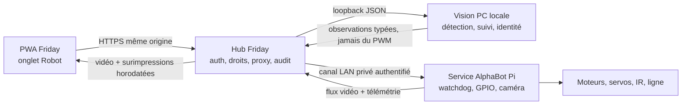

# Plan d’implémentation — Robot Friday sur AlphaBot2-Pi

Date : 24 août 2026 ; état actualisé le 25 août 2026

Statut : **plan directeur en cours d’exécution ; R0/R1 livrés, R2/R3/R4
partiellement recettés sur le matériel réel, aucune autonomie domestique
autorisée**

État au 24 août 2026 : le Pi a été sauvegardé puis réinstallé, l’accès SSH par
clé, le service Python, le watchdog, la passerelle hub, l’onglet PWA, le flux
CSI, les capteurs passifs et les servos de tête sont déployés. La production
cible désormais uniquement le mode `alphabot2`, avec roues et servos désactivés
au démarrage puis contrôlés par des switchs explicites. La locomotion manuelle
réelle, les diagonales, la puissance et le trim sont implantés, sans mesure
finale de ligne droite. Le servo pan tremble par intermittence et des
sous-tensions ont été observées. La première étape R5 est livrée avec YOLO26s
ONNX isolé sur le PC ; suivi, cartographie, évitement, identité et cognition
restent à réaliser. L’état présent est dans le
[checkpoint](22-checkpoint-robot-alphabot2-2026-08-24.md), la chronologie dans
le [journal](21-journal-implementation-alphabot2-2026-08-24.md) et les opérations
dans le [runbook](runbooks/robot-alphabot2.md).

Documents d’autorité :

- [19-document-fondateur-agent-physique-friday.md](19-document-fondateur-agent-physique-friday.md) ;
- [ADR-014](adr/014-agent-physique-otto-diy-oeil-friday.md).

## 1. Résultat recherché

L’AlphaBot2-Pi réemployé devient le premier corps de Friday. Il doit permettre
de maîtriser, dans cet ordre :

1. l’arrêt, les moteurs, la tête, la caméra et les capteurs existants ;
2. la téléopération locale depuis un onglet `Robot` de la PWA ;
3. la caractérisation de la locomotion et le suivi de ligne ;
4. la détection d’objets et de personnes, le suivi anonyme et les gestes de
   regard ;
5. la reconnaissance consentie des profils du foyer ;
6. des comportements courts, observables et annulables ;
7. une cognition Friday capable de proposer une intention sans jamais
   commander directement les moteurs.

Le succès de ce prototype n’est pas de reproduire sans LiDAR la future V1. Son
succès est de fournir une téléprésence agréable, une perception utile et une
maîtrise mesurée du corps tout en identifiant précisément les limites à lever.

## 2. Verdict matériel et placement du calcul

### 2.1 Matériel actuel

Le prototype confirmé contient un Raspberry Pi 3 Model B Rev 1.2 avec 1 Go de
RAM, une caméra CSI, deux moteurs sans encodeurs, deux servos pan/tilt, deux
capteurs IR avant et cinq capteurs de ligne. Il n’a ni LiDAR, ni IMU, ni capteur
de vide qualifié, ni télémétrie de batterie exacte, ni contrôleur vital
indépendant.

Des sous-tensions ont déjà été observées lors de mouvements de servo. Ajouter
du calcul ou un accélérateur sur le rail actuel avant une revue d’alimentation
est donc interdit.

### 2.2 Placement retenu pour l’Alpha

| Fonction                           |   Pi 3B embarqué |               PC Friday | Motif                                                        |
| ---------------------------------- | ---------------: | ----------------------: | ------------------------------------------------------------ |
| arrêt, watchdog, PWM moteurs       |          **oui** |                     non | la perte réseau doit arrêter le corps                        |
| servos pan/tilt                    |          **oui** |         consigne bornée | mouvement fluide proche du matériel                          |
| lecture IR et ligne                |          **oui** |              télémétrie | fréquence et latence déterministes                           |
| acquisition et encodage caméra     |          **oui** |               réception | éviter les images brutes par GPIO/réseau inutilement         |
| suivi de ligne PID                 |          **oui** |             supervision | boucle locale courte, sans modèle IA                         |
| détection objets/personnes         |    non au départ |                 **oui** | Pi 3B trop contraint pour flux + contrôle + inférence fiable |
| suivi anonyme multi-image          |    non au départ |                 **oui** | état temporel et diagnostic centralisés                      |
| détection/reconnaissance de visage |    non au départ |                 **oui** | biométrie, chiffrement et consentement restent sur le PC     |
| description sémantique/VLM         |              non | **oui, ponctuellement** | trop lente et jamais nécessaire à l’évitement                |
| compréhension, persona et mémoire  | non dans l’Alpha |                 **oui** | continuité avec Friday sans charger le Pi                    |

Le Pi est donc un **adaptateur matériel temps court** et le PC un **coprocesseur
de perception et cognition**. La coupure du PC laisse l’arrêt et le contrôle
local du corps fonctionnels, mais retire la reconnaissance et les comportements
visuels avancés.

### 2.3 Où résident les modèles et les données

- Modèles PC : `D:\FridayData\robot\models`, hors Git,
  accompagnés d’un manifeste contenant origine, licence, hash SHA-256, format,
  classes, prétraitement, seuils et résultats de benchmark.
- Vision active : Worker Node distinct construit avec le hub, utilisant ONNX
  Runtime CPU. Le processus principal ne fait ni prétraitement ni inférence et
  ne reçoit que des observations validées. Un service loopback séparé reste une
  option future si un autre runtime l'exige, pas l'architecture livrée.
- Modèles embarqués futurs : `/var/lib/friday-robot/models`, uniquement après
  copie administrative explicite et vérification du hash ; aucun téléchargement
  automatique ou code distant.
- Empreintes faciales : chiffrées sur le PC, séparées des images et des comptes
  d’authentification. Le Pi ne conserve ni nom ni empreinte durable.
- Images : aucune conservation par défaut. Une capture de diagnostic exige une
  action explicite, une destination hors Git et une suppression prévue.
- Journaux : état, latence, classe, score et décision ; jamais de flux vidéo ou
  d’image implicite.

### 2.4 Évolutions de calcul à évaluer, sans achat immédiat

1. **Conserver Pi 3B + PC**, solution de référence de l’Alpha et premier
   benchmark obligatoire.
2. **Raspberry Pi AI Camera**, candidat embarqué le plus cohérent : MobileNet
   SSD et PoseNet sont exécutés dans le capteur IMX500. La documentation cible
   Pi 4/5 et indique que d’autres Pi à connecteur caméra peuvent être adaptés ;
   la compatibilité exacte du Pi 3B actuel doit donc être prouvée sur banc.
3. **Coral USB**, candidat secondaire : testé officiellement sur Pi 3B+ et Pi 4,
   pas sur notre 3B exact ; l’USB 2, la puissance et la pérennité logicielle
   doivent être mesurés avant toute décision.
4. **Pi 4**, envisageable seulement après validation mécanique et alimentation
   séparée 5 V/3 A. Le GPIO est rétrocompatible, mais l’adaptateur Waveshare est
   officiellement destiné au Pi 3 et les sous-tensions actuelles interdisent un
   échange direct.
5. **Pi 5 + AI HAT+**, hors Alpha : alimentation 5 V/5 A recommandée,
   refroidissement, câble caméra et montage à reprendre. L’AI HAT+ exige le Pi 5
   et ne peut pas être empilé naïvement avec l’adaptateur AlphaBot2-Pi.

Décision : aucun accélérateur avant les mesures du pipeline PC, de la latence
Wi-Fi et de l’alimentation. Un accélérateur n’est justifié que si une capacité
utile doit survivre à la coupure du PC ou si la latence mesurée l’exige.

### 2.5 Test décisif : le Pi 3B peut-il garder un modèle léger ?

Le Pi 3B peut techniquement exécuter certains modèles TFLite/ONNX très légers.
La question n’est pas de réussir une image isolée, mais de rester stable pendant
la caméra, le réseau, les servos, les capteurs et le watchdog. Un benchmark
embarqué est donc conservé dans R5, après sécurisation de l’alimentation :

- MobileNet SSD quantifié à `300×300` ou candidat comparable ;
- visage YuNet quantifié à résolution réduite, sans reconnaissance d’identité ;
- caméra 640×480 et télémétrie matérielle actives simultanément ;
- mesure FPS, p50/p95, CPU, mémoire, température, `get_throttled`, pertes
  d’images et retard maximal de la boucle watchdog ;
- essai de 30 minutes, puis mouvements de tête courts pendant l’inférence.

Le modèle peut rester sur le Pi seulement si le watchdog ne dépasse jamais son
budget, qu’aucune sous-tension active n’apparaît, que la température reste dans
la plage décidée et que la capacité obtient au moins 3 détections/s utiles. Même
en cas de réussite, ce modèle sert à conserver une détection grossière lorsque
le PC manque ; il ne devient pas le système d’évitement. En cas d’échec, le Pi
reste exclusivement adaptateur et le pipeline PC demeure la solution finale.

### 2.6 Capacités annexes du corps retrouvé

| Capacité             | Alpha actuelle                       | Évolution prévue                                                           |
| -------------------- | ------------------------------------ | -------------------------------------------------------------------------- |
| voix entrante        | aucun microphone robot confirmé      | microphone PC/PWA d’abord, réseau de micros seulement dans un lot matériel |
| parole               | buzzer uniquement                    | TTS sur PC vers petit haut-parleur après revue alimentation                |
| expression lumineuse | 4 WS2812B présents, pilote absent    | pilote local borné, couleurs/animations courtes                            |
| énergie              | seuil ADC saturé, pas de pourcentage | état qualitatif seulement, puis vrai moniteur tension/courant              |
| appel de Friday      | possible depuis la PWA/PC            | orientation tête, puis approche uniquement après capteurs minimaux         |
| mémoire/persona      | PC Friday                            | aucun secret ou profil durable sur le Pi de l’Alpha                        |

## 3. Architecture cible du prototype

### 3.1 Fréquences de responsabilité

- sorties moteur et arrêt local : 20 à 50 Hz sur le Pi ;
- expiration d’une commande : 350 à 500 ms maximum ;
- renouvellement pendant un appui : environ 150 à 200 ms ;
- capteurs IR/ligne : fréquence mesurée puis fixée, cible 20 Hz minimum ;
- vidéo livrée : 640×480 à 15 images/s ;
- détection PC : cible 5 images/s minimum, suivi léger entre deux détections ;
- identité : 1 à 2 évaluations/s seulement lorsqu’un visage stable est présent ;
- VLM/description : ponctuel, sur demande ou événement, jamais dans une boucle
  de mouvement.

### 3.2 Chemin d’une commande humaine

1. L’utilisateur authentifié ouvre `Robot` et voit l’état réel.
2. Il active volontairement le switch `Roues` ; la PWA arme alors la conduite
   pour 60 secondes au plus et renouvelle à 45 secondes tant que la page reste
   visible.
3. Un appui maintenu envoie des impulsions lentes, identifiées et expirables.
4. Le hub vérifie session, origine, schéma, horodatage, autorité et débit.
5. Le Pi revalide les mêmes bornes et transforme la direction en rampe PWM.
6. Relâchement, sortie d’onglet, perte réseau, exception ou expiration appelle
   `stop()`.
7. Le Pi remet les sorties à zéro même si le hub ou la PWA disparaît.

Les commandes physiques ne passent jamais par l’outbox offline, ne sont jamais
rejouées, ne sont jamais mises en cache par le service worker et ne sont jamais
retentées après leur expiration.

## 4. Capacités de perception et cognition

### 4.1 Pipeline temps réel initial

1. capture d’une image horodatée et numérotée ;
2. correction couleur et redimensionnement ;
3. détection objets/personnes ;
4. suivi anonyme avec identifiants éphémères (`personne 1`, `objet 3`) ;
5. détection de visage uniquement si le mode personnes est autorisé ;
6. comparaison biométrique uniquement pour les profils consentants ;
7. production d’une observation JSON bornée ;
8. association de l’observation à l’image pour la surimpression ;
9. expiration rapide de toute observation non rafraîchie.

Une étiquette vue dans une image, un QR code, un écran ou un texte détecté est
une donnée hostile. Elle ne peut jamais devenir une instruction ou accorder une
capacité.

### 4.2 Modèles candidats et rôle exact

| Besoin                      | Candidat de départ                                         | Emplacement Alpha           | Usage                                                 |
| --------------------------- | ---------------------------------------------------------- | --------------------------- | ----------------------------------------------------- |
| objets/personnes génériques | MobileNet SSD ou PP-PicoDet exporté ONNX                   | PC                          | benchmark rapidité/précision avant choix final        |
| visage présent              | YuNet quantifié                                            | PC                          | boîte et points du visage, sans identité              |
| identité consentie          | SFace ou alternative dont la licence des poids est validée | PC                          | empreinte locale, résultat `connu/inconnu/incertain`  |
| suivi                       | ByteTrack ou suivi géométrique comparable                  | PC                          | identité anonyme temporaire entre images              |
| pose humaine                | modèle léger facultatif                                    | PC, puis AI Camera possible | geste et orientation, jamais authentification         |
| objets propres au foyer     | modèle affiné ou embeddings visuels                        | PC, phase tardive           | seulement après corpus autorisé et validation séparée |
| description de scène        | VLM Friday déjà hébergé sur PC                             | PC, à la demande            | texte explicatif, jamais évitement ni moteur          |

Le choix final n’est pas fait sur une démonstration publique. Chaque poids doit
avoir licence, provenance, hash et corpus de validation local documentés. Les
poids SFace et certains checkpoints tiers nécessitent notamment une
clarification de redistribution/provenance avant intégration durable.

### 4.3 Reconnaissance des personnes

Trois niveaux sont séparés :

1. `personne détectée` : aucune biométrie ;
2. `personne suivie anonymement` : identifiant volatil, supprimé après perte ;
3. `profil probablement reconnu` : consentement enregistré, plusieurs images
   d’enrôlement, score supérieur au seuil et possibilité `inconnu/incertain`.

La reconnaissance ne déverrouille rien, ne remplace jamais Better Auth et ne
suffit jamais à autoriser une action. Le réglage permet l’enrôlement, la pause,
la consultation des profils consentants et la suppression réelle de
l’empreinte.

### 4.4 Objets et « personnages »

Le détecteur générique sait reconnaître des classes courantes, pas chaque objet
personnel. Une tasse particulière, un jouet précis ou un animal précis exige un
apprentissage ou une empreinte visuelle séparée. L’interface doit donc afficher
la différence entre :

- classe : `tasse`, `chaise`, `personne`, `chat` ;
- instance suivie : `tasse 2`, temporaire ;
- identité apprise : `tasse bleue de la cuisine` ou profil humain, seulement
  après enrôlement explicite.

### 4.5 Cognition Friday complète

La cognition est une chaîne de décisions, pas un modèle unique :

1. perception structurée et périssable ;
2. état courant du corps, de la caméra et des permissions ;
3. intention humaine ou comportement autorisé ;
4. plan court composé uniquement de primitives enregistrées ;
5. validation déterministe par le Physical Agent Gateway ;
6. exécution d’une primitive à la fois ;
7. observation du résultat, arrêt ou étape suivante ;
8. journal explicable et veto utilisateur.

Le LLM/persona peut proposer `regarder_personne`, `saluer`, `photographier` ou
`avancer_impulsion`. Il ne produit ni GPIO, ni PWM, ni URL, ni shell, et il ne
peut ni armer la conduite ni étendre ses droits. Durant l’Alpha, toute
locomotion issue de la cognition requiert une confirmation humaine immédiate.

## 5. Locomotion, évitement et localisation spatiale

### 5.1 Ce qui est possible maintenant

- impulsions manuelles lentes et expirables ;
- rotation approximative ;
- ligne droite compensée pour un sol et un niveau de batterie donnés ;
- suivi d’une ligne contrastée par PID ;
- arrêt indicatif sur obstacle vu par l’un des deux IR avant ;
- repères AprilTag ou colorés dans une enceinte d’essai ;
- correction visuelle lente depuis le PC.

### 5.2 Ce qui n’est pas possible de façon fiable

- vitesse métrique fermée ou distance parcourue exacte ;
- cap absolu et odométrie ;
- carte domestique générale et retour borne ;
- distance fiable à un obstacle depuis une seule caméra ;
- détection sûre des objets noirs, transparents, très bas ou hors champ ;
- protection d’un escalier ;
- déplacement autonome hors vue.

### 5.3 Politique d’évitement

La reconnaissance d’objet n’est jamais la barrière vitale. Le robot n’a pas
besoin de savoir si l’obstacle est un enfant, un chat ou un carton pour
s’arrêter.

- Niveau 0 actuel : expiration des commandes, arrêt sur déconnexion et IR avant
  local. Ce niveau reste expérimental car Linux et les capteurs actuels sont des
  points uniques de défaillance.
- Niveau 1 Alpha : vision PC utilisée pour ralentir ou refuser une nouvelle
  impulsion, jamais pour garantir l’arrêt.
- Niveau 2 minimal recommandé : deux encodeurs, IMU, pare-chocs, capteurs de
  vide et plusieurs ToF proches ; contrôleur indépendant pour l’arrêt.
- Niveau 3 future V1 : LiDAR et navigation de sûreté telle que définie par
  l’ADR-014.

Une profondeur monoculaire ou un flux optique peut être benchmarké en mode
observateur, mais ne devient pas un capteur de distance de sûreté.

### 5.4 Localisation sans LiDAR

La localisation contrôlée la plus réaliste pour l’Alpha est :

1. caméra calibrée ;
2. AprilTags fixes dont les poses sont connues ;
3. estimation de pose près d’un tag ;
4. déplacements très courts entre repères ;
5. perte de repère = arrêt, jamais navigation à l’aveugle.

Le suivi de ligne peut fournir un chemin ; des tags aux intersections donnent
un identifiant de zone. Cette solution est utile pour apprendre le pipeline,
mais ne remplace pas une localisation continue dans la maison.

## 6. Onglet `Robot` dans Friday

### 6.1 Structure de l’écran

L’onglet devient une septième destination principale, sans bouton `+` métier.
À 360 px, l’écran se compose verticalement de :

1. état `Indisponible`, `Connecté`, `Armé`, `En mouvement` ou `Arrêt requis` ;
2. vidéo 4:3 montrant le capteur 640×480 sans recadrage ;
3. case unique `Reco` pour afficher ou masquer toutes les détections ;
4. commandes de tête compactes sous la vidéo ;
5. joystick elliptique, puissance, trim et arrêt sous l’image ;
6. télémétrie repliable et indicateurs `Cartographie`/`Autonome` à venir.

La barre de navigation à sept entrées devra être testée à 360 px. Si les
libellés ne restent pas lisibles, le choix prévu est une barre horizontale
défilable avec destination active toujours ramenée dans le champ, pas une
réduction illisible de la police.

### 6.2 Vidéo et surimpressions

Le candidat livré expose une seule case `Reco`. Les catégories techniques
ci-dessous restent des capacités de contrat ou des lots futurs, et non des
cases distinctes dans l'interface :

- `Objets` : boîtes, classe et confiance ;
- `Personnes` : boîtes et identifiants anonymes ;
- `Identités` : nom probable ou `Inconnu/Incertain`, seulement avec consentement ;
- `Suivi` : cible active et trajectoire courte à l’écran ;
- `Sécurité` : zones proches, état IR, blocage de mouvement ;
- `Repères` : identifiant et pose estimée des AprilTags ;
- `Diagnostic` : FPS capture/détection, latence, âge de l’observation et taille
  d’image.

Les coordonnées sont normalisées de `0` à `1` et portent `frameId`, dimensions
et horodatage. La PWA dessine sur un `canvas` superposé à la vidéo et retire
toute boîte expirée. La surimpression ne doit jamais sembler appartenir à une
image plus récente que l’observation.

Le premier flux est MJPEG, simple et inspectable. La cible initiale est
640×480 à 15 images/s. WebRTC n’est ajouté que si le benchmark montre une
latence insuffisante ; il ne doit pas précéder la maîtrise du watchdog.

### 6.3 Commandes de tête

- quatre petits boutons et bouton centre ;
- pression courte = incrément borné ; aucun maintien répétitif automatique ;
- position normalisée dans l’UI, conversion en microsecondes uniquement sur le
  Pi ;
- plages logicielles actuelles : pan `700–2300 µs`, tilt `900–2100 µs` ;
- pas horizontal volontairement large (`0,5` normalisé), sens adapté au montage
  et rampe pan de `10 µs` toutes les `20 ms` ;
- vitesse de variation bornée et retour centre explicite ;
- aucun balayage automatique tant que l’alimentation n’est pas stabilisée.

### 6.4 Commandes de locomotion

- joystick tactile elliptique sous l’image, avec diagonales différentielles ;
- conduite inactive tant que le switch `Roues` est OFF ; l’armement interne de
  60 s est déclenché et renouvelé par ce switch, sans bouton séparé ;
- puissance bornée et persistée de 10 à 35 %, sans valeur en m/s trompeuse ;
- trim de direction `G 10` à `D 10`, en marche avant uniquement ;
- appui maintenu obligatoire, aucune commande au simple changement d’écran ;
- `pointerup`, `pointercancel`, perte de focus, masquage ou démontage déclenche
  `stop` ;
- clavier possible sur PC avec `Espace = arrêt`, sans activation implicite ;
- le bouton `ARRÊT` reste utilisable même si l’armement a expiré ;
- aucune macro de déplacement ni commande autonome.

### 6.5 Modes proposés progressivement

- `Manuel` est le seul mode actif et devient implicite dans la PWA ; activer les
  roues force ce mode avant l'armement.
- L'ancien menu `Calibrage`/`Ligne`/`Suivi visuel`/`Balises`/`Compagnon` est
  retiré : ces entrées n'implémentaient aucun comportement et pouvaient seulement
  désactiver la téléopération.
- `Cartographie` et `Autonome` sont affichés comme jalons `À venir`, désactivés
  et sans appel API. Leur présence ne vaut ni conception validée ni
  autorisation de mouvement.

Chaque mode expérimental affiche ses préconditions et refuse de démarrer si un
capteur, le flux, le watchdog ou l’armement manque.

### 6.6 API et transport

- PWA → hub : HTTPS même origine et session Friday existante ;
- hub → Pi : canal LAN privé, secret dédié de 32 octets minimum et adresse IP
  privée littérale configurée ;
- vidéo : proxy du hub pour éviter contenu mixte et exposition directe du Pi ;
- commandes : UUID, émission, expiration, capacité, action et bornes strictes ;
- état/surimpressions : SSE au départ ou WebSocket authentifié si les mesures le
  justifient ;
- débit : limitation par appareil et refus des commandes concurrentes ;
- droits par défaut proposés : propriétaire autorisé, second adulte en lecture
  vidéo seulement jusqu’à autorisation explicite. Ce point exige validation
  produit avant activation réelle.

## 7. Phases d’implémentation et portes de sortie

Les estimations sont des heures de travail agentique, hors attente de matériel
et hors temps d’observation utilisateur.

### Phase R0 — figer, sauvegarder et sécuriser le Pi — livrée

Implémentation :

- image bit à bit de la carte SD et hash ;
- inventaire des fichiers, services, tâches cron et démarrages automatiques ;
- clé SSH dédiée, rotation/désactivation du mot de passe temporaire ;
- maintien LAN privé uniquement ;
- procédure d’arrêt et de restauration ;
- choix d’une image Raspberry Pi OS maintenue et recette de retour arrière.

Tests/gate : redémarrage sans mouvement, SSH par clé, aucun service moteur
automatique, image restaurable. Action physique utilisateur requise pour la
carte SD et la zone de test.

### Phase R1 — simulateur, contrats et Physical Agent Gateway — livrée

Implémentation :

- schémas communs état/armement/drive/tête/stop/télémétrie ;
- simulateur déterministe sans GPIO ;
- TTL, idempotence, validation des nombres, débit et journal ;
- état interdit par défaut ;
- faux flux vidéo et fausses détections horodatées ;
- tests de perte de lien, duplicat, ordre et expiration.

Gate : aucune entrée invalide ne produit de mouvement simulé ; `stop` est
prioritaire ; 100 % des scénarios de perte de lien finissent à zéro.

### Phase R2 — adaptateur Pi et maîtrise statique — partiellement recettée

Implémentation :

- service Python 3 séparé, sans LLM ni accès aux données Friday ;
- driver TB6612FNG, PCA9685, TLC1543 et IR ;
- watchdog local, `finally: stop()`, état GPIO nul au démarrage/arrêt ;
- mouvement servo progressif ;
- télémétrie température, `get_throttled`, capteurs et état de commande ;
- flux caméra après préchauffage couleur.

Tests/gate sur cales : sens de chaque roue, arrêt, expiration, exception,
SIGTERM, déconnexion Wi-Fi, plages servo, absence de collision mécanique et
absence de sous-tension active persistante.

### Phase R3 — locomotion caractérisée — contrôle livré, mesures restantes

Implémentation :

- mesure du PWM de démarrage et de maintien de chaque roue ;
- rampes accélération/décélération ;
- table de compensation gauche/droite par surface ;
- protocole de mesure distance, dérive, batterie qualitative et charge ;
- PID de ligne avec arrêt sur perte de piste.

Tests/gate : au moins 10 passages par sens et surface de référence ; dérive
médiane documentée sur 0,5 m et 1 m ; 20 parcours de ligne ; toute perte de
ligne prolongée arrête le robot. Si la dérive dépasse la tolérance décidée, la
« ligne droite » reste une commande manuelle approximative.

### Phase R4 — onglet Robot réel — livré, recette d’endurance restante

Implémentation :

- destination `Robot`, vidéo, surimpressions réelles et télémétrie ;
- armement, commandes à maintien, arrêt, tête et centre ;
- client sans outbox, sans cache et sans retry tardif ;
- proxy hub vers adaptateur, auth et limite de débit ;
- comportement responsive à 360 px et reprise après arrière-plan.

Tests/gate : composants, API, Playwright mobile, touch/pointer cancel, passage
offline, perte hub/Pi, session révoquée, deux appareils concurrents, service
worker et flux non caché. Recette réelle d’abord roues levées, puis enceinte
fermée.

### Phase R5 — vision PC générique — 18 à 30 h

État au 25 août 2026 : YOLO26s ONNX sur ONNX Runtime CPU remplace le premier
candidat SSD-MobileNet. Le Worker dédié lit une capture MJPEG mutualisée avec la
PWA, saute par défaut une image sur deux et alimente les surimpressions
objets/personnes sans persistance, identité, suivi ni droit d'action. Sur trois
images sombres réelles, une inférence chaude prend 112 à 145 ms et retrouve
table, bouteille et chaises au seuil 0,30. Le premier chargement prend environ
780 ms. Après isolation, `/api/health` reste à 2,1 ms de médiane, 3,4 ms p95,
4,3 ms p99 et 71,4 ms maximum sur la mesure persistante, sans pointe proche du
watchdog moteur de 350 ms. La gate de cinq détections/s est franchie ; le corpus
local, la précision/rappel, la latence p95 prolongée et le suivi anonyme restent
à faire.

Implémentation :

- Worker vision isolé et fermeture propre avec le contrôleur ;
- corpus local autorisé sans visages persistés ;
- benchmark MobileNet SSD, PP-PicoDet et éventuellement un troisième candidat ;
- benchmark embarqué Pi 3B défini en 2.5, après le benchmark PC et sans
  déplacer le watchdog ;
- détecteur retenu, suivi anonyme et observations versionnées ;
- surimpressions objets/personnes/diagnostic ;
- gestes de tête suivant une cible, corps immobile.

Gate : modèle/licence/hash enregistrés ; cible ≥ 5 détections/s à 640×480 ;
latence d’observation p95 mesurée ; précision/rappel par classes utiles ; perte
de cible = arrêt du geste de tête, jamais recherche motorisée ouverte.

### Phase R6 — évitement contrôlé et balises — 16 à 28 h

Implémentation :

- frein logiciel sur IR et observations visuelles périssables ;
- overlay zones de sécurité ;
- calibration caméra et AprilTags ;
- pose près d’une balise et parcours balisé court ;
- mode observateur comparant décision visuelle et action humaine.

Gate : au moins 30 essais d’obstacles variés en enceinte fermée, perte de tag,
perte vidéo, latence injectée et faux positif. Aucun résultat ne débloque les
escaliers ou l’autonomie hors vue. Un échec impose l’ajout ToF/pare-chocs/vide
avant de poursuivre le corps autonome.

### Phase R7 — identité consentie — 14 à 24 h

Implémentation :

- écran de consentement/enrôlement/suppression ;
- détection YuNet et benchmark de l’empreinte candidate ;
- chiffrement, seuils `connu/inconnu/incertain`, anti-répétition ;
- surimpression masquée par défaut et audit sans image ;
- effacement réel et invalidation des caches.

Gate : jeu de validation séparé par personne, lumière, angle, lunettes et
distance ; aucun faux accepté sur le jeu négatif local ; cas ambigus rendus
`incertain` ; suppression vérifiée ; jamais utilisé comme authentification.

### Phase R8 — cognition et persona corporel — 16 à 26 h

Implémentation :

- état corporel synthétique et outils en lecture ;
- registre fermé de gestes/sons/regards ;
- propositions du LLM validées par schéma ;
- confirmation humaine pour toute locomotion ;
- routines réversibles, budget d’attention et veto ;
- coupure PC ramenant le robot à un périphérique générique sûr.

Gate : tests d’injection par texte visible, voix, QR code et sortie modèle ;
outil inconnu refusé ; aucune extension de droits ; arrêt et veto prioritaires ;
aucune mutation Agenda/Courses/Budget depuis le robot.

### Phase R9 — décision d’évolution matérielle — 8 à 16 h d’étude

Comparer les mesures aux besoins :

- alimentation séparée/stabilisée obligatoire si sous-tension reproduite ;
- encodeurs + IMU si la locomotion doit devenir métrique ;
- ToF + vide + pare-chocs + contrôleur indépendant avant autonomie ;
- AI Camera si l’absence du PC doit conserver la détection ;
- Pi 4 uniquement si calcul général embarqué justifié ;
- Pi 5/AI HAT+, LiDAR, pince et borne restent un nouveau lot avec revue du
  panier et de l’ADR-014.

## 8. Matrice de vérification complète

### Logiciel automatisé

- contrats : bornes, NaN/infini, champs inconnus, horodatage et UUID ;
- auth : session absente/révoquée, origine hostile, droits par appareil ;
- réseau : timeout, duplicat, désordre, coupure, reprise et flux tronqué ;
- PWA : aucune commande offline/outbox/cache, arrêt au changement de visibilité ;
- vision : format image hostile, sortie modèle invalide, boîte hors limites,
  observation trop vieille ;
- cognition : outil inconnu, prompt injection visuelle, action non autorisée,
  boucle et consommation bornées.

### Banc matériel

- démarrage/arrêt de chaque sortie ;
- sens et rampe de chaque moteur ;
- watchdog sous charge CPU et caméra ;
- servos aux limites retenues ;
- sous-tension, température et redémarrage ;
- latence stop PWA → hub → Pi → GPIO ;
- flux caméra 30 minutes sans fuite mémoire ni vidéo conservée.

### Enceinte au sol

- différents sols et niveaux de batterie ;
- câble, meuble, objet mat/brillant, personne et animal simulé ;
- perte Wi-Fi et PC arrêté ;
- commande simultanée de deux appareils ;
- IR masqué, caméra masquée et ligne perdue ;
- interrupteur physique toujours accessible.

### Critères de performance initiaux

- expiration locale moteur ≤ 500 ms après la dernière commande ;
- arrêt volontaire LAN p95 mesuré et cible ≤ 250 ms ;
- vidéo utilisable cible ≥ 8 images/s et latence p95 cible ≤ 350 ms ;
- détection PC cible ≥ 5 images/s ;
- aucune sous-tension active persistante pendant la recette ;
- aucune image conservée sans action explicite ;
- toute donnée ou décision trop vieille disparaît de l’overlay et ne peut plus
  influencer une action.

Les seuils sont des gates d’expérience, pas des promesses de sûreté certifiée.

## 9. Ordre de livraison recommandé

Le premier candidat réellement utile regroupe R0 à R4 : Pi sécurisé, adaptateur
avec watchdog, locomotion caractérisée et onglet de téléopération. La perception
R5 commence ensuite avec le corps immobile. L’identité R7 arrive après la
détection anonyme, jamais avant. La cognition R8 arrive après que toutes les
primitives ont des tests et un arrêt indépendant du modèle.

Charge estimée totale R0–R9 : **126 à 210 heures agentiques**, dont plusieurs
recettes physiques courtes qui exigent l’utilisateur près de l’interrupteur.
Cette estimation n’inclut ni achat, ni attente de livraison, ni observation
d’usage.

## 10. Premier checkpoint utilisateur

Avant le déploiement réel de R2, il faudra :

1. créer et vérifier l’image complète de la carte SD ;
2. confirmer que le robot est roues levées, tête libre et interrupteur accessible ;
3. choisir l’autorité du second adulte dans l’onglet Robot ;
4. accepter ou refuser l’usage ultérieur de biométrie faciale ;
5. ne décider d’aucun achat avant les benchmarks Pi 3B + PC.

Tous les développements simulés et les tests de contrat peuvent avancer avant
ce checkpoint physique.

## 11. Références techniques primaires

- [Waveshare AlphaBot2-Pi](https://www.waveshare.com/wiki/AlphaBot2-Pi) ;
- [Raspberry Pi — alimentation et matériel](https://www.raspberrypi.com/documentation/computers/raspberry-pi.html) ;
- [Raspberry Pi AI Camera](https://www.raspberrypi.com/documentation/accessories/ai-camera.html) ;
- [Raspberry Pi AI HATs](https://www.raspberrypi.com/documentation/accessories/ai-hat-plus.html) ;
- [Coral USB Accelerator, datasheet](https://www.coral.ai/static/files/Coral-USB-Accelerator-datasheet.pdf) ;
- [OpenCV Zoo — YuNet et SFace](https://github.com/opencv/opencv_zoo) ;
- [PaddleDetection — PP-PicoDet](https://github.com/PaddlePaddle/PaddleDetection).
