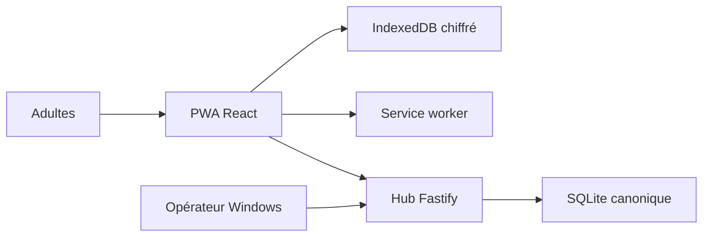

# Friday — modèle de menace P0

Date : 8 août 2026
Révision : P0, à actualiser après le vertical slice et avant l'authentification

## Executive summary

Friday concentre des données familiales et budgétaires sur un hub Windows accessible depuis le LAN et conserve une copie chiffrée dans une PWA. Les risques dominants du P0 sont une compromission de l'origine Web permettant d'utiliser la clé IndexedDB, un client LAN non autorisé qui atteint l'API de synchronisation, une erreur d'idempotence qui altère les données, et la compromission de la chaîne de mise à jour PWA. Le P0 réduit ces risques par une origine HTTPS unique, une CSP sans script tiers, des schémas runtime, un journal d'opérations idempotent et des dépendances verrouillées.

## Scope and assumptions

Périmètre : le futur code de `apps/web`, `apps/hub`, `packages/contracts`, `packages/domain`, les scripts d'exploitation P0 et leur configuration. À cette révision, le dépôt contient surtout les spécifications ; les contrôles décrits comme « prévus » ne sont pas encore des contrôles effectifs.

Hors périmètre P0 : Google Calendar, Drive, RSS, Ollama, budget réel, comptes définitifs, accès Internet au hub et projets sources externes. Ils seront ajoutés au modèle lors de leur lot.

Hypothèses validées par les décisions canoniques :

- deux adultes de confiance utilisent un foyer unique ;
- le hub n'est jamais exposé directement à Internet et Ollama reste sur la boucle locale ;
- le navigateur mobile est protégé par le verrouillage du téléphone ;
- l'attaquant distant réaliste est présent sur le LAN ou contrôle une entrée affichée par Friday ;
- la PWA et l'API sont servies par la même origine HTTPS stable ;
- l'authentification et la révocation d'appareil arrivent au Lot 1A, après le spike de synchronisation.

Questions ouvertes qui peuvent modifier le risque : état de BitLocker sur le PC, capacité réelle de réservation DHCP du routeur, méthode finale de distribution de l'autorité locale et présence d'appareils non fiables sur le Wi-Fi Maison.

Preuves principales : `docs/09-decision-finale-pwa-mvp.md`, sections Architecture, Modèle offline et Comptes et sécurité ; `docs/10-feuille-de-route-technique-implementation.md`, sections 3, 4, 6, 7, 8 et 14.

## System model

### Primary components

- PWA React : interface, orchestration locale et synchronisation.
- Service worker Workbox : cache de l'app shell uniquement.
- IndexedDB/Dexie : clé non extractible, payloads chiffrés, outbox et curseur.
- Hub Fastify : terminaison HTTPS, validation, API et fichiers statiques.
- SQLite : état canonique, opérations appliquées et journal de changements.
- Opérateur Windows : certificats, configuration, données et processus du hub.

### Data flows and trust boundaries

- Adulte → PWA : titres de tâches et actions tactiles, via DOM React ; rendu JSX échappé et validation locale prévue.
- PWA → IndexedDB : tâches et opérations ; AES-GCM avec données associées, transaction Dexie atomique prévue.
- PWA → Hub : lots JSON de synchronisation sur HTTPS même origine ; validation Zod, taille bornée et authentification d'appareil prévues.
- Hub → SQLite : opérations validées et changements ; transaction SQL et idempotence par `operationId` prévues.
- Hub → PWA : changements depuis un curseur opaque ; validation de réponse et chiffrement avant persistance locale prévus.
- Opérateur → Hub : variables d'environnement, certificats et scripts locaux ; ACL Windows et secrets hors dépôt prévus.

#### Diagram

## Assets and security objectives

| Asset                                   | Why it matters                                  | Security objective (C/I/A) |
| --------------------------------------- | ----------------------------------------------- | -------------------------- |
| Tâches et futures données Maison        | Vie privée et continuité familiale              | C/I/A                      |
| Données budgétaires futures             | Sensibles financièrement                        | C/I/A                      |
| Clé Web Crypto locale                   | Permet le déchiffrement sur l'origine Friday    | C/I                        |
| Sessions et identité d'appareil futures | Contrôlent l'accès au foyer                     | C/I/A                      |
| Journal d'opérations et curseurs        | Empêchent pertes, doublons et écrasements       | I/A                        |
| Base SQLite canonique                   | Source de vérité du foyer                       | C/I/A                      |
| Autorité locale et clé TLS              | Établissent la confiance de l'origine           | C/I                        |
| Bundle PWA et lockfile                  | Code exécuté avec accès aux données déchiffrées | I/A                        |

## Attacker model

### Capabilities

- émettre des requêtes vers le port Friday depuis le même LAN ;
- soumettre des payloads JSON malformés, trop grands, rejoués ou concurrents ;
- contrôler du texte métier ultérieurement rendu par l'interface ;
- provoquer des coupures et renvois de requêtes ;
- exploiter une dépendance ou une erreur de mise à jour du service worker ;
- lire les fichiers du PC ou du profil navigateur après compromission locale selon les protections OS.

### Non-capabilities

- aucun accès Internet direct au hub n'est supposé ;
- aucun accès administrateur Windows ni téléphone déverrouillé n'est supposé par défaut ;
- aucun contrôle du compte GitHub, du registre npm ou de la clé privée de l'autorité n'est supposé ;
- les deux adultes ne sont pas modélisés comme locataires hostiles entre eux au MVP.

## Entry points and attack surfaces

| Surface                     | How reached             | Trust boundary                     | Notes                                                 | Evidence                                                     |
| --------------------------- | ----------------------- | ---------------------------------- | ----------------------------------------------------- | ------------------------------------------------------------ |
| App shell et service worker | navigation HTTPS locale | LAN → origine Friday               | code à privilège élevé dans l'origine                 | `docs/10-feuille-de-route-technique-implementation.md`, §7.1 |
| `POST /api/sync/push`       | JSON HTTPS              | PWA → hub                          | rejeu, conflit, surcharge et validation               | même document, §6.3–6.5                                      |
| `GET /api/sync/pull`        | HTTPS + curseur         | PWA → hub                          | curseur forgé et fuite de changements                 | même document, §6.3                                          |
| IndexedDB                   | API navigateur          | JavaScript de l'origine → stockage | clé utilisable par tout script compromis de l'origine | même document, §7.2                                          |
| Variables et fichiers TLS   | session Windows         | opérateur → processus hub          | secrets et permissions locales                        | même document, §7.3 et §13                                   |
| Dépendances/build           | `pnpm install` et build | registre/Git → bundle              | scripts d'installation et code supply-chain           | même document, §4.1 et §12.4                                 |

## Top abuse paths

1. Un contenu non fiable atteint un sink HTML → exécution dans l'origine Friday → utilisation de la `CryptoKey` → exfiltration des données locales.
2. Un appareil du LAN appelle le push sans identité valide → envoie une opération forgée → altère une tâche partagée.
3. Une réponse réseau est perdue après commit → le client renvoie l'opération → une implémentation non idempotente crée un doublon.
4. Deux appareils modifient la même révision → le serveur accepte silencieusement le dernier payload → perte d'une modification.
5. Une dépendance de build est compromise → le bundle PWA vole les données au déchiffrement → fuite du foyer.
6. Une ancienne version de service worker reste active → parle à un protocole incompatible → outbox bloquée ou corrompue.
7. La clé privée de l'autorité locale quitte le PC → un faux hub présente un certificat de confiance → interception sur le LAN.

## Threat model table

| Threat ID | Threat source                           | Prerequisites                                 | Threat action                                         | Impact                              | Impacted assets                       | Existing controls (evidence)                                                     | Gaps                               | Recommended mitigations                                                                          | Detection ideas                                          | Likelihood | Impact severity | Priority |
| --------- | --------------------------------------- | --------------------------------------------- | ----------------------------------------------------- | ----------------------------------- | ------------------------------------- | -------------------------------------------------------------------------------- | ---------------------------------- | ------------------------------------------------------------------------------------------------ | -------------------------------------------------------- | ---------- | --------------- | -------- |
| TM-001    | contenu stocké ou dépendance compromise | script exécuté dans l'origine Friday          | utilise les APIs DOM/Web Crypto pour lire les données | fuite locale et opérations forgées  | données, clé locale, sessions futures | CSP, zéro script tiers et JSX échappé sont exigés par `docs/10...`, §3.3 et §7.2 | contrôles pas encore codés         | CSP stricte par header, aucun sink HTML, dépendances verrouillées, cookies HttpOnly              | violations CSP, audit des bundles, journal d'opérations  | medium     | high            | high     |
| TM-002    | appareil non fiable du LAN              | port hub joignable avant auth complète        | appelle push/pull avec une identité forgée            | lecture ou altération du foyer      | données, SQLite                       | exposition Internet interdite par `docs/09...`, Architecture                     | auth/appairage différés au Lot 1A  | garder le P0 sur loopback hors recette, ajouter appareil/session révocable avant données réelles | journal requestId/deviceId, refus d'identités inconnues  | medium     | high            | high     |
| TM-003    | client légitime ou attaquant réseau     | réponse perdue ou rejeu volontaire            | renvoie le même `operationId`                         | doublon ou divergence               | journal, tâches, budget futur         | transaction et idempotence exigées par `docs/10...`, §6.4                        | absence actuelle d'implémentation  | contrainte unique SQL, résultat d'ack mémorisé, tests réponse perdue                             | compteur de replays et incohérences de révision          | high       | medium          | high     |
| TM-004    | deux clients légitimes                  | modifications concurrentes                    | envoie une révision ancienne                          | écrasement silencieux               | intégrité des objets                  | règles de conflit documentées dans `docs/10...`, §6.5                            | interface de résolution future     | comparaison `baseRevision`, conflit persistant, jamais de last-write-wins générique              | métrique de conflits et audit par entityId               | medium     | medium          | medium   |
| TM-005    | chaîne de dépendances                   | paquet ou publication compromis               | injecte du code au build/install                      | compromission complète de l'origine | bundle, données, clé                  | pnpm et lockfile imposés par `docs/10...`, §4.1                                  | pas encore de lockfile ni audit CI | versions exactes, `--frozen-lockfile`, revue des scripts, dépendances minimales                  | audit de lockfile et diff de bundle                      | low        | high            | medium   |
| TM-006    | mise à jour PWA défectueuse             | nouvelle version incompatible ou cache ancien | active un service worker qui casse données/protocole  | indisponibilité ou perte d'outbox   | cache, outbox, disponibilité          | stratégie prompt et compatibilité N/N-1 exigées par `docs/10...`, §7.1           | non implémentée                    | précache shell seul, migrations testées, activation explicite, E2E offline                       | version visible, erreurs de migration, télémétrie locale | medium     | medium          | medium   |
| TM-007    | accès local ou mauvaise manipulation    | clé d'autorité lisible/exportée               | signe un faux certificat Friday                       | MITM crédible sur le LAN            | TLS, sessions, données                | `rootCA-key.pem` doit rester sur le PC selon `docs/10...`, §7.3                  | état ACL/BitLocker inconnu         | ACL minimales, stockage hors dépôt/Drive, procédure de rotation                                  | inventaire des certificats et permissions                | low        | high            | medium   |

## Criticality calibration

- Critical : compromission pré-auth à distance du hub ou extraction générale des données sans accès local ; exemples : RCE Fastify, bundle signé/servi compromis à tous les appareils.
- High : lecture/altération significative depuis le LAN ou l'origine Web ; exemples : XSS utilisant la clé locale, push non autorisé, vol de session d'appareil.
- Medium : perte bornée, conflit ou indisponibilité nécessitant des préconditions ; exemples : opération dupliquée, migration PWA bloquée, fuite de métadonnées.
- Low : information technique peu sensible ou nuisance facilement réversible ; exemples : version exposée par healthcheck, requêtes invalides journalisées sans payload.

## Focus paths for security review

| Path                     | Why it matters                             | Related Threat IDs     |
| ------------------------ | ------------------------------------------ | ---------------------- |
| `apps/web/src/crypto/`   | clé non extractible, IV et AAD             | TM-001                 |
| `apps/web/src/db/`       | transaction tâche + outbox et migrations   | TM-003, TM-006         |
| `apps/web/src/sync/`     | validation des réponses et ordre push/pull | TM-002, TM-003, TM-004 |
| `apps/web/src/sw.ts`     | privilège de cache et mises à jour         | TM-006                 |
| `apps/hub/src/api/`      | limite et validation des requêtes          | TM-002                 |
| `apps/hub/src/sync/`     | idempotence, révisions et conflits         | TM-003, TM-004         |
| `apps/hub/src/db/`       | transactions, contraintes et migrations    | TM-003, TM-005         |
| `apps/hub/src/server.ts` | TLS, CSP et fichiers statiques             | TM-001, TM-002, TM-007 |
| `pnpm-lock.yaml`         | code tiers réellement installé             | TM-005                 |
| `infra/certificates/`    | procédure sans clé privée versionnée       | TM-007                 |

## Quality check

- [x] surfaces P0 documentées ;
- [x] chaque frontière apparaît dans au moins une menace ;
- [x] runtime séparé du build et des tests ;
- [x] hypothèses issues des décisions utilisateur explicites ;
- [x] inconnues BitLocker, DHCP, Wi-Fi et certificat consignées ;
- [ ] contrôles revalidés contre le code après le vertical slice.
