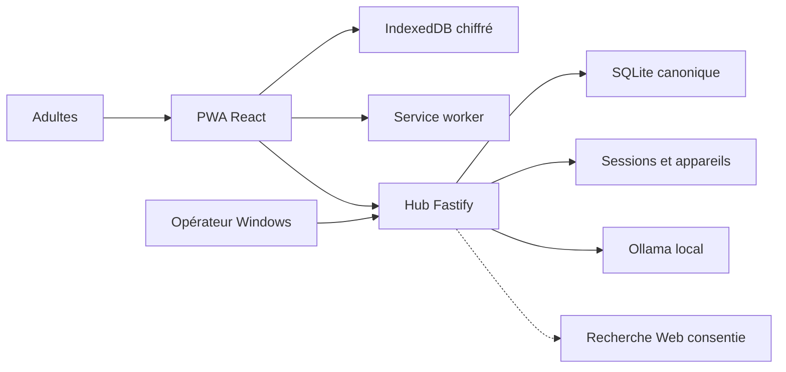

# Friday — modèle de menace du candidat local-first

Date : 10 août 2026
Révision : Budget et Assistant candidats ; accès Tailscale décidé mais inactif

## Executive summary

Friday concentre des données familiales et des conversations Assistant sur un hub Windows accessible depuis le LAN et conserve une copie chiffrée dans une PWA. Chaque session est liée à un adulte, un foyer et un appareil révocable ; l’inscription publique est fermée et push/pull sont protégés. Le risque résiduel principal reste l’accès au cache d’un téléphone perdu. La future route Tailscale `/32` ajoute une frontière distante privée, mais elle n’est ni installée ni activée.

## Scope and assumptions

Périmètre : `apps/web`, `apps/hub`, `packages/contracts`, `packages/domain`, SQLite, IndexedDB, les scripts d’exploitation, l’authentification/appairage, Budget et Assistant.

Hors périmètre runtime : Google Calendar, Drive, RSS, accès Internet direct au hub, Tailscale tant que l’ADR-013 reste en pause et projets sources externes. Ollama et les recherches Web bornées de l’Assistant sont couverts comme dépendances non critiques.

Hypothèses validées par les décisions canoniques :

- deux adultes de confiance utilisent un foyer unique ;
- le hub n'est jamais exposé directement à Internet et Ollama reste sur la boucle locale ;
- le navigateur mobile est protégé par le verrouillage du téléphone ;
- l'attaquant distant réaliste est présent sur le LAN, contrôle une entrée affichée par Friday ou, après activation future, compromet un compte/appareil Tailscale ;
- la PWA et l'API sont servies par la même origine HTTPS stable ;
- l'authentification est fermée à deux comptes et un appareil mobile par adulte au MVP ;
- le premier adulte initialise le foyer, puis autorise le second avec un code court, expirant et à usage unique ;
- un appareil déjà appairé continue à écrire localement hors ligne, mais toute synchronisation requiert une session serveur valide ;
- une révocation bloque les futures synchronisations sans prétendre effacer un cache déjà téléchargé sur un téléphone hors ligne.
- la future route Tailscale reste limitée à `192.168.1.14/32` et `TCP 8443`, sans exposition publique ; tout nouvel accès Friday doit alors être enrôlé sur le Wi-Fi Maison.

Questions ouvertes qui peuvent modifier le risque : état de BitLocker sur le PC, présence d'appareils non fiables sur le Wi-Fi Maison et méthode de récupération si les deux appareils sont perdus. Elles ne bloquent pas le MVP local à deux adultes.

Preuves principales : `docs/09-decision-finale-pwa-mvp.md`, sections Architecture, Modèle offline et Comptes et sécurité ; `docs/10-feuille-de-route-technique-implementation.md`, sections 3, 4, 6, 7, 8 et 14.

## System model

### Primary components

- PWA React : interface, orchestration locale et synchronisation.
- Service worker Workbox : cache de l'app shell uniquement.
- IndexedDB/Dexie : clé non extractible, payloads chiffrés, outbox et curseur.
- Hub Fastify : terminaison HTTPS, validation, API et fichiers statiques.
- SQLite : état canonique, opérations appliquées et journal de changements.
- Assistant : conversations privées par profil, file persistante et recherche Web consentie.
- Ollama local : génération non critique, exclusivement sur la boucle locale.
- Opérateur Windows : certificats, configuration, données et processus du hub.

### Data flows and trust boundaries

- Adulte → PWA : identifiants, code d'appairage, titres et actions tactiles via React ; rendu JSX échappé et validation locale.
- PWA → IndexedDB : tâches, courses, budget, conversations Assistant, outboxes et identité d’appareil ; AES-GCM avec AAD propre à chaque type d’entité et transactions Dexie atomiques.
- PWA → Hub : cookies de session HttpOnly et lots JSON sur HTTPS même origine ; validation Zod, taille bornée et contrôle de la session, du foyer, du profil et de l'appareil.
- Hub → SQLite : comptes, sessions, appareils, codes hachés, opérations et changements ; transactions SQL et idempotence par `operationId`.
- Hub → PWA : profil et changements depuis un curseur ; validation de réponse avant persistance chiffrée locale.
- Hub → Ollama/Web : prompt borné vers Ollama local et recherche distante seulement après consentement ; aucun droit de mutation métier.
- Opérateur → Hub : variables, secret d'authentification local, certificats, sauvegarde SQLite et seed budget normalisé ; secrets et données réelles hors dépôt/Drive, BitLocker et ACL Windows exigés avant import.

#### Diagram

## Assets and security objectives

| Asset                                | Why it matters                                  | Security objective (C/I/A) |
| ------------------------------------ | ----------------------------------------------- | -------------------------- |
| Tâches et futures données Maison     | Vie privée et continuité familiale              | C/I/A                      |
| Données budgétaires futures          | Sensibles financièrement                        | C/I/A                      |
| Clé Web Crypto locale                | Permet le déchiffrement sur l'origine Friday    | C/I                        |
| Sessions et identité d'appareil      | Contrôlent l'accès au foyer                     | C/I/A                      |
| Codes d'appairage                    | Autorisent la création du second compte         | C/I                        |
| Journal d'opérations et curseurs     | Empêchent pertes, doublons et écrasements       | I/A                        |
| Base SQLite canonique                | Source de vérité du foyer                       | C/I/A                      |
| Autorité locale et clé TLS           | Établissent la confiance de l'origine           | C/I                        |
| Bundle PWA et lockfile               | Code exécuté avec accès aux données déchiffrées | I/A                        |
| Conversations et sources Assistant   | Données privées par profil et contenus distants | C/I/A                      |
| Compte et appareils Tailscale futurs | Contrôleront la route distante privée           | C/I/A                      |

## Attacker model

### Capabilities

- émettre des requêtes vers le port Friday depuis le même LAN ;
- tenter des mots de passe et codes d'appairage, rejouer un code intercepté ou réutiliser une ancienne session ;
- soumettre des payloads JSON malformés, trop grands, rejoués ou concurrents ;
- contrôler du texte métier ultérieurement rendu par l'interface ;
- provoquer des coupures et renvois de requêtes ;
- exploiter une dépendance ou une erreur de mise à jour du service worker ;
- lire les fichiers du PC ou du profil navigateur après compromission locale selon les protections OS.
- fournir du contenu Web hostile à l’Assistant ou, après activation future, compromettre un appareil Tailscale approuvé.

### Non-capabilities

- aucun accès Internet direct au hub n’est supposé ; la route Tailscale reste inactive ;
- aucun accès administrateur Windows ni téléphone déverrouillé n'est supposé par défaut ;
- aucun contrôle du compte GitHub, du registre npm ou de la clé privée de l'autorité n'est supposé ;
- les deux adultes ne sont pas modélisés comme locataires hostiles entre eux au MVP.

## Entry points and attack surfaces

| Surface                     | How reached             | Trust boundary                     | Notes                                                    | Evidence                                                      |
| --------------------------- | ----------------------- | ---------------------------------- | -------------------------------------------------------- | ------------------------------------------------------------- |
| App shell et service worker | navigation HTTPS locale | LAN → origine Friday               | code à privilège élevé dans l'origine                    | `docs/10-feuille-de-route-technique-implementation.md`, §7.1  |
| `POST /api/sync/push`       | JSON HTTPS              | PWA → hub                          | rejeu, conflit, surcharge et validation                  | même document, §6.3–6.5                                       |
| `GET /api/sync/pull`        | HTTPS + curseur         | PWA → hub                          | curseur forgé et fuite de changements                    | même document, §6.3                                           |
| Routes auth et appairage    | JSON HTTPS              | appareil inconnu → hub             | brute force, inscription indue, fixation de session      | `apps/hub/src/app.ts`, `apps/hub/src/auth/`                   |
| IndexedDB                   | API navigateur          | JavaScript de l'origine → stockage | clé utilisable par tout script compromis de l'origine    | même document, §7.2                                           |
| Variables et fichiers TLS   | session Windows         | opérateur → processus hub          | secrets et permissions locales                           | même document, §7.3 et §13                                    |
| Dépendances/build           | `pnpm install` et build | registre/Git → bundle              | scripts d'installation et code supply-chain              | même document, §4.1 et §12.4                                  |
| Routes Assistant            | JSON HTTPS authentifié  | PWA → hub → Ollama/Web             | séparation profil, prompt injection et contenus hostiles | `apps/hub/src/assistant/`, `docs/runbooks/assistant-gemma.md` |
| Route Tailscale future      | tunnel privé `/32`      | appareil approuvé → hub            | compte/appareil compromis et enrôlement distant          | `docs/adr/013-acces-exterieur-tailscale-route-privee.md`      |

## Top abuse paths

1. Un contenu non fiable atteint un sink HTML → exécution dans l'origine Friday → utilisation de la `CryptoKey` → exfiltration des données locales.
2. Un appareil du LAN appelle le push sans identité valide → envoie une opération forgée → altère une tâche partagée.
3. Une réponse réseau est perdue après commit → le client renvoie l'opération → une implémentation non idempotente crée un doublon.
4. Deux appareils modifient la même révision → le serveur accepte silencieusement le dernier payload → perte d'une modification.
5. Une dépendance de build est compromise → le bundle PWA vole les données au déchiffrement → fuite du foyer.
6. Une ancienne version de service worker reste active → parle à un protocole incompatible → outbox bloquée ou corrompue.
7. La clé privée de l'autorité locale quitte le PC → un faux hub présente un certificat de confiance → interception sur le LAN.
8. Un client devine ou rejoue un code d'appairage → crée un compte ou appareil non autorisé → accède au foyer.
9. Un appareil révoqué conserve une session encore acceptée → reprend la synchronisation → lit ou modifie des données après révocation.
10. Un fichier de seed normalisé reste lisible par un autre compte Windows ou entre dans Git/Drive → fuite des revenus et dépenses du foyer.
11. Deux appareils génèrent la même échéance récurrente avec des identifiants différents → double dépense ou double revenu dans les synthèses.
12. Une page hostile injecte des instructions dans la recherche Assistant → tente d’altérer la réponse ou d’obtenir des données → fuite ou conseil trompeur.
13. Un appareil Tailscale non autorisé atteint le hub → tente un nouvel enrôlement à distance → accès persistant au foyer.

## Threat model table

| Threat ID | Threat source                            | Prerequisites                                    | Threat action                                         | Impact                              | Impacted assets                       | Existing controls (evidence)                                                                               | Gaps                                                                 | Recommended mitigations                                                                                          | Detection ideas                                                | Likelihood | Impact severity | Priority |
| --------- | ---------------------------------------- | ------------------------------------------------ | ----------------------------------------------------- | ----------------------------------- | ------------------------------------- | ---------------------------------------------------------------------------------------------------------- | -------------------------------------------------------------------- | ---------------------------------------------------------------------------------------------------------------- | -------------------------------------------------------------- | ---------- | --------------- | -------- |
| TM-001    | contenu stocké ou dépendance compromise  | script exécuté dans l'origine Friday             | utilise les APIs DOM/Web Crypto pour lire les données | fuite locale et opérations forgées  | données, clé locale, sessions futures | CSP stricte par header, JSX/Markdown sans HTML brut, cookies HttpOnly et dépendances verrouillées          | une XSS conserverait l’accès à la clé utilisable dans l’origine      | conserver CSP, revue des sinks et audit des dépendances                                                          | violations CSP, audit des bundles, journal d'opérations        | low        | high            | medium   |
| TM-002    | appareil non fiable du LAN               | port hub joignable et session absente/volée      | appelle push/pull avec une identité forgée            | lecture ou altération du foyer      | données, SQLite                       | session Better Auth et appareil actif requis ; identité du push liée au profil et au foyer                 | recette physique et rotation après vol à confirmer                   | conserver le LAN privé, tester refus et révocation, ne jamais exposer le hub à Internet                          | audit auth et refus d'identité                                 | low        | high            | medium   |
| TM-003    | client légitime ou attaquant réseau      | réponse perdue ou rejeu volontaire               | renvoie le même `operationId`                         | doublon ou divergence               | journal, tâches, budget               | transaction, contrainte unique, ack mémorisé et tests de réponse perdue                                    | recette physique multi-appareils encore ouverte                      | conserver les tests de rejeu et surveiller les incohérences de révision                                          | compteur de replays et incohérences de révision                | low        | medium          | low      |
| TM-004    | deux clients légitimes                   | modifications concurrentes                       | envoie une révision ancienne                          | écrasement silencieux               | intégrité des objets                  | règles de conflit documentées dans `docs/10...`, §6.5                                                      | interface de résolution future                                       | comparaison `baseRevision`, conflit persistant, jamais de last-write-wins générique                              | métrique de conflits et audit par entityId                     | medium     | medium          | medium   |
| TM-005    | chaîne de dépendances                    | paquet ou publication compromis                  | injecte du code au build/install                      | compromission complète de l'origine | bundle, données, clé                  | pnpm-lock versionné, installation figée, audit et bundle sans script tiers                                 | revue continue des mises à jour nécessaire                           | `--frozen-lockfile`, revue des scripts et dépendances minimales                                                  | audit de lockfile et diff de bundle                            | low        | high            | medium   |
| TM-006    | mise à jour PWA défectueuse              | nouvelle version incompatible ou cache ancien    | active un service worker qui casse données/protocole  | indisponibilité ou perte d'outbox   | cache, outbox, disponibilité          | signal persistant, activation explicite, migrations N−1 et E2E offline                                     | recettes physiques multi-cycles encore ouvertes                      | conserver l’activation explicite et les migrations testées                                                       | version visible et erreurs de migration                        | low        | medium          | low      |
| TM-007    | accès local ou mauvaise manipulation     | clé d'autorité lisible/exportée                  | signe un faux certificat Friday                       | MITM crédible sur le LAN            | TLS, sessions, données                | `rootCA-key.pem` doit rester sur le PC selon `docs/10...`, §7.3                                            | état ACL/BitLocker inconnu                                           | ACL minimales, stockage hors dépôt/Drive, procédure de rotation                                                  | inventaire des certificats et permissions                      | low        | high            | medium   |
| TM-008    | client non autorisé du LAN               | interception/devinette du code avant usage       | consomme le code et crée le second compte             | prise de place et accès au foyer    | comptes, sessions, données            | 8 chiffres aléatoires, HMAC, usage unique, expiration 10 min, quota et journal                             | code transmis manuellement ; bootstrap initial à protéger            | générer le code seulement avec le second appareil prêt, surveiller le journal, permettre la révocation           | échecs par IP, créations et consommations de codes             | low        | high            | medium   |
| TM-009    | appareil perdu ou session volée          | session et cache présents sur l'appareil         | tente de synchroniser ou lit le cache hors ligne      | lecture et altération persistantes  | sessions, données, journal            | session liée au `deviceId`, suppression des sessions et refus push/pull après révocation                   | cache téléchargé non effaçable à distance                            | verrouillage du téléphone, révocation rapide, future procédure de rotation/récupération                          | journal des refus et dernière activité par appareil            | medium     | high            | high     |
| TM-010    | autre compte Windows ou erreur opérateur | seed réel en clair avec ACL héritées             | lit, copie ou versionne le fichier normalisé          | fuite financière du foyer           | revenus, dépenses, projets            | chemin imposé hors Git sous `D:\FridayData`, import sans libellés dans les logs                            | BitLocker non vérifiable sans élévation et ACL actuelles trop larges | bloquer le seed tant que BitLocker, sauvegarde et ACL compte Friday/SYSTEM/Administrateurs ne sont pas confirmés | contrôle préalable et inventaire ACL sans afficher les données | medium     | high            | high     |
| TM-011    | deux clients légitimes hors ligne        | même série arrivée à échéance sur deux appareils | matérialise deux occurrences logiques                 | double comptage financier           | budget, projections, journal          | identifiant d'occurrence déterministe modèle + date, `operationId` déterministe et application idempotente | recette physique à deux appareils en attente                         | tests de convergence, contrainte d'identifiant et rapprochement après reconnexion                                | détection de couples modèle/date dupliqués                     | medium     | high            | high     |
| TM-012    | contenu Web hostile                      | recherche Assistant consentie                    | injecte de fausses instructions ou sources            | réponse trompeuse ou fuite bornée   | conversations, sources, contexte      | consentement, sources bornées, validation d’identifiants et aucune mutation métier directe                 | qualité réelle et corpus hostile à approfondir                       | renforcer les tests de prompt injection et limiter les données transmises                                        | erreurs de citation et sources rejetées                        | medium     | medium          | medium   |
| TM-013    | compte/appareil Tailscale compromis      | ADR-013 activée et appareil approuvé             | atteint `8443` et tente un enrôlement                 | accès distant persistant            | sessions, données, hub                | route `/32`, grants `TCP 8443`, auth Friday et approbation Tailscale prévues                               | Tailscale et enrôlement local non encore implantés                   | appareil approuvé uniquement, MFA, enrôlement LAN et révocation double                                           | journal Friday et inventaire des appareils Tailscale           | low        | high            | medium   |

## Criticality calibration

- Critical : compromission pré-auth à distance du hub ou extraction générale des données sans accès local ; exemples : RCE Fastify, bundle signé/servi compromis à tous les appareils.
- High : lecture/altération significative depuis le LAN ou l'origine Web ; exemples : XSS utilisant la clé locale, push non autorisé, vol de session d'appareil.
- Medium : perte bornée, conflit ou indisponibilité nécessitant des préconditions ; exemples : opération dupliquée, migration PWA bloquée, fuite de métadonnées.
- Low : information technique peu sensible ou nuisance facilement réversible ; exemples : version exposée par healthcheck, requêtes invalides journalisées sans payload.

## Focus paths for security review

| Path                                                     | Why it matters                                   | Related Threat IDs     |
| -------------------------------------------------------- | ------------------------------------------------ | ---------------------- |
| `apps/web/src/crypto/`                                   | clé non extractible, IV et AAD                   | TM-001                 |
| `apps/web/src/db/`                                       | transaction tâche + outbox et migrations         | TM-003, TM-006         |
| `apps/web/src/sync/`                                     | validation des réponses et ordre push/pull       | TM-002, TM-003, TM-004 |
| `apps/web/src/sw.ts`                                     | privilège de cache et mises à jour               | TM-006                 |
| `apps/hub/src/app.ts`                                    | limite, origine et validation des requêtes       | TM-002, TM-008, TM-009 |
| `apps/hub/src/sync/`                                     | idempotence, révisions et conflits               | TM-003, TM-004         |
| `apps/hub/src/db/`                                       | transactions, contraintes et migrations          | TM-003, TM-005         |
| `apps/hub/src/main.ts`                                   | TLS, origines approuvées et fichiers statiques   | TM-001, TM-002, TM-007 |
| `apps/hub/src/auth/`                                     | inscription fermée, sessions et appairage        | TM-002, TM-008, TM-009 |
| `apps/hub/src/budget/`                                   | validation, résumé non sensible et seed unique   | TM-010                 |
| `apps/hub/src/assistant/`                                | séparation profil, file et contenus Web hostiles | TM-012                 |
| `pnpm-lock.yaml`                                         | code tiers réellement installé                   | TM-005                 |
| `infra/certificates/`                                    | procédure sans clé privée versionnée             | TM-007                 |
| `docs/adr/013-acces-exterieur-tailscale-route-privee.md` | future frontière distante                        | TM-013                 |

## Quality check

Contrôles du candidat : inscription publique masquée, bootstrap fermé après le premier membre, cookie durci, mutations limitées aux origines approuvées, code d’appairage à usage unique et expirant, session liée à l’appareil, identité de push vérifiée, révocation, CSP, idempotence, activation PWA explicite et Assistant séparé par profil sans mutation métier. Les parcours sont couverts par intégration et Chrome mobile ; la recette réelle reste exigée.

- [x] surfaces runtime et nouvelles surfaces d'authentification documentées ;
- [x] chaque frontière apparaît dans au moins une menace ;
- [x] runtime séparé du build et des tests ;
- [x] hypothèses issues des décisions utilisateur explicites ;
- [x] contexte confirmé par l'utilisateur : foyer unique, deux adultes, LAN sans exposition Internet ;
- [x] inconnues BitLocker, Wi-Fi et récupération consignées ;
- [x] contrôles d'authentification revalidés par tests après leur implémentation ;
- [x] surfaces Assistant et future frontière Tailscale documentées ;
- [ ] bootstrap, appairage à deux appareils et révocation à confirmer physiquement.
- [ ] Tailscale `/32` et enrôlement local à valider uniquement après reprise explicite.
