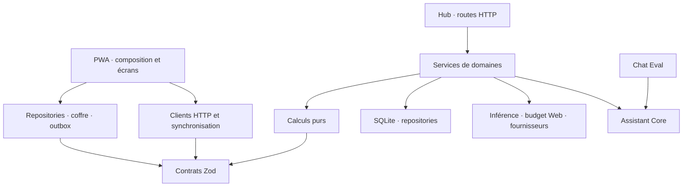

# Architecture et développement de Friday

Statut documentaire : actif. Révision : 6 septembre 2026.

Cette carte décrit la structure après les deux lots de modularisation. Les mesures
avant/après restent dans les rapports ; la taille d'un fichier n'est pas une norme
d'architecture. Commencer par [contribuer](../../CONTRIBUTING.md), puis le
[runbook développement](../runbooks/development.md) pour exécuter les contrôles.

## Directions de dépendances

Les routes valident et délèguent ; les calculs Budget ne résident pas dans React.
Le Hub n'importe pas le banc et la PWA n'importe pas le Hub. Le contexte appareil,
l'outbox et l'inférence ne dépendent pas des écrans consommateurs.

## Trouver la responsabilité

| Ensemble        | Entrée et modules actuels                                                                                                                                                                                                                         |
| --------------- | ------------------------------------------------------------------------------------------------------------------------------------------------------------------------------------------------------------------------------------------------- |
| Composition PWA | [App](../../apps/web/src/App.tsx), [contrôleur](../../apps/web/src/app/use-app-controller.tsx), hooks d'état, actions, `use-local-data`, `use-app-sync`, `use-app-lifecycle` dans [app](../../apps/web/src/app/)                                  |
| Stockage PWA    | [db](../../apps/web/src/db/) : `device-context`, `profile-defaults`, `outbox-repository`, `sync-repository` et repositories par domaine                                                                                                           |
| Transport PWA   | [sync](../../apps/web/src/sync/) : clients API, synchronisation et capacités Maison                                                                                                                                                               |
| Hub             | [app.ts](../../apps/hub/src/app.ts) compose les services et enregistre [http](../../apps/hub/src/http/) ; Chat et Menus ont leurs plugins                                                                                                         |
| Auth            | [auth](../../apps/hub/src/auth/) : façade `auth-service`, runtime de session, protection, repository, membres, appareils et types                                                                                                                 |
| Migrations      | [database.ts](../../apps/hub/src/db/database.ts) conserve registre et réparations ; SQL dans [migrations](../../apps/hub/src/db/migrations/)                                                                                                      |
| Contrats        | [index public](../../packages/contracts/src/index.ts), contrats par domaine, `common.ts` et unions `sync.ts`                                                                                                                                      |
| Maison          | [domaine](../../packages/domain/src/maison.ts), [service sync](../../apps/hub/src/maison/maison-sync.ts), commandes/repository/UI PWA                                                                                                             |
| Budget          | [formulaires et présentation](../../apps/web/src/budget/), fonctions pures dans [domain](../../packages/domain/src/) ; chargement différé et précache                                                                                             |
| Inférence       | [ordonnanceur](../../apps/hub/src/inference/inference-scheduler.ts), [budget Web](../../apps/hub/src/integrations/web/web-budget.ts)                                                                                                              |
| Chat            | [runtime](../../packages/assistant-core/src/runtime.ts), [pipelines et publication](../../packages/assistant-core/src/runtime/), [adaptateur Hub](../../apps/hub/src/chat/verified-chat-engine.ts)                                                |
| Veille          | [watch](../../apps/hub/src/watch/) : service, repositories, digest, planification et politiques ; UI [watch](../../apps/web/src/watch/)                                                                                                           |
| Robot           | [façade topologique](../../apps/hub/src/robot/robot-visual-topology.ts), [topologie](../../apps/hub/src/robot/visual-topology/), [autonomie](../../apps/hub/src/robot/autonomy/) et [façade autonome](../../apps/hub/src/robot/robot-autonomy.ts) |
| Tests           | [HTTP](../../apps/hub/src/http/), tests de services/repositories et [E2E par domaine](../../tests/e2e/) avec fixtures explicites                                                                                                                  |

Les façades conservent les interfaces et réexports nécessaires aux consommateurs.
Ne pas réintroduire un import d'un module enfant vers sa façade pour partager un état.
Auth conserve une instance de session/limiteur ; topologie une file d'observation et
un état partagé ; autonomie une instance d'épisode et sa coordination temporelle.
Les effets React restent composés à la racine pour préserver brouillons et navigation.

## Suivre une écriture Maison

1. Le formulaire valide une commande avec les contrats et calculs purs.
2. Le repository chiffre avant d'ouvrir la transaction ; objets, courses et outbox
   sont écrits atomiquement. Le contexte appareil fournit identité et clé persistées.
3. Le client pousse l'outbox ; la route HTTP authentifie et délègue au service sync.
4. SQLite vérifie révision, idempotence et limites de la commande composite.
5. Le pull et les acquittements sont appliqués par les repositories de synchronisation,
   avec les objets et le curseur dans une transaction locale.

Un ancien Hub laisse les commandes Maison en attente, sans bloquer tâches et courses
compatibles. Ne pas conclure qu'un fichier `task-repository` possède encore tout le
stockage partagé. Les doublons réseau, conflits composites et vieux Hubs ont leurs tests.

## Chat, stockage privé et annulation Robot

Chat et Menus injectent les fournisseurs réseau dans le cœur partagé. Le budget Web
et l'ordonnanceur appartiennent à une composition Hub unique. Le [document 32](../32-fondation-reconstruction-chat.md)
décrit les décisions de pipeline et la mémoire privée de recherche ; ne pas modifier
un prompt à l'occasion d'un simple déplacement documentaire ou technique.

La topologie sérialise ses observations. Les epochs invalident les continuations
Robot arrêtées, y compris préparation/capture de panorama ; ils complètent les commandes
expirables et le watchdog. Les tests de cycle de vie restent simulés.

## Imports TypeScript et contrats publics

Les modules ESM compilés du Hub utilisent généralement des suffixes `.js` dans leurs
imports TypeScript. Ce n'est pas une règle universelle à appliquer au dépôt.
`@friday/contracts` exporte directement `src/index.ts` et ses modules internes
utilisent `.ts` pour le chargement natif de sources par Node 24. Son script build
vérifie les types sans émettre de JavaScript. Respecter les configurations de chaque
package ; ne pas remplacer ces suffixes globalement.

Les imports de types ne constituent pas des cycles d'exécution. La garde
`pnpm architecture` analyse imports/réexports et chargements littéraux TypeScript ;
les chemins calculés, CSS et Python sont hors de sa couverture. La cascade CSS
reste ordonnée malgré son découpage. Aucun cycle runtime n'est actuellement autorisé.

## Modifier et vérifier

Ajouter un champ synchronisé demande contrat, calcul éventuel, persistance/migration,
chiffrement, synchronisation, UI et tests de compatibilité. Conserver les anciens
stores et migrations tant que l'historique ou les clients en dépendent.
Un changement d'authentification ou de Robot exige des tests de concurrence adaptés,
pas seulement une comparaison de signatures publiques.

Les suites HTTP auparavant regroupées dans `app.test.ts` sont réparties par domaine.
Les E2E utilisent un Hub en mémoire, des contextes navigateur neufs et des fixtures
explicites ; l'ancien `offline-task.spec.ts` ne constitue plus leur point d'entrée.
L'[annexe TypeScript](typescript-pour-python-r-sql.md) conserve les explications pédagogiques.
