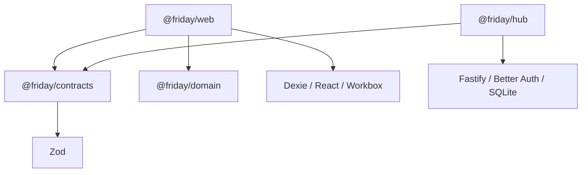
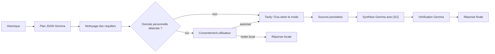

# Friday — guide complet fonctionnel et technique

Date de référence : 27 août 2026

Public : lecteur à l’aise avec Python, R et SQL, mais débutant en TypeScript/React

État décrit : candidat déployé avec migrations SQLite 1–32 et Dexie 1–7

Pour une reprise rapide et les limites physiques, consulter d’abord
[l’état canonique App + Robot](../27-etat-canonique-app-robot-2026-08-25.md).
Ce guide privilégie l’explication pédagogique et ne remplace pas les runbooks.

## 1. À quoi sert ce guide

Ce document explique Friday sous trois angles complémentaires :

1. **utilisateur** : ce que fait chaque écran et ce qui se passe en ligne ou hors ligne ;
2. **données** : où vivent les informations et comment elles convergent entre le téléphone et le PC ;
3. **développeur** : comment retrouver le code, le lire avec des repères Python/SQL et modifier l’application sans casser son modèle local-first.

Le point essentiel à retenir est le suivant :

> Friday n’est pas une interface Web qui attend le serveur pour enregistrer. Pour Agenda, Courses et Budget, l’application écrit d’abord dans la base locale chiffrée du navigateur et dans une outbox, puis synchronise avec SQLite sur le PC.

Cette règle reste vraie même lorsque le PC est disponible. Il n’existe donc pas un chemin « en ligne » et un autre « hors ligne » pour les écritures métier courantes.

## 2. État réel de l’application

### 2.1 Ce qui fonctionne aujourd’hui

| Domaine                         | État actuel                                                                                                            |
| ------------------------------- | ---------------------------------------------------------------------------------------------------------------------- |
| Authentification fermée         | Implantée : propriétaire, second adulte, appairage par code, appareils, révocation et approbation d’un nouvel appareil |
| Aujourd’hui                     | Implanté : tâches en cours, résumé Courses, alerte Budget, état de synchronisation et conflits                         |
| Agenda                          | Implanté : tâches, date, heure, durée, responsable, note, récurrence, vues Liste/Semaine/Mois, édition et suppression  |
| Courses                         | Implanté : liste partagée, quantité, achat/réouverture, édition, suppression et rayon manuel                           |
| Classement par rayon            | Implanté : règles locales, Ministral via Ollama pour les inconnus, aperçu, corrections et application explicite        |
| En course                       | Implanté : vue plein écran, groupes par rayon, grandes cibles tactiles, progression, fonctionnement offline            |
| Budget                          | Implanté : réel, prévisionnel, récurrences, enveloppes, provisions, réserve, corrections et suppressions               |
| Chat                            | Implanté : Local, Friday, Web léger/approfondi, cache/outbox chiffrés, Qwen/Gemma, Tavily + Exa et pause/reprise       |
| Mise à jour PWA                 | Implantée : détection persistante et activation après confirmation de l’utilisateur                                    |
| Veille orchestrée               | Implantée : dossiers privés, sources RSS/Web, concepts, sujets, synthèses, cadence et runs persistants                 |
| Robot                           | Implanté : téléopération, YOLO, graphe topologique, panoramas, SARSA(λ), `Va là`, `Récup`, manette et veille réseau    |
| Google Calendar Maison          | Non implanté ; la lecture et le cache offline restent le prochain lot naturel                                          |
| Sauvegarde chiffrée automatisée | Conçue et documentée, mais pas encore implantée de bout en bout                                                        |
| Résolution avancée des conflits | Reportée jusqu’à un signal d’usage réel ; le conflit est détecté et signalé, sans écran complet de résolution          |
| Purge des tombstones            | Désactivée ; les suppressions logiques sont conservées                                                                 |
| Accès extérieur Tailscale       | Décidé mais volontairement en pause                                                                                    |

### 2.2 Niveau de preuve

Le candidat du 27 août 2026 passe `pnpm verify` avec 27 tests Robot Python,
26 contrats, 15 tests domaine, 165 tests Hub, 104 tests PWA et 25 scénarios
Chrome mobile. Cela valide le code automatisé, pas tous les comportements
physiques.

La persistance et la convergence offline des tâches ont été confirmées sur le Galaxy A17. Les recettes physiques complètes d’authentification, Courses, classement, `En course`, Budget, Chat et Veille restent ouvertes sur l’A17. Sur l’iPhone, mise à jour PWA, appairage du second adulte, authentification, redémarrage offline, convergence à deux appareils et suppression de l’auto-zoom des champs Tâche/Course sont confirmés ; seule l’observation d’usage prolongée reste ouverte.

## 3. Le modèle mental en une page

Friday possède deux copies des données Maison :

- **sur chaque navigateur/appareil** : une copie chiffrée dans IndexedDB, manipulée par Dexie ;
- **sur le PC familial** : la copie canonique dans SQLite, manipulée par `better-sqlite3`.

Le téléphone peut continuer à travailler sans le PC. Le PC devient autorité lorsque la synchronisation reprend.

```mermaid
flowchart LR
    U["Utilisateur"] --> R["React : écrans et formulaires"]
    R --> REPO["Repository local"]
    REPO -->|"transaction atomique"| IDB["Dexie / IndexedDB\nobjets chiffrés"]
    REPO -->|"même transaction"| OUT["Outbox chiffrée"]
    OUT -->|"push quand le hub répond"| API["Fastify /api/sync/push"]
    API --> AUTH["Session + appareil + profil"]
    AUTH --> SVC["SyncService"]
    SVC -->|"transaction"| SQL["SQLite canonique"]
    SQL --> LOG["change_log + curseur"]
    LOG -->|"pull"| IDB
```



Le parallèle avec une architecture Python serait :

| Friday           | Équivalent mental Python/SQL                                                             |
| ---------------- | ---------------------------------------------------------------------------------------- |
| React            | interface Streamlit/Dash, mais avec état et rendu explicitement pilotés                  |
| composant React  | fonction qui retourne une arborescence d’interface                                       |
| hook `useState`  | variable d’état réactive associée à l’instance de l’écran                                |
| repository Dexie | couche DAO/repository vers une base embarquée du navigateur                              |
| IndexedDB        | base clé/index native du navigateur, plus proche d’un magasin documentaire que de SQLite |
| outbox           | table de commandes à rejouer, comme une file transactionnelle SQL                        |
| Fastify          | Flask/FastAPI côté Node.js                                                               |
| Zod              | Pydantic pour validation à l’exécution, avec inférence de types TypeScript               |
| `better-sqlite3` | module Python `sqlite3`, synchrone et transactionnel                                     |
| Vitest           | pytest                                                                                   |
| Playwright       | Playwright Python, pilotant ici Chrome et le service worker                              |
| pnpm workspace   | monorepo de packages, comparable à plusieurs paquets Python liés dans un même dépôt      |

## 4. Architecture du dépôt

```text
friday/
├── apps/
│   ├── web/                 PWA React, IndexedDB, chiffrement et synchronisation
│   └── hub/                 Serveur Fastify, SQLite, auth, jobs et Ollama/Tavily
├── packages/
│   ├── contracts/           Schémas Zod et types échangés entre Web et hub
│   ├── domain/              Calculs purs : budget, dates, récurrences
│   ├── config/              Place réservée à la configuration partagée
│   └── test-support/        Place réservée aux aides de test partagées
├── tests/e2e/               Scénarios navigateur Chrome mobile
├── infra/windows/           Scripts de lancement, arrêt, certificats et raccourcis
├── docs/                    Décisions, runbooks, recettes et guides
├── package.json             Commandes globales du monorepo
├── pnpm-workspace.yaml      Déclaration des workspaces
└── tsconfig.base.json       Règles TypeScript strictes communes
```

### 4.1 Dépendances entre blocs



Les imports directs de `apps/web` vers `apps/hub` sont interdits. Les deux côtés communiquent par HTTP et partagent seulement les contrats et les fonctions métier pures.

## 5. Parcours fonctionnel complet

### 5.1 Première ouverture et authentification

Le point d’entrée React est `apps/web/src/main.tsx`. Il monte le composant principal `App` dans la balise HTML `#root`.

`App` appelle `useClosedAuth()` :

1. le client relit d’abord la session appairée dans IndexedDB et ouvre immédiatement le cache local, sauf si une déconnexion volontaire est en attente ;
2. il tente en parallèle logique `GET /api/auth/state`, avec une échéance de cinq secondes ;
3. si le hub répond et qu’un cookie valide existe, la session est remise en cache localement ;
4. si le réseau mobile est actif mais ne fournit aucune route vers l’IP privée du hub, l’interface reste ouverte avec la session locale au lieu de rester sur `Ouverture du foyer` ;
5. sans session en cache, `AuthGate` affiche l’écran de connexion/appairage.

Trois parcours existent :

- **foyer vide** : le premier utilisateur saisit son nom, son identifiant Friday, une phrase secrète d’au moins 12 caractères et le nom de l’appareil ; il devient `owner` ;
- **second adulte** : le propriétaire génère un code de 8 chiffres valable 10 minutes ; le second adulte crée son identité avec ce code ;
- **nouvel appareil d’un compte existant** : l’utilisateur fournit ses identifiants, puis un appareil déjà autorisé doit accepter la demande dans les 10 minutes.

Le serveur utilise Better Auth, mais l’utilisateur ne fournit pas d’adresse e-mail. Friday dérive une adresse technique interne non affichée. Les cookies de session sont `HttpOnly`, `SameSite=Strict` et `Secure` sur l’origine HTTPS.

Un appareil révoqué ne peut plus synchroniser. Sa copie locale déjà téléchargée ne peut cependant pas être effacée à distance : c’est une limite normale d’un système offline.

Fichiers à lire :

- `apps/web/src/auth/AuthGate.tsx` : formulaires et états visibles ;
- `apps/web/src/auth/use-closed-auth.ts` : état React de l’authentification ;
- `apps/web/src/auth/auth-client.ts` : appels HTTP et cache de session ;
- `apps/hub/src/auth/auth-service.ts` : règles serveur, Better Auth, appareils et audit ;
- `apps/hub/src/app.ts` : routes HTTP et contrôle d’origine.

### 5.2 En-tête et état de connexion

L’en-tête affiche seulement :

- `Connecté` : le navigateur et le hub répondent ;
- `Connexion…` : une tentative est en cours ou l’état n’est pas encore déterminé ;
- `Hors ligne` : le navigateur n’a pas de réseau ou le hub ne répond pas.

Cliquer sur l’état relance une synchronisation et une recherche de mise à jour PWA.

Une synchronisation est également déclenchée :

- au montage de l’application ;
- au retour réseau ;
- au retour au premier plan ;
- toutes les 60 secondes lorsque Friday reste visible.

Chaque tentative expire au bout de 5 secondes. L’interface ne doit donc jamais rester indéfiniment sur `Connexion…`.

### 5.3 Aujourd’hui

L’écran agrège les informations déjà présentes dans le cache local :

- nombre de tâches encore ouvertes ;
- liste courte des tâches en cours, limitée par un réglage local ;
- nombre de produits à acheter et trois premiers libellés ;
- alerte Budget du mois ;
- nombre de conflits éventuels ;
- nombre de modifications en attente et heure de dernière synchronisation.

Il ne refait pas une requête serveur spécifique : `App` charge les repositories locaux, ce qui garantit que l’écran reste utile hors ligne.

### 5.4 Agenda et tâches

Une tâche comporte :

| Champ       | Règle                                                 |
| ----------- | ----------------------------------------------------- |
| titre       | obligatoire, 200 caractères maximum                   |
| date        | facultative                                           |
| heure       | facultative, mais exige une date                      |
| durée       | facultative, mais exige une heure ; 1 à 1 440 minutes |
| responsable | profil courant, autre profil ou non attribuée         |
| note        | facultative, 2 000 caractères maximum                 |
| récurrence  | facultative, mais exige une date                      |
| statut      | `todo` ou `done`                                      |

Les vues sont :

- **Liste** : tâches ouvertes puis terminées, triées par date et heure ;
- **Semaine** : semaine du lundi au dimanche ;
- **Mois** : grille mensuelle complétée en semaines entières.

Le filtre responsable fonctionne dans les trois vues. Les libellés des deux responsables peuvent être personnalisés localement sans modifier leurs UUID stables.

#### Récurrences

Friday accepte :

- tous les jours ;
- toutes les semaines ;
- tous les `N` jours ;
- tous les mois ;
- tous les ans ;
- une date de fin inclusive.

Une série bornée est matérialisée immédiatement dans IndexedDB. Chaque occurrence future reçoit un UUID déterministe calculé depuis `seriesId + date`. Rejouer la création ne doit donc pas produire une seconde occurrence logique.

Pour les anciennes récurrences non bornées, terminer une occurrence peut générer la suivante. Les changements de mois respectent le jour d’ancrage et bornent les dates impossibles au dernier jour du mois.

Modifier ou supprimer une tâche récurrente propose deux portées :

- l’occurrence sélectionnée ;
- toute la série.

Une suppression n’efface pas immédiatement l’objet. Elle renseigne `deletedAt`, synchronise ce tombstone et masque ensuite l’objet des listes normales.

#### Chemin de code d’une création

```text
App.submitTask
  → createLocalTask
  → normalisation par @friday/domain
  → validation TaskRecordSchema
  → chiffrement de la tâche
  → création + chiffrement de TaskOperation
  → transaction Dexie(tasks + outbox)
  → rechargement de l’état React
  → syncNow en arrière-plan
```

### 5.5 Courses

Une course contient un libellé obligatoire, une quantité libre facultative, un état acheté/non acheté et éventuellement une surcharge manuelle de famille de magasin/rayon.

Les actions Ajouter, Acheter, Reprendre, Modifier et Supprimer passent toutes par le cache local chiffré et l’outbox. Elles restent donc disponibles hors ligne.

La liste des produits restants est regroupée directement par rayon. Une classification manuelle portée par l’article gagne toujours sur la classification automatique. Les produits non classés vont dans le groupe générique prévu par la taxonomie.

### 5.6 Classement des courses par rayon

Le classement est différent des mutations ordinaires : son lancement, son arrêt et son application exigent le hub, car le job et Ollama résident sur le PC. La liste elle-même reste utilisable hors ligne.

Pipeline :

1. le hub prend un snapshot des produits non achetés ;
2. il applique d’abord les corrections exactes apprises pour le foyer ;
3. il applique ensuite les règles déterministes intégrées ;
4. seuls les libellés inconnus sont envoyés à `ministral-3:8b` par lots de 30 ;
5. chaque entrée et chaque réponse porte un index vérifié ;
6. le résultat complet devient un aperçu, sans modifier la liste ;
7. l’utilisateur corrige éventuellement les rayons ;
8. l’application vérifie que l’article et sa révision n’ont pas changé ;
9. l’application enregistre les résultats valides et apprend les corrections exactes.

Le job est stocké dans SQLite. Fermer la PWA ne l’interrompt pas. Après un redémarrage du hub, un job `running` repasse en file. Un arrêt supprime tout résultat partiel. Un aperçu terminé expire après 24 heures.

Les classifications ont leur propre journal et leur propre curseur, distincts du flux général des tâches/courses/budget.

### 5.7 Mode En course

`En course` remplace temporairement toute l’interface par une vue plein écran :

- rayons ;
- produits restants ;
- grandes cibles cochables ;
- quantité éventuelle ;
- nombre restant et barre de progression ;
- bouton Quitter.

Cocher un produit appelle exactement la même mutation locale que dans la liste normale. Ce mode n’appelle pas Ollama et fonctionne avec le cache existant hors ligne.

### 5.8 Budget

Le Budget est partagé entre les deux adultes et n’utilise jamais de LLM pour ses calculs.

#### Les cinq types de données

| Type                        | Rôle                                                                  |
| --------------------------- | --------------------------------------------------------------------- |
| `budget_entry`              | mouvement réellement arrivé : dépense, revenu ou transfert d’épargne  |
| `budget_recurring_template` | modèle mensuel ou annuel qui matérialise des mouvements déterministes |
| `budget_envelope`           | allocation mensuelle ou cumulable pour une catégorie/projet           |
| `budget_planned_expense`    | dépense future avec échéance et provision éventuelle                  |
| `budget_savings_month`      | objectif mensuel et paramètres de réserve                             |

#### Mouvements réels

Une entrée peut être :

- dépense : frais fixes, courses, santé, loisirs ou extras ;
- revenu : régulier ou extra ;
- transfert d’épargne : versement ou retrait.

Les montants sont toujours stockés en centimes entiers. Il n’existe pas de `float` monétaire.

Formules centrales :

```text
épargne réelle = versements d’épargne − retraits
reste réel = revenus − dépenses − versements + retraits
taux d’épargne = épargne réelle / revenus, ou null si revenus = 0
```

Une correction crée un nouveau mouvement lié par `correctionOfId`. L’ancien reste dans l’audit, mais les calculs effectifs l’excluent. Une suppression renseigne un tombstone.

#### Prévisionnel

Le `Montant non affecté` ne décrit pas l’argent réellement présent. Il calcule :

```text
revenus prévus
− frais fixes
− allocations d’enveloppes
− provisions de projets
− objectif d’épargne
```

Une provision est une réservation virtuelle : elle ne devient jamais de l’épargne réelle. Payer une dépense future crée une entrée réelle déterministe, puis marque le plan payé, sans double comptage.

#### Récurrences

Au chargement local, `materializeDueBudgetEntries(today)` calcule les occurrences dues sur la fenêtre utile. L’UUID dépend de `templateId + date`, ce qui rend la création idempotente. Les dates du 29 février et les jours 29–31 sont bornés proprement.

Supprimer une occurrence peut laisser la série active. Supprimer depuis l’option série supprime l’occurrence choisie et arrête le modèle futur sans effacer l’historique antérieur.

#### Écran

L’écran montre :

- reste réel ;
- revenus et dépenses du mois ;
- épargne réelle face à l’objectif ;
- montant non affecté ;
- enveloppes et soldes ;
- revenus/frais récurrents ;
- échéances à 30/60/90 jours ;
- mouvements récents ;
- projection glissante sur 12 mois ;
- réserve réelle, cible suggérée et proposition de clôture.

Les données financières réelles ne doivent pas être chargées avant validation de BitLocker, des ACL de `D:\FridayData` et d’une sauvegarde préalable.

### 5.9 Chat

Le Chat est privé par profil, contrairement aux données Maison. Une route vérifie toujours le profil de la session avant de retourner conversation, messages ou run.

Chaque conversation choisit un mode :

| Mode           | Comportement                                                                                |
| -------------- | ------------------------------------------------------------------------------------------- |
| Local          | Qwen par défaut ou Gemma via Ollama ; aucun appel Internet                                  |
| Friday         | lecture seule des faits autorisés du foyer et du Robot, avec références `[F…]`              |
| Web léger      | 1 à 2 recherches Tavily `basic`, plafond de 2 crédits                                       |
| Web approfondi | Tavily et Exa MCP anonyme en parallèle ; au plus 6 appels Tavily et 2 appels Exa adaptatifs |

Le choix d’un mode Web impose son pipeline. Si le plan Ollama refuse ou omet la recherche, Friday construit une requête déterministe de secours au lieu de rétrograder silencieusement en local.

Pipeline Web :



Les e-mails, numéros de téléphone et adresses postales détectés sont retirés des requêtes. Si un nettoyage a été nécessaire, l’utilisateur doit accepter la version affichée avant l’envoi à Tavily.

Le modèle par défaut est `qwen3.5:9b-q4_K_M`. Pour une demande locale complexe, l’orchestrateur lui fait produire automatiquement un plan interne non-thinking de 256 tokens au plus avant la réponse. `gemma4:e4b-it-qat` reste sélectionnable dans les réglages et active automatiquement son thinking natif lorsque la complexité ou le mode Web le justifie. Le réglage ne concerne que le Chat ; classement Courses et import photo gardent leurs modèles dédiés. Les titres utilisent 8K, la décision, le plan Web et l’audit factuel ciblé 16K, puis la délibération locale et la réponse 32K. L’audit Web est toujours confié à Qwen sans thinking et ne peut corriger que les segments contestés ; les segments soutenus restent inchangés. Aucun raisonnement brut ou plan interne n’est affiché, enregistré ou réinjecté dans l’historique ; seuls les jalons opérationnels sont conservés.

#### File et reprise

- une seule génération lourde est exécutée à la fois ;
- les profils alternent équitablement tout en gardant leur ordre FIFO ;
- un profil peut avoir au plus cinq demandes en attente ;
- une conversation ne peut avoir qu’un run actif ;
- la file, les sources, les tentatives et les événements sont dans SQLite ;
- les recherches Tavily et Exa terminées ne sont pas rejouées après reprise si le mode reste identique ;
- `Mettre en pause` annule l’appel actif sans enregistrer de brouillon ;
- `Reprendre` remet le même run en file avec le mode actuellement sélectionné ; si ce mode a changé, le pipeline précédent est écarté et le nouveau repart proprement, sans rendre les crédits déjà consommés au quota mensuel ;
- file, consentement et durée de pause ne comptent pas dans le temps de traitement affiché.

Les seuils mensuels Tavily sont 750 crédits pour l’alerte, 850 pour bloquer le mode approfondi et 950 pour arrêter le Web. L’interface prend le maximum entre le compteur local et celui du compte Tavily.

#### Offline du Chat

Les conversations et réponses déjà chargées restent lisibles depuis le cache chiffré. Un message rédigé hors ligne est placé dans une outbox Chat séparée et envoyé au retour réseau avec son `clientRequestId`. Créer une nouvelle conversation exige toutefois le hub.

Le Chat ne dispose d’aucune route permettant de modifier directement Agenda, Courses ou Budget.

### 5.10 Veille orchestrée et Calendar

La Veille est implantée et privée par profil. Chaque dossier conserve ses sources, sa cadence, ses concepts suivis/secondaires/masqués, ses sujets fusionnés, sa synthèse et la progression de son run. RSS/Atom reste prioritaire ; une découverte multi-sources aide à constituer la veille et un complément Tavily quotidien borné peut fournir quelques articles lorsqu’il reste moins de six flux. Les migrations SQLite 16 à 18 et Dexie 6 à 7 portent ce domaine.

Google Calendar reste en revanche non implanté : aucune table Calendar active ni synchronisation Google n’existe encore, et l’écran Aujourd’hui ne montre donc pas encore de rendez-vous Google.

### 5.11 Robot

L’onglet Robot pilote un AlphaBot2 réel par une passerelle authentifiée. La PWA
affiche la caméra, les détections, les switches d’actionneurs, le joystick, les
presets de tête, les modes Manuel/Autonome, les repères visuels et `Va là`. Une
manette standard peut piloter roues et caméra en Manuel. Les commandes physiques
ne sont jamais placées dans l’outbox et ne sont pas rejouées.

Le Pi garde le watchdog, les GPIO, l’arrêt local et un agent réseau minimal de
veille. Le PC exécute YOLO26s, ORB/RANSAC et le flot optique, construit un graphe
de lieux et de passages, acquiert des panoramas corporels et apprend des
habitudes SARSA(λ) qualitatives. Il n’existe plus de carte métrique `x/y`, de
Dyna-Q ni de bouton Carto : les observations stables en Manuel et en Autonome
alimentent la même mémoire topologique bornée. Les objets restent rattachés au
lieu où ils ont été observés ; les personnes ne sont pas mémorisées durablement.

La veille réseau est manuelle. Le Hub arrête mouvement, autonomie, caméra,
runtime GPIO et inférence, tandis que l’agent réseau du Pi reste joignable. Le
réveil revient en Manuel avec roues et servos désactivés, sans reprendre le run
précédent. Le code est déployé ; la recette physique du premier cycle
veille/réveil reste distincte.

Cette verticale ne transforme pas la caméra monoculaire et les IR en SLAM
métrique ou en évitement domestique garanti. L’état et les limites sont dans
[le document 27](../27-etat-canonique-app-robot-2026-08-25.md), l’exploitation
dans [le runbook AlphaBot2](../runbooks/robot-alphabot2.md).

## 6. La synchronisation, étape par étape

### 6.1 Forme d’une opération

Chaque commande de l’outbox ressemble à ceci :

```ts
{
  protocolVersion: 1,
  operationId: "uuid de la commande",
  deviceId: "uuid de l'appareil",
  profileId: "uuid de l'auteur",
  entityType: "task",
  entityId: "uuid de la tâche",
  operation: "upsert",
  baseRevision: 3,
  clientCreatedAt: "2026-08-11T10:00:00.000Z",
  payload: { /* tâche complète */ }
}
```

`clientCreatedAt` ordonne les opérations locales, mais ne décide jamais de l’autorité serveur. `baseRevision` exprime la version canonique sur laquelle le client pense travailler.

### 6.2 Écriture locale atomique

Le repository :

1. normalise les entrées ;
2. construit un objet complet ;
3. le valide avec Zod ;
4. construit l’opération ;
5. chiffre séparément l’objet et l’opération ;
6. écrit les deux dans une même transaction Dexie.

Si la transaction échoue, l’interface ne doit pas confirmer l’écriture. Si elle réussit, l’objet est immédiatement visible, sans attendre le PC.

### 6.3 Push

`syncNow()` :

1. lit les opérations `pending` ou `sent`, triées par date ;
2. les marque `sent` ;
3. envoie au plus 100 opérations à `POST /api/sync/push` ;
4. en cas d’échec réseau, les remet `pending` ;
5. applique les accusés reçus.

Le serveur vérifie que :

- la session existe ;
- l’appareil et le profil de l’opération correspondent à la session ;
- le foyer est le foyer Friday attendu ;
- `entityId` correspond au payload ;
- le créateur d’un nouvel objet correspond au profil courant ;
- le schéma Zod est valide ;
- l’origine du navigateur est approuvée.

### 6.4 Idempotence serveur

Avant d’appliquer une opération, `SyncService` cherche son `operationId` dans `applied_operations`.

- trouvé : il retourne exactement le même accusé sans réappliquer ;
- absent et révision correcte : il applique la mutation, incrémente la révision, écrit `change_log`, mémorise l’accusé ;
- absent et révision incorrecte : il mémorise et retourne un conflit stable.

Tout se déroule dans une transaction SQLite.

### 6.5 Pull

Après le push, le client appelle `GET /api/sync/pull?after=<curseur>` :

1. le hub lit jusqu’à 500 lignes de `change_log` après le curseur ;
2. il revalide chaque payload ;
3. le client rechiffre les données pour son propre appareil ;
4. il met à jour les tables Dexie et le curseur dans une transaction ;
5. React recharge l’état local.

Le curseur est un entier monotone global basé sur `change_log.sequence`.

### 6.6 Conflits et suppressions

Une révision serveur différente de `baseRevision` produit `revision_mismatch`. L’outbox et la ligne locale passent à l’état `conflict`, et Aujourd’hui affiche un avis.

L’écran complet permettant de choisir entre deux versions n’est pas encore implanté. Ne pas ajouter une règle « dernier horodatage client gagne » : le serveur refuse volontairement d’utiliser l’heure du téléphone comme arbitre.

Les suppressions sont des `upsert` avec `deletedAt` non nul. Elles restent dans SQLite, le journal de changements et les caches jusqu’à une future politique de purge explicitement décidée.

## 7. Stockage et chiffrement

### 7.1 IndexedDB/Dexie sur l’appareil

La base navigateur s’appelle `friday` et possède sept versions Dexie.

| Table                    | Contenu                                                        |
| ------------------------ | -------------------------------------------------------------- |
| `tasks`                  | enveloppes chiffrées de tâches et métadonnées techniques       |
| `groceryItems`           | courses chiffrées                                              |
| `groceryClassifications` | résultats de rayons chiffrés                                   |
| cinq tables `budget*`    | objets Budget chiffrés                                         |
| `assistantConversations` | conversations privées chiffrées                                |
| `assistantMessages`      | messages privés chiffrés                                       |
| `assistantOutbox`        | messages Chat offline chiffrés                                 |
| `outbox`                 | opérations Maison chiffrées                                    |
| `keys`                   | objet `CryptoKey` non extractible                              |
| `settings`               | curseurs, identité d’appareil, session en cache et préférences |

Les index techniques — ID, révision, date, état de synchronisation — restent en clair afin qu’IndexedDB puisse rechercher et trier sans déchiffrer toute la base.

### 7.2 AES-GCM

Au premier besoin, `getDeviceContext()` génère une clé AES-256-GCM non extractible et la place dans IndexedDB. Chaque chiffrement utilise :

- un IV aléatoire de 12 octets ;
- un tag de 128 bits ;
- des données associées, par exemple `tasks:<id>:1:<deviceId>`.

Les données associées ne sont pas secrètes, mais empêchent de déplacer silencieusement un ciphertext vers une autre table, un autre objet ou un autre appareil.

Limite : si du JavaScript hostile s’exécute dans l’origine Friday, il peut demander au navigateur de déchiffrer. Les protections importantes sont donc aussi HTTPS, CSP, absence de scripts tiers, validation, Markdown sans HTML brut et hygiène des dépendances.

### 7.3 SQLite sur le PC

Le fichier par défaut est `%LOCALAPPDATA%\Friday\friday.sqlite`, ou `D:\FridayData\friday.sqlite` lorsque `FRIDAY_DATA_DIR` est défini.

SQLite est ouvert avec :

```sql
PRAGMA foreign_keys = ON;
PRAGMA busy_timeout = 5000;
PRAGMA journal_mode = WAL; -- sauf base :memory:
```

Les migrations sont numérotées 1 à 32 et enregistrées dans
`schema_migrations`. Une migration entière est transactionnelle. Les migrations
20 à 25 représentent l’ancien prototype Robot ; la 26 retire ses tables. Les
migrations 27 à 32 portent le graphe topologique visuel, les préférences Reco,
le trim global, les panoramas/habitudes et le réglage des impulsions. Le détail
et les sauvegardes de retour arrière restent centralisés dans le document 27.

Principales familles de tables :

- métier partagé : `tasks`, `grocery_items`, cinq tables `budget_*` ;
- synchronisation : `applied_operations`, `change_log` ;
- auth : `user`, `session`, `account`, `households`, `household_members`, `friday_devices`, `pairing_codes`, `device_approval_requests`, `auth_audit_log` ;
- classement : `grocery_classification_jobs`, `grocery_classifications`, `grocery_classification_rules`, `grocery_classification_change_log` ;
- Chat : `assistant_conversations`, `assistant_messages`, `assistant_runs`, `assistant_sources`, `assistant_run_events`, `assistant_research_attempts`, `assistant_web_usage`, `assistant_scheduler`.
- Robot actif : `robot_visual_places`, vues, secteurs, ports, transitions,
  objets, habitudes, récupérations, essais de route et préférences partagées.

Les tables Budget stockent le payload métier complet en JSON validé, avec ID/révision/foyer/date également disponibles comme colonnes techniques. Les tables tâches et courses utilisent des colonnes SQL explicites.

## 8. PWA et service worker

Vite construit l’interface. `vite-plugin-pwa` injecte la liste des fichiers produits dans `src/sw.ts`.

Le service worker :

- précache HTML, JavaScript, CSS, SVG et manifeste ;
- sert `index.html` pour les navigations hors ligne ;
- n’intercepte pas `/api/*` comme navigation ;
- nettoie les anciens caches ;
- ne stocke pas les données métier dans le Cache API.

Les données métier restent dans IndexedDB, indépendamment du cache de l’application.

Lorsqu’une nouvelle version attend :

1. `pwa.ts` mémorise le signal, même si React n’est pas encore monté ;
2. l’interface affiche `Une mise à jour est prête` ;
3. l’utilisateur clique `Mettre à jour` ;
4. le service worker reçoit `SKIP_WAITING` et la page est rechargée par le mécanisme du plugin.

Friday recherche aussi une mise à jour au démarrage, au retour au premier plan, au retour réseau et au clic sur l’état de connexion.

## 9. Lire le TypeScript avec des réflexes Python/R/SQL

### 9.1 TypeScript n’est pas un runtime séparé

Le navigateur et Node.js exécutent du JavaScript. TypeScript ajoute des types contrôlés avant l’exécution. Les types disparaissent au build.

```ts
function cents(value: number): number {
  return Math.round(value * 100);
}
```

Équivalent mental Python :

```python
def cents(value: float) -> int:
    return round(value * 100)
```

Différence : le compilateur TypeScript bloque de nombreuses incohérences avant le lancement, mais il ne valide pas automatiquement un JSON reçu du réseau. C’est le rôle de Zod.

### 9.2 `type`, `interface` et unions

```ts
type Destination =
  'today' | 'agenda' | 'groceries' | 'budget' | 'assistant' | 'watch';
```

C’est l’équivalent d’un `Literal[...]` Python. Une autre chaîne est refusée par le compilateur.

```ts
interface SyncResult {
  conflicts: number;
  cursor: number;
  pending: number;
  syncedAt: string;
}
```

C’est proche d’un `TypedDict` ou d’une dataclass utilisée comme contrat de forme. Dans Friday, `interface` décrit souvent une structure interne ; `type` sert aussi aux unions et aux types dérivés.

### 9.3 `null`, `undefined` et `?`

Avec `strict` et `exactOptionalPropertyTypes` :

- `field: string | null` : le champ existe, mais peut valoir `null` ;
- `field?: string` : le champ peut être absent ;
- `field: string | undefined` : il existe conceptuellement, mais sa valeur peut être `undefined`.

Friday utilise beaucoup `null` dans les objets synchronisés, car JSON et SQL le représentent clairement.

```ts
const dueDate = input.dueDate ?? null;
```

`??` prend la valeur de droite seulement si la gauche vaut `null` ou `undefined`. Contrairement à `||`, il ne remplace pas `0`, `false` ou une chaîne vide.

### 9.4 `const`, `let` et immutabilité

- `const` interdit de réassigner la variable ;
- `let` autorise la réassignation ;
- un objet déclaré `const` peut encore être muté, sauf type `readonly` ou discipline immuable.

Friday privilégie les copies :

```ts
const updatedTask = {
  ...task,
  status: 'done',
  updatedAt: now,
};
```

`...task` est comparable à `{**task}` en Python ou à une copie/tibble transformé en R.

### 9.5 Destructuration

```ts
const { deviceId, key, profileId } = await getDeviceContext();
```

Équivalent : lire trois clés d’un dictionnaire/objet retourné.

```ts
const [tasks, groceries] = await Promise.all([listTasks(), listGroceryItems()]);
```

`Promise.all` lance les deux opérations asynchrones en parallèle et retourne un tableau de résultats.

### 9.6 `async`, `await` et `Promise`

Une fonction `async` retourne toujours une `Promise<T>`, comparable à une coroutine Python :

```ts
async function listTasks(): Promise<LocalTask[]> {
  // ...
}
```

`await` suspend cette fonction sans bloquer l’ensemble du navigateur. Les appels réseau, Web Crypto et IndexedDB sont asynchrones. `better-sqlite3`, lui, expose volontairement des opérations synchrones dans le processus hub.

### 9.7 Tableaux et style fonctionnel

| TypeScript              | Python                                   | R/dplyr                            |
| ----------------------- | ---------------------------------------- | ---------------------------------- |
| `items.map(f)`          | `[f(x) for x in items]`                  | `mutate`/transformation vectorisée |
| `items.filter(p)`       | `[x for x in items if p(x)]`             | `filter`                           |
| `items.reduce(f, init)` | `functools.reduce`                       | `summarise`/accumulate             |
| `items.find(p)`         | `next((x for x in items if p(x)), None)` | premier résultat filtré            |
| `items.some(p)`         | `any(...)`                               | `any(...)`                         |
| `items.every(p)`        | `all(...)`                               | `all(...)`                         |
| `items.toSorted(cmp)`   | `sorted(items, key=...)`                 | `arrange`                          |

`toSorted` retourne une copie ; `sort` modifie le tableau d’origine.

### 9.8 Génériques

```ts
async function parse<T>(
  response: Response,
  schema: { parse(input: unknown): T },
): Promise<T> {
  /* ... */
}
```

`T` est un paramètre de type. La fonction peut retourner plusieurs formes, mais le schéma passé fixe la forme précise pour chaque appel. C’est comparable à un `TypeVar` Python.

### 9.9 Réduction de type et unions discriminées

`SyncOperation` est une union discriminée par `entityType` :

```ts
if (operation.entityType === 'grocery_item') {
  // Ici TypeScript sait que operation est GroceryItemOperation.
}
```

C’est un pattern matching contrôlé par le compilateur. Les `switch` sur les types métier doivent rester exhaustifs ; la configuration interdit les chutes involontaires entre `case`.

### 9.10 Zod : l’équivalent pratique de Pydantic

```ts
export const TaskStatusSchema = z.enum(['todo', 'done']);
export type TaskStatus = z.infer<typeof TaskStatusSchema>;
```

Le schéma sert à deux choses :

- valider une valeur réelle à l’exécution ;
- dériver le type TypeScript statique.

```ts
const parsed = PushRequestSchema.safeParse(request.body);
if (!parsed.success) {
  return reply.code(400).send({ error: 'invalid_sync_payload' });
}
```

`safeParse` ne lève pas d’exception. `parse` retourne la valeur validée ou lève une erreur. Utiliser les schémas aux frontières : HTTP, stockage déchiffré, JSON Ollama/Tavily et migrations.

### 9.11 React et JSX

Un composant est une fonction qui retourne du JSX :

```tsx
function NavButton({ active, label, onClick }: Props) {
  return <button aria-current={active}>{label}</button>;
}
```

Le JSX ressemble au HTML, mais :

- les expressions JavaScript sont entre `{}` ;
- les événements reçoivent des fonctions, par exemple `onClick={() => ...}` ;
- `className` remplace `class` ;
- les composants commencent par une majuscule.

#### Hooks importants

- `useState` : état qui provoque un nouveau rendu ;
- `useEffect` : effet après rendu, avec fonction de nettoyage éventuelle ;
- `useMemo` : valeur recalculée seulement si ses dépendances changent ;
- `useCallback` : identité de fonction stable selon les dépendances ;
- `useRef` : référence mutable sans nouveau rendu, souvent vers un élément DOM ;
- `useSyncExternalStore` : abonnement sûr à un état externe, ici le signal de mise à jour PWA ;
- `lazy` + `Suspense` : chargement différé du gros écran Chat et du rendu Markdown.

Attention : le tableau de dépendances d’un hook est fonctionnel, pas décoratif. Oublier une dépendance peut capturer une ancienne valeur ; en ajouter une instable peut relancer un effet en boucle.

### 9.12 Classes et champs privés

Le hub utilise des classes de service :

```ts
class SyncService {
  readonly #database: Database.Database;

  #apply(operation: SyncOperation) {
    /* ... */
  }
}
```

`#database` et `#apply` sont réellement privés en JavaScript. Dans d’autres classes, `private` est surtout une contrainte TypeScript.

### 9.13 Imports ESM et suffixe `.js`

Le dépôt est en modules ES (`"type": "module"`). Vous verrez :

```ts
import { buildHub } from './app.js';
```

Le fichier source s’appelle pourtant `app.ts`. Le suffixe `.js` décrit le module produit au runtime ; TypeScript sait le résoudre vers le `.ts` source. Ne le remplacez pas spontanément par `.ts`.

`import type` charge seulement un type et disparaît au build :

```ts
import type { TaskRecord } from '@friday/contracts';
```

### 9.14 Assertions à éviter

Vous rencontrerez `as Type`, `!` et parfois `as const` :

- `as const` conserve des littéraux précis et rend souvent les valeurs readonly ;
- `value!` affirme au compilateur que la valeur n’est pas nulle ;
- `value as Type` force une interprétation de type sans validation réelle.

Privilégier Zod ou une vérification explicite aux frontières. Une assertion ne rend jamais un JSON correct à l’exécution.

## 10. Cartographie détaillée du code

### 10.1 Packages partagés

| Fichier                                                                              | Rôle                                                                                |
| ------------------------------------------------------------------------------------ | ----------------------------------------------------------------------------------- |
| [`packages/contracts/src/index.ts`](../../packages/contracts/src/index.ts)           | source de vérité des payloads, opérations, réponses API, taxonomie et types inférés |
| [`packages/contracts/src/index.test.ts`](../../packages/contracts/src/index.test.ts) | compatibilité et règles de validation                                               |
| [`packages/domain/src/index.ts`](../../packages/domain/src/index.ts)                 | fonctions pures de budget, normalisation et récurrence                              |
| [`packages/domain/src/index.test.ts`](../../packages/domain/src/index.test.ts)       | exemples métier les plus lisibles pour apprendre les règles                         |

Commencer par `packages/domain` si vous voulez lire du TypeScript sans React, HTTP ou base de données.

### 10.2 PWA

| Fichier                                                                                    | Rôle                                                                                             |
| ------------------------------------------------------------------------------------------ | ------------------------------------------------------------------------------------------------ |
| [`apps/web/src/App.tsx`](../../apps/web/src/App.tsx)                                       | coque principale, navigation, état global local, Agenda, Courses, réglages et orchestration sync |
| [`apps/web/src/BudgetView.tsx`](../../apps/web/src/BudgetView.tsx)                         | calculs de présentation, formulaires et écran Budget                                             |
| [`apps/web/src/AssistantView.tsx`](../../apps/web/src/AssistantView.tsx)                   | conversations, polling des runs, consentement, pause/reprise et composition                      |
| [`apps/web/src/RobotView.tsx`](../../apps/web/src/RobotView.tsx)                           | vidéo, téléopération, manette, modes, autonomie, veille réseau et accès aux repères              |
| [`apps/web/src/RobotGraphView.tsx`](../../apps/web/src/RobotGraphView.tsx)                 | graphe tactile de lieux, passages, objets, renommage, fusion et `Va là`                          |
| [`apps/web/src/TaskCalendar.tsx`](../../apps/web/src/TaskCalendar.tsx)                     | vues Semaine/Mois                                                                                |
| [`apps/web/src/ShoppingMode.tsx`](../../apps/web/src/ShoppingMode.tsx)                     | mode plein écran magasin                                                                         |
| [`apps/web/src/ItemEditorDialogs.tsx`](../../apps/web/src/ItemEditorDialogs.tsx)           | édition tactile tâches/courses                                                                   |
| [`apps/web/src/GroceryClassification.tsx`](../../apps/web/src/GroceryClassification.tsx)   | indicateur global et aperçu corrigeable                                                          |
| [`apps/web/src/db/friday-db.ts`](../../apps/web/src/db/friday-db.ts)                       | schéma et migrations Dexie                                                                       |
| [`apps/web/src/db/task-repository.ts`](../../apps/web/src/db/task-repository.ts)           | tâches, outbox partagée, accusés, pull et curseur                                                |
| [`apps/web/src/db/grocery-repository.ts`](../../apps/web/src/db/grocery-repository.ts)     | mutations Courses locales                                                                        |
| [`apps/web/src/db/budget-repository.ts`](../../apps/web/src/db/budget-repository.ts)       | mutations Budget et matérialisation déterministe                                                 |
| [`apps/web/src/db/assistant-repository.ts`](../../apps/web/src/db/assistant-repository.ts) | cache/outbox Chat privés et chiffrés                                                             |
| [`apps/web/src/crypto/vault.ts`](../../apps/web/src/crypto/vault.ts)                       | AES-GCM et sérialisation base64                                                                  |
| [`apps/web/src/sync/sync-client.ts`](../../apps/web/src/sync/sync-client.ts)               | cycle push/pull avec timeout                                                                     |
| [`apps/web/src/sync/assistant-client.ts`](../../apps/web/src/sync/assistant-client.ts)     | API Chat avec repli cache/outbox                                                                 |
| [`apps/web/src/pwa.ts`](../../apps/web/src/pwa.ts)                                         | enregistrement, détection et activation du service worker                                        |
| [`apps/web/src/sw.ts`](../../apps/web/src/sw.ts)                                           | stratégie Workbox                                                                                |
| [`apps/web/src/styles.css`](../../apps/web/src/styles.css)                                 | toute la présentation responsive et les thèmes                                                   |

`App.tsx` est actuellement volumineux. Pour comprendre une action, partez du libellé visible avec `rg`, trouvez le handler, puis descendez vers le repository importé.

### 10.3 Hub

| Fichier                                                                                                                      | Rôle                                                                      |
| ---------------------------------------------------------------------------------------------------------------------------- | ------------------------------------------------------------------------- |
| [`apps/hub/src/main.ts`](../../apps/hub/src/main.ts)                                                                         | variables d’environnement, TLS, chemin DB et écoute réseau                |
| [`apps/hub/src/app.ts`](../../apps/hub/src/app.ts)                                                                           | construction Fastify, CSP, routes, validation, auth et fichiers statiques |
| [`apps/hub/src/db/database.ts`](../../apps/hub/src/db/database.ts)                                                           | ouverture SQLite et migrations 1–32                                       |
| [`apps/hub/src/sync/sync-service.ts`](../../apps/hub/src/sync/sync-service.ts)                                               | idempotence, révisions, upserts, journal et pull                          |
| [`apps/hub/src/auth/auth-service.ts`](../../apps/hub/src/auth/auth-service.ts)                                               | Better Auth, foyer fermé, appareils, approbation, révocation et audit     |
| [`apps/hub/src/groceries/grocery-classification-service.ts`](../../apps/hub/src/groceries/grocery-classification-service.ts) | job persistant et application des rayons                                  |
| [`apps/hub/src/groceries/grocery-classification-rules.ts`](../../apps/hub/src/groceries/grocery-classification-rules.ts)     | règles déterministes                                                      |
| [`apps/hub/src/groceries/ollama-classification-engine.ts`](../../apps/hub/src/groceries/ollama-classification-engine.ts)     | contrat JSON vers Ministral et validation des index                       |
| [`apps/hub/src/assistant/assistant-service.ts`](../../apps/hub/src/assistant/assistant-service.ts)                           | conversations, file, runs, Tavily/Exa, checkpoints et reprise             |
| [`apps/hub/src/assistant/assistant-engine.ts`](../../apps/hub/src/assistant/assistant-engine.ts)                             | appels Gemma, prompts système, plan JSON et vérification                  |
| [`apps/hub/src/assistant/tavily-search.ts`](../../apps/hub/src/assistant/tavily-search.ts)                                   | client Tavily, retry, limites et compteur distant                         |
| [`apps/hub/src/assistant/exa-mcp-search.ts`](../../apps/hub/src/assistant/exa-mcp-search.ts)                                 | client Exa MCP anonyme, diagnostic et temporisation                       |
| [`apps/hub/src/watch/watch-service.ts`](../../apps/hub/src/watch/watch-service.ts)                                           | découvertes, runs, concepts, sujets et synthèses de Veille                |
| [`apps/hub/src/budget/budget-seed.ts`](../../apps/hub/src/budget/budget-seed.ts)                                             | import idempotent d’un fichier normalisé hors dépôt                       |
| [`apps/hub/src/robot/robot-visual-topology.ts`](../../apps/hub/src/robot/robot-visual-topology.ts)                           | lieux, secteurs, passages, objets et persistance du graphe topologique    |
| [`apps/hub/src/robot/robot-place-recognition.ts`](../../apps/hub/src/robot/robot-place-recognition.ts)                       | passerelle ORB/RANSAC et flot optique vers le worker OpenCV               |
| [`apps/hub/src/robot/robot-panorama-survey.ts`](../../apps/hub/src/robot/robot-panorama-survey.ts)                           | acquisition corporelle stabilisée et fermeture visuelle des panoramas     |
| [`apps/hub/src/robot/robot-habit-learning.ts`](../../apps/hub/src/robot/robot-habit-learning.ts)                             | habitudes SARSA(λ) qualitatives et généralisées                           |
| [`apps/hub/src/robot/robot-autonomy.ts`](../../apps/hub/src/robot/robot-autonomy.ts)                                         | boucle autonome impulsion/stabilisation, navigation et `Récup`            |
| [`apps/hub/src/robot/robot-power.ts`](../../apps/hub/src/robot/robot-power.ts)                                               | orchestration Hub de la veille réseau et du réveil sûr                    |

### 10.4 Tests

| Niveau           | Emplacement                            | Ce qu’il prouve                                              |
| ---------------- | -------------------------------------- | ------------------------------------------------------------ |
| fonctions pures  | `packages/domain/src/index.test.ts`    | formules, centimes, dates, provisions, récurrences           |
| contrats         | `packages/contracts/src/index.test.ts` | refus des formes invalides et compatibilité                  |
| repositories Web | `apps/web/src/db/*.test.ts`            | chiffrement, transaction objet+outbox, tombstones, révisions |
| services hub     | `apps/hub/src/**/*.test.ts`            | migrations, auth, idempotence, jobs, file Assistant          |
| API              | `apps/hub/src/app.test.ts`             | routes avec sessions et origines réelles simulées            |
| navigateur       | `tests/e2e/offline-task.spec.ts`       | parcours Chrome mobile, service worker et coupures réseau    |
| appareil réel    | `docs/recipes/`                        | limites que Chrome desktop ne peut pas prouver               |

## 11. Routes HTTP actuelles

### 11.1 Général et synchronisation

| Méthode | Route                   | Rôle                                      |
| ------- | ----------------------- | ----------------------------------------- |
| GET     | `/api/health`           | santé du hub sans exiger Ollama           |
| POST    | `/api/sync/push`        | pousser un lot d’opérations authentifiées |
| GET     | `/api/sync/pull?after=` | tirer le journal général après un curseur |

### 11.2 Authentification

| Méthode  | Route                                   | Rôle                                                    |
| -------- | --------------------------------------- | ------------------------------------------------------- |
| GET      | `/api/auth/state`                       | foyer à initialiser et session courante                 |
| POST     | `/api/auth/bootstrap`                   | créer le propriétaire sur foyer vide                    |
| POST     | `/api/auth/login`                       | connecter un appareil connu ou demander une approbation |
| POST     | `/api/auth/pair`                        | créer/réparer le second adulte avec code                |
| POST     | `/api/auth/pairing-code`                | générer le code à usage unique                          |
| GET      | `/api/auth/members`                     | lister les deux profils                                 |
| GET      | `/api/auth/devices`                     | lister les appareils et révocations                     |
| GET/POST | `/api/auth/device-approval-requests...` | consulter, approuver, refuser et suivre une demande     |
| POST     | `/api/auth/devices/:id/revoke`          | révoquer un appareil                                    |
| DELETE   | `/api/auth/adult`                       | oublier le compte adulte après révocation               |
| POST     | `/api/auth/sign-out`                    | route Better Auth relayée                               |

Les routes publiques génériques d’inscription/connexion Better Auth sont masquées ; seules les façades fermées ci-dessus sont exposées à l’interface.

### 11.3 Classement

| Méthode | Route                                                   | Rôle                            |
| ------- | ------------------------------------------------------- | ------------------------------- |
| POST    | `/api/groceries/classification-proposals`               | créer ou retrouver le job actif |
| GET     | `/api/groceries/classification-proposals/:jobId`        | état/progression/aperçu         |
| POST    | `/api/groceries/classification-proposals/:jobId/cancel` | demander l’arrêt                |
| POST    | `/api/groceries/classifications/apply`                  | appliquer l’aperçu corrigé      |
| GET     | `/api/groceries/classifications?after=`                 | tirer les rayons partagés       |

### 11.4 Chat

| Groupe        | Routes                                             |
| ------------- | -------------------------------------------------- |
| conversations | lister, créer, modifier, archiver/supprimer        |
| messages      | lire l’historique et soumettre un message          |
| runs          | lire, mettre en pause/annuler, reprendre/réessayer |
| consentement  | accepter ou refuser les requêtes nettoyées         |
| événements    | lire le journal opérationnel d’un run              |
| quota         | lire l’usage Web mensuel                           |
| file          | résumé des demandes privées du profil              |

### 11.5 Veille

Les routes `/api/watch/*` couvrent l’aperçu privé, la validation et la découverte de sources, la création/modification/suppression d’une veille, l’ajout de sources découvertes, le lancement manuel et les états privés des articles et concepts.

### 11.6 Robot

Les routes `/api/robot/*` couvrent état, flux caméra, actionneurs, locomotion,
orientation bornée, préférences partagées, graphe de repères, objets,
autonomie, `Va là`, `Récup` et veille/réveil réseau. Elles exigent une session
autorisée et ne sont jamais des opérations offline rejouables.

Il n’existe volontairement pas de routes CRUD directes pour tâches/courses/budget : leurs mutations passent par `/api/sync/push`.

## 12. Lancer Friday

### 12.1 Prérequis

- Node.js 24 ;
- pnpm 11.16.x ;
- Chrome stable pour les E2E ;
- Windows pour le runtime cible ;
- Ollama seulement pour le classement, le Chat et les analyses Friday ;
- Python 3 pour le runtime Pi et le worker OpenCV de localisation Robot ;
- aucune dépendance Docker en production.

### 12.2 Installation et contrôle

```powershell
pnpm install --frozen-lockfile
pnpm verify
```

`pnpm verify` exécute, dans cet ordre :

```text
Prettier check
→ ESLint
→ TypeScript typecheck
→ tests Vitest de tous les workspaces
→ build contracts/domain/web/hub
→ E2E Playwright Chrome mobile
```

### 12.3 Développement local

```powershell
pnpm dev
```

- Vite : `http://127.0.0.1:5173` ;
- hub : `http://127.0.0.1:8443` ;
- Vite relaie `/api` vers le hub ;
- SQLite va par défaut dans `%LOCALAPPDATA%\Friday`.

### 12.4 Build et aperçu

```powershell
pnpm build
pnpm preview
```

Fastify sert alors `apps/web/dist` et l’API depuis la même origine.

### 12.5 Runtime LAN A17

Après une modification du runtime :

```powershell
powershell.exe -NoProfile -ExecutionPolicy Bypass `
  -File .\infra\windows\Start-FridayRecipe.ps1 `
  -NoBrowser -ExitAfterHealthCheck -RestartExisting -KeepHubRunning
```

L’origine stable est `https://192.168.1.14:8443`. Le script refuse une écoute LAN sans certificat et clé TLS, et refuse d’arrêter un processus inconnu qui occuperait le port.

### 12.6 Variables importantes

| Variable                                   | Rôle / défaut                                                       |
| ------------------------------------------ | ------------------------------------------------------------------- |
| `FRIDAY_HOST`                              | `127.0.0.1`; `0.0.0.0` pour la recette LAN avec TLS                 |
| `FRIDAY_PORT`                              | `8443`                                                              |
| `FRIDAY_DATA_DIR`                          | répertoire contenant `friday.sqlite`                                |
| `FRIDAY_DATABASE_PATH`                     | surcharge du fichier SQLite, utilisée aussi avec `:memory:` en test |
| `FRIDAY_TLS_CERT_PATH`                     | certificat serveur LAN                                              |
| `FRIDAY_TLS_KEY_PATH`                      | clé privée serveur LAN                                              |
| `FRIDAY_PUBLIC_ORIGIN`                     | origine publique utilisée par auth/cookies                          |
| `FRIDAY_TRUSTED_ORIGINS`                   | origines supplémentaires séparées par virgules                      |
| `FRIDAY_AUTH_SECRET`                       | secret Better Auth ; sinon généré à côté de la base                 |
| `FRIDAY_OLLAMA_URL`                        | `http://127.0.0.1:11434`                                            |
| `FRIDAY_GROCERY_CLASSIFICATION_MODEL`      | `ministral-3:8b`                                                    |
| `FRIDAY_GROCERY_CLASSIFICATION_TIMEOUT_MS` | délai de classement, défaut 120 s                                   |
| `FRIDAY_ASSISTANT_MODEL`                   | `gemma4:e4b-it-qat`                                                 |
| `FRIDAY_ASSISTANT_QWEN_MODEL`              | `qwen3.5:9b-q4_K_M`                                                 |
| `FRIDAY_ASSISTANT_TIMEOUT_MS`              | délai par appel Ollama, runtime conseillé 720 s                     |
| `FRIDAY_TAVILY_API_KEY`                    | active les recherches Web ; reste exclusivement côté hub            |

Aucun secret ne doit avoir le préfixe `VITE_`, car les variables `VITE_*` peuvent être intégrées au bundle navigateur.

Le Chat utilise Qwen par défaut et Gemma comme remplacement dans les réglages. Les enveloppes sont 8K pour les titres, 16K pour décision/plan/audit factuel et 32K pour la réponse ; aucune des variables de modèle ne fixe directement le contexte. L’audit est une passe Qwen structurée distincte du modèle de rédaction.

## 13. Méthode pratique pour modifier l’application

### 13.1 Trouver un comportement

1. cherchez le texte visible :

   ```powershell
   rg -n "Classer par rayon" apps/web/src
   ```

2. trouvez le handler React ;
3. suivez la fonction importée vers `db/` ou `sync/` ;
4. trouvez le schéma dans `packages/contracts` ;
5. trouvez la route dans `apps/hub/src/app.ts` ;
6. descendez vers le service et la table SQLite ;
7. lisez le test voisin avant de changer la règle.

### 13.2 Ajouter un champ synchronisé

Ordre sûr :

1. décider la sémantique, la nullabilité et la valeur par défaut ;
2. modifier le schéma Zod et son test ;
3. ajouter la migration SQLite si la table est colonnaire ;
4. mettre à jour les types/lectures/écritures du hub ;
5. mettre à jour le repository Dexie et, si nécessaire, la version Dexie ;
6. mettre à jour le formulaire React ;
7. couvrir création offline, push, pull et migration ;
8. lancer les tests ciblés puis `pnpm verify` ;
9. reconstruire/redémarrer le runtime et effectuer la recette physique adaptée.

Ne modifiez pas seulement l’interface : un champ synchronisé traverse contrat, cache chiffré, opération, validation serveur, SQLite et pull.

### 13.3 Ajouter une nouvelle entité Maison

Il faut au minimum :

- schéma Record ;
- schéma Operation ;
- ajout à l’union `SyncOperation` ;
- schéma Change et ajout à l’union `Change` ;
- table/migration SQLite ;
- branche dans `SyncService` ;
- table/version Dexie ;
- repository local transactionnel ;
- prise en charge des accusés et changements ;
- tests local/offline/idempotence/conflit/migration ;
- UI.

### 13.4 Modifier une formule Budget

Commencez dans `packages/domain/src/index.test.ts` avec une fixture lisible. Changez ensuite la fonction pure. Évitez de placer une formule uniquement dans `BudgetView.tsx`, car elle deviendrait difficile à tester et à réutiliser.

### 13.5 Modifier l’Assistant

Séparez trois niveaux :

- interface/polling/cache : `apps/web` ;
- orchestration et persistance : `assistant-service.ts` ;
- modèle/prompts/HTTP Ollama : `assistant-engine.ts`.

Toute nouvelle source Web doit être une décision produit et sécurité explicite. Les voies Internet actuelles du Chat sont Tavily et le MCP Exa anonyme ; la Veille utilise RSS/Atom, la lecture HTTP bornée et un complément Tavily limité. Ne donnez pas au Chat un accès direct aux mutations métier.

### 13.6 Modifier la base SQLite

Ajoutez une nouvelle constante de migration et une entrée de version. Ne réécrivez pas une migration déjà appliquée : les bases réelles ont mémorisé sa version.

Un changement de schéma doit être testé :

- sur base vide ;
- depuis la version précédente ;
- avec des données et une outbox existantes si le changement touche la sync.

### 13.7 Déboguer la synchronisation

Suivez les mêmes identifiants :

```text
entityId     objet métier
operationId  tentative logique idempotente
revision     version canonique de l’objet
cursor       position dans le journal global
deviceId     appareil auteur
profileId    profil auteur
```

Questions à poser dans l’ordre :

1. l’objet local et l’opération ont-ils été écrits ensemble ?
2. l’outbox est-elle `pending`, `sent`, `acknowledged` ou `conflict` ?
3. l’opération déchiffrée contient-elle le bon appareil/profil ?
4. le serveur possède-t-il déjà cet `operationId` ?
5. `baseRevision` correspond-elle à la révision SQLite ?
6. une ligne a-t-elle été ajoutée à `change_log` ?
7. le curseur local a-t-il avancé ?
8. le pull a-t-il rechiffré la version canonique dans la bonne table ?

Ne modifiez pas directement la base réelle pendant le diagnostic. Faites d’abord une copie cohérente.

## 14. Sécurité et frontières à préserver

- le hub et la PWA partagent la même origine HTTPS ;
- une écoute LAN sans TLS est refusée ;
- les mutations refusent une origine cross-site/non approuvée ;
- les réponses API portent `Cache-Control: no-store` ;
- la CSP autorise seulement les ressources de l’origine, sans `eval`, objet ou framing ;
- le body Fastify est limité à 256 Kio ;
- Ollama reste sur loopback et n’est jamais appelé depuis la PWA ;
- la clé Tavily ne quitte pas le hub ;
- les sessions sont dans des cookies non lisibles par JavaScript ;
- les payloads sensibles locaux sont chiffrés ;
- le Markdown Chat n’interprète pas le HTML brut ;
- le contenu Web est traité comme hostile ;
- le prompt ne remplace jamais l’autorisation par profil ;
- aucune donnée financière réelle avant chiffrement disque, ACL et sauvegarde ;
- aucune clé privée de certificat, secret auth ou token dans Git.

## 15. Limites et pièges fréquents

1. **`navigator.onLine` ne prouve pas que le hub répond.** Friday maintient donc séparément `online` et `hubReachable`, puis présente un libellé utilisateur commun `Hors ligne`.
2. **Un type TypeScript ne valide pas un JSON.** Utiliser Zod à chaque frontière.
3. **IndexedDB n’est pas SQL.** Les jointures et agrégats sont faits en mémoire ou via des index simples.
4. **Le chiffrement local ne protège pas contre une origine compromise.** Il protège surtout les données au repos et l’inspection accidentelle.
5. **Le service worker ne contient pas les données métier.** Effacer son cache et effacer IndexedDB sont deux opérations différentes.
6. **Un appareil révoqué garde sa copie offline existante.** La révocation bloque les futurs échanges serveur.
7. **Les réglages de noms/palette sont locaux à l’appareil.** Ils ne modifient pas les UUID de profils.
8. **Le classement n’est pas offline.** Son résultat mis en cache l’est ; le job, l’arrêt et la confirmation exigent le hub.
9. **Le Chat offline met un message en attente, il ne génère pas localement sur le téléphone.** Gemma ou Qwen tourne sur le PC.
10. **Veille et Calendar sont des promesses de roadmap, pas des fonctions actuelles.**
11. **Les conflits sont détectés mais pas encore résolus par un écran complet.**
12. **Les tombstones ne sont pas purgés.** Ne pas ajouter une suppression physique opportuniste.
13. **Les preuves E2E desktop ne remplacent pas une recette A17/iPhone.**
14. **`App.tsx` et `BudgetView.tsx` sont volumineux.** Extraire un composant est possible, mais ne changez pas simultanément l’architecture et une règle métier sans nécessité.

## 16. Parcours de lecture recommandé

Pour apprendre Friday sans connaître TypeScript :

### Étape 1 — fonctions pures

Lire :

1. `packages/domain/src/index.test.ts` ;
2. `packages/domain/src/index.ts`.

Objectif : reconnaître types, fonctions, tableaux, centimes et dates sans infrastructure.

### Étape 2 — contrats

Lire dans `packages/contracts/src/index.ts` :

1. `TaskRecordSchema` ;
2. `TaskOperationSchema` ;
3. `SyncOperationSchema` ;
4. `PushRequestSchema` / `PushResponseSchema` ;
5. `ChangeSchema` / `PullResponseSchema`.

Objectif : comprendre la forme des données et Zod.

### Étape 3 — une écriture offline complète

Lire :

1. `createLocalTask` dans `task-repository.ts` ;
2. `syncNow` dans `sync-client.ts` ;
3. `/api/sync/push` dans `app.ts` ;
4. `SyncService.push` et `#apply` ;
5. `applyAcks` et `applyChanges` côté Web ;
6. les tests correspondants.

Objectif : maîtriser le cœur local-first.

### Étape 4 — React

Lire un petit composant (`ShoppingMode.tsx`), puis `TaskCalendar.tsx`, puis seulement les sections utiles de `App.tsx`.

Objectif : comprendre props, état, effets et événements sans commencer par 2 400 lignes.

### Étape 5 — domaines avancés

- Budget : fonctions pures → repository → `BudgetView` ;
- classement : règles → engine Ollama → service persistant → UI ;
- Chat : contrats → repository cache → client → service → engine → vue.

## 17. Glossaire

| Terme        | Définition Friday                                                    |
| ------------ | -------------------------------------------------------------------- |
| canonique    | copie SQLite du PC qui arbitre les révisions                         |
| client/local | copie IndexedDB d’un navigateur/appareil                             |
| outbox       | file locale durable des mutations à pousser                          |
| opération    | commande immuable identifiée par `operationId`                       |
| idempotent   | rejouer la même opération ne produit pas un second effet             |
| révision     | version monotone d’un objet canonique                                |
| curseur      | position de lecture dans un journal de changements                   |
| tombstone    | objet conservé avec `deletedAt`, mais caché de l’usage normal        |
| push         | envoi de l’outbox au hub                                             |
| pull         | récupération des changements canoniques après un curseur             |
| PWA          | application Web installable avec service worker et cache applicatif  |
| app shell    | fichiers HTML/CSS/JS nécessaires pour ouvrir l’interface             |
| Dexie        | bibliothèque TypeScript simplifiant IndexedDB et ses transactions    |
| Zod          | bibliothèque de validation runtime et d’inférence de types           |
| job/run      | travail persistant exécuté sur le hub                                |
| checkpoint   | résultat intermédiaire persisté pour reprendre sans tout refaire     |
| AAD          | métadonnées authentifiées par AES-GCM sans être chiffrées            |
| WAL          | journal SQLite améliorant robustesse et concurrence lecture/écriture |

## 18. Références internes à garder sous la main

- [`docs/00-reprise-nouveau-chat.md`](../00-reprise-nouveau-chat.md) : état réel et limites de preuve ;
- [`docs/09-decision-finale-pwa-mvp.md`](../09-decision-finale-pwa-mvp.md) : promesse produit ;
- [`docs/10-feuille-de-route-technique-implementation.md`](../10-feuille-de-route-technique-implementation.md) : architecture et critères ;
- [`docs/12-etat-budget-partage.md`](../12-etat-budget-partage.md) : checkpoint Budget ;
- [`docs/13-etat-assistant-local.md`](../13-etat-assistant-local.md) et [`docs/15-checkpoint-chat-tavily.md`](../15-checkpoint-chat-tavily.md) : checkpoint Chat ;
- [`docs/runbooks/development.md`](../runbooks/development.md) : commandes locales ;
- [`docs/runbooks/classement-courses.md`](../runbooks/classement-courses.md) : exploitation du classement ;
- [`docs/runbooks/assistant-gemma.md`](../runbooks/assistant-gemma.md) : exploitation Qwen/Gemma, Tavily et Exa ;
- [`docs/17-etat-veille-orchestree.md`](../17-etat-veille-orchestree.md) et [`docs/runbooks/veille-rss.md`](../runbooks/veille-rss.md) : état et exploitation de la Veille ;
- [`docs/runbooks/reprise-budget.md`](../runbooks/reprise-budget.md) : porte avant données financières réelles ;
- [`docs/recipes/`](../recipes/) : preuves physiques à exécuter sur appareils.

## 19. Résumé final

Pour vous orienter rapidement :

- **l’interface** vit dans `apps/web/src` ;
- **la copie locale chiffrée** est décrite dans `db/friday-db.ts` et manipulée par les repositories ;
- **la forme autorisée des données** vit dans `packages/contracts` ;
- **les calculs déterministes** vivent dans `packages/domain` ;
- **l’API et la sécurité de frontière** vivent dans `apps/hub/src/app.ts` ;
- **la base canonique et ses migrations** vivent dans `apps/hub/src/db/database.ts` ;
- **la convergence** vit dans les deux fichiers `sync-client.ts` et `sync-service.ts` ;
- **les fonctions IA** sont des services optionnels du hub, jamais le cœur des données Maison ;
- **la commande de confiance** reste `pnpm verify`, complétée par les recettes physiques.

Si vous ne retenez qu’un chemin de lecture, suivez une tâche : formulaire React → `createLocalTask` → transaction Dexie + outbox → `syncNow` → route Fastify → `SyncService` → SQLite + `change_log` → pull → rechiffrement IndexedDB → nouveau rendu React. C’est la colonne vertébrale de Friday.
